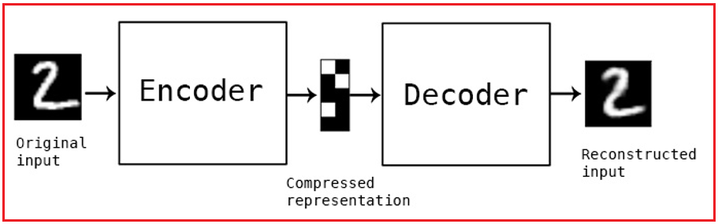
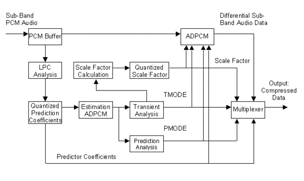

## 这篇文章在解决什么问题

在可穿戴设备和移动传感器越来越普及的今天，手表、手机、手环会持续采集加速度、陀螺仪等时序信号。 
这些数据当然可以用来做**活动识别**，例如判断用户是在走路、跑步还是静止。

但问题在于，传感器数据里不仅有“动作信息”，往往还混着“身份信息”。

例如：

- 不同人的步频、摆臂节奏和身体惯性不同；
- 同样是跑步，不同人的传感器波形也会呈现稳定差异；
- 这些差异叠加起来，就会形成某种意义上的 **behavior fingerprint**。

这意味着，平台即使表面上只是在做动作分类，实际上也可能从数据里进一步识别“是谁在使用设备”。  

如果原始数据被泄露，攻击者甚至可能利用这些个人特征反推出用户身份。

所以这个问题的核心不是“要不要上传数据”，而是：

> 能不能只上传完成任务所必需的信息，而尽量不暴露用户是谁？

## 为什么只加噪声还不够

一种经典思路是向数据中注入噪声，例如拉普拉斯噪声。  

它的优点很直接：能扰乱原始信号，降低攻击者恢复个人特征的能力。

但这种方法也有明显代价：

- 噪声加得太少，隐私保护不够；
- 噪声加得太多，动作识别精度会明显下降；
- 对边缘设备来说，复杂的扰动机制也可能带来额外计算开销。

换句话说，单纯“把数据搅乱”并不是最优解。  

我们更希望做到的是：**有选择地保留任务相关信息，主动压制身份相关信息。**

## C-AAE 的目标

C-AAE 可以理解为一个面向隐私保护的表示学习框架，它想同时达成两件事：

1. 保留足够的动作语义，让系统仍然能够完成活动识别。
2. 削弱能够区分个体身份的细节，让上传后的表示尽量“匿名”。

更直白地说，C-AAE 追求的是把下面两类信息拆开：

- 与任务相关的信息：走路、跑步、上下楼等动作模式；
- 与身份相关的信息：步态细节、个人节奏、高频个体特征等。

如果模型最后提取到的表示主要服务于“识别动作”，而不再容易暴露“识别个人”，那它就达到了设计目标。

| 部分       | 作用                                                 |
| ---------- | ---------------------------------------------------- |
| 编码器     | 把原始传感器窗口压到潜空间                           |
| 匿名化表示 | 保留活动相关信息，压低身份线索                       |
| ADPCM      | 对潜表示再做差分编码，进一步降码率并削弱残余身份信息 |
| 下游识别器 | 做活动识别                                           |

## 怎么理解 AAE 这部分

这里可以把匿名自编码器理解成一个“有立场的压缩器”。

普通自编码器的目标，是尽可能在压缩后重建输入；  

而匿名自编码器更进一步，它不是机械地保留全部信息，而是希望在压缩过程中主动丢掉那些不利于隐私保护的部分。

可以把它想象成一位编辑在改稿：

- 文章的主题观点必须保留；
- 暴露作者身份的口头禅、书写习惯和个人痕迹应尽量删掉。

映射到传感器信号上，就是：

- 保留能够区分动作类别的关键时序结构；
- 压制容易泄露用户身份的细粒度特征。

因此，AAE 的价值不只是“降维”，而是**带目标地提取匿名表示**。

## 为什么还要结合 ADPCM

- PCM ：完整发送
- DPCM：只发送前后两次数据中的差值（不同部分）
- ADPCM:消去高频特征（视为一种毛刺）

仅靠匿名表示学习还不够，系统通常还要考虑部署成本，尤其是在资源受限的边缘设备上。

这时引入 [ADPCM](https://www.telos.info/s/digital-signal-processing/surround-sound-formats/adpcm/)（自适应差分脉冲编码调制）有两个现实意义：

### 1. 进一步压缩数据体积

ADPCM 不直接发送完整信号，而是重点编码信号变化量。  

对于连续传感器数据，这种方式往往能显著降低传输和存储开销。

### 2. 天然削弱部分高频个体细节

很多能够体现个体差异的细碎高频特征，在差分编码和低比特表示过程中会被弱化。  

这并不意味着隐私问题被彻底解决，但它确实能在一定程度上减少“可识别的个人纹理”。

所以，AAE 与 ADPCM 的组合可以理解为两层处理：

- 第一层：通过匿名表示学习，尽量把动作信息和身份信息分离；
- 第二层：通过轻量压缩编码，进一步降低传输成本并抑制部分冗余细节。

## 一个更完整的系统流程

如果把整套方案放到智能手表或手机场景中，可以把流程概括为：

`手表/手机传感器 -> 匿名自编码器提取表示 -> ADPCM 压缩 -> 云端活动识别模型 -> 输出动作类别`

这个流程背后的设计思想很明确：

- 原始信号尽量不要直接上传；
- 先在本地把数据转换成更“匿名”的表示；
- 再把压缩后的结果发到云端做分类。

这样做的好处是，服务器拿到的就不再是完整原始轨迹，而是经过筛选和压缩后的任务表示。

## 这套方法的难点在哪里

C-AAE 的思路很有吸引力，但真正落地时仍然有几个难点不能回避。

### 任务性能和隐私保护之间存在拉扯

如果匿名化过强，动作识别准确率可能下降；  

如果保留的信息太多，身份泄露风险又会上升。

因此模型训练往往要在“可用性”和“匿名性”之间反复权衡。

### 强个体差异动作更难处理

有些动作本身就高度依赖个体习惯，例如跑步姿态、手臂摆动方式。  

在这类场景里，动作信息和身份信息往往纠缠得更紧，分离难度也更高。

### 压缩后仍可能存在反推风险

即使只传输低比特表示，也不能简单认为数据就绝对安全。  

如果攻击者掌握足够多的先验知识，仍有可能通过重建或推断攻击恢复部分敏感信息。

所以，压缩不是隐私保护的终点，只是整体方案中的一环。

## 为什么这个方向值得做

我觉得 C-AAE 这类工作真正有价值的地方，在于它没有把隐私保护理解为“彻底不使用数据”，而是尝试回答一个更现实的问题：

> 在智能服务必须依赖数据的前提下，怎样让系统只看到它真正需要看到的部分？

这类研究特别适合可穿戴计算、移动健康监测、边缘智能等场景。  

因为这些场景天然依赖持续感知，同时又高度接近个人生活，隐私风险非常真实。

如果未来能把这类方法做得更稳定，它的意义不只是提升一个模型指标，而是帮助我们建立一种更合理的数据使用方式。

## 总结

C-AAE 的核心思想可以压缩成一句话：

> 尽量保留“动作是什么”，尽量隐藏“这个动作是谁做的”。

围绕这个目标，文章里的技术路线可以概括为三步：

1. 用匿名自编码器提取更适合隐私保护的表示。
2. 用 ADPCM 进一步做轻量压缩与细节抑制。
3. 在云端使用压缩后的表示完成活动识别。

如果后面继续展开这个方向，我认为最值得继续补充的内容有三块：

- C-AAE 的具体损失函数设计；
- 隐私指标与识别精度之间的实验权衡；
- 与纯噪声扰动、纯压缩方法之间的对比实验。

## 可能的研究方向

- 能不能把 C-AAE 的思路迁移到 [边缘计算](../../pages/边缘计算) 场景里的本地感知设备？
- 能不能把匿名化表示和 [联邦学习](../../pages/联邦学习) 结合，形成“先匿名化再协同训练”的两层隐私结构？
- 对于资源更紧的设备，能否把它和 [量化](../../pages/量化)、轻量编码器一起考虑？
