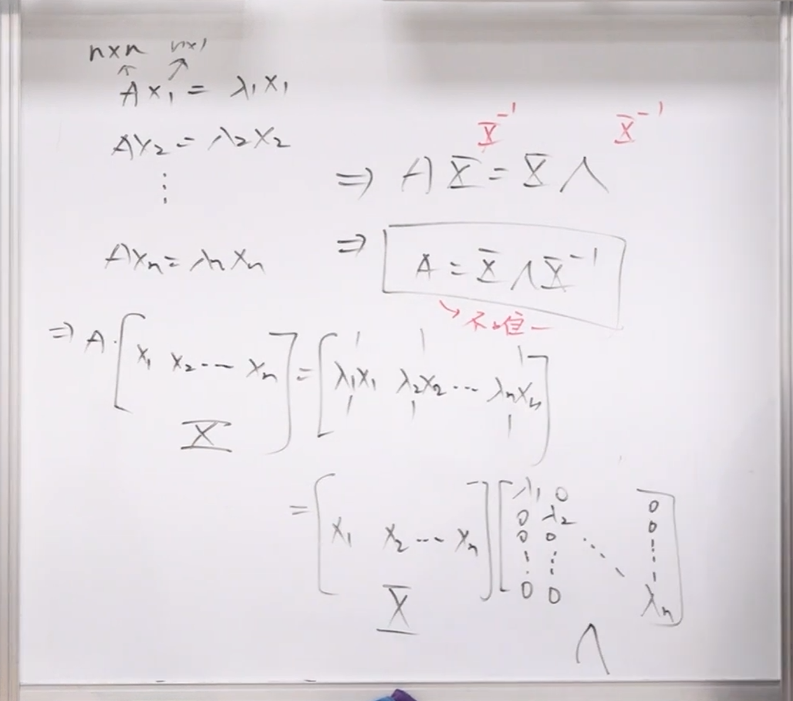
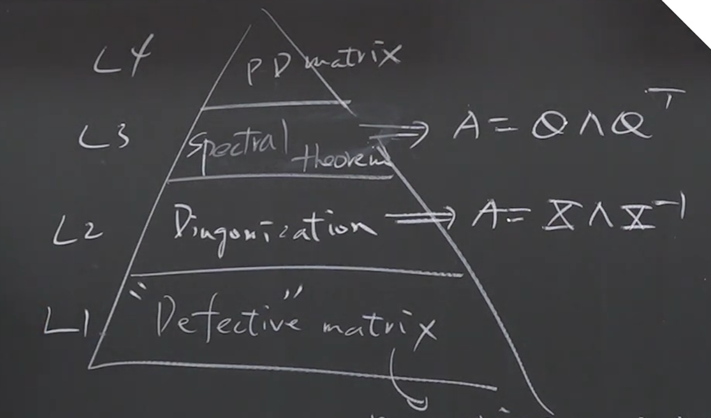

### 特征值与特征向量的核心动机
在线性代数中，我们经常需要处理输入向量 $x$ 经过矩阵 $A$ 的线性转换，得到输出向量 $Ax$。当矩阵 $A$ 非常庞大（例如 $1000 \times 1000$）且需要进行多次转换（例如 $A^k x$）时，直接相乘的计算量会非常惊人。

特征值与特征向量的发明正是为了解决这个问题。对于一个矩阵 $A$，如果我们能找到特定的向量 $x$（即**特征向量**），使得 $A$ 作用在 $x$ 上时，其效果等同于纯量 $\lambda$（即**特征值**）乘上 $x$：
$$Ax = \lambda x$$
那么，高维度的矩阵乘法就被简化成了简单的纯量倍数放大或缩小。

### 什么是对角化

### 矩阵的金字塔阶级

基于特征向量的表现，矩阵被划分为一个严阶级的“金字塔”：

*   **金字塔底层：瑕疵矩阵 (Defective Matrix)**
    *   **定义：** 虽然能算出特征值（通常伴随重复的特征值），但在求零空间时，**找不到 $n$ 条线性独立的特征向量**的矩阵。
    *   **后果：** 这种矩阵“残缺不全”，无法凑齐构成 $n$ 维空间的基底 (Basis)。因此，**它无法被对角化**，在应用上最难处理。

*   **金字塔中层：可对角化矩阵 (Diagonalizable Matrix)**
    *   **定义：** 如果一个 $n \times n$ 矩阵能够提供 **$n$ 条线性独立的特征向量**。
    *   **优势：** 这 $n$ 条特征向量可以组成 $n$ 维空间的基底。我们可以将这些特征向量排成一个矩阵 $X$（特征向量矩阵），从而将原矩阵 $A$ 分解为：
        $$A = X \Lambda X^{-1}$$
        （其中 $\Lambda$ 是由特征值组成的对角矩阵）。所有复杂的 $A$ 的运算，都可以转化为极简的 $\Lambda$ 对角矩阵的运算。

*   **金字塔顶层：完美矩阵 (具有谱定理 Spectral Theorem 的矩阵)**
    *   **定义：** 例如对称矩阵 (Symmetric Matrix)。
    *   **优势：** 这种矩阵不仅能找到 $n$ 条独立的特征向量，而且这 $n$ 条特征向量**天然互相垂直 (Orthogonal)**。
    *   此时对角化公式会进化为 $A = Q \Lambda Q^T$（其中 $Q$ 是正交矩阵，反矩阵 $Q^{-1}$ 直接等同于转置矩阵 $Q^T$），这在工程和纯数学中都是最优美、最好算的形态。
- 最上层
	- PD matrix: 天龙人
	  - 同时满足矩阵对角化这个空间中最为完美的要求，同时也满足逆矩阵世界中最完美的要求（可逆）
