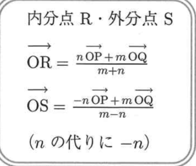
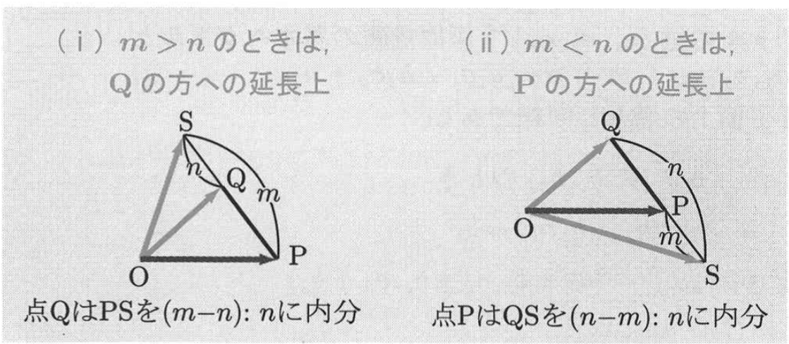

# Vector Components Study Handout

## 1. Position Vectors and Components in the Plane

A position vector shows the location of a point from the origin. If point `A` has coordinates `(a1, a2)`, then the vector `OA` can be written as `a = (a1, a2)`.

In the `xy`-plane, we use two basic vectors:

- `e1 = (1, 0)`
- `e2 = (0, 1)`

So every plane vector can be written in basic-vector form:

`a = (a1, a2) = a1e1 + a2e2`

This means the first number is the `x`-part, and the second number is the `y`-part.

**Key words**

- position vector: a vector from the origin to a point
- component: each coordinate of a vector
- basic vector: the standard unit direction, such as `e1` or `e2`

**Examples**

1. Write `a = (2, 3)` in basic-vector form.
2. If `e1 = (1, 0)` and `e2 = (0, 1)`, what is `(4, -1)` in basic-vector form?
3. What does the second component of `(5, 7)` mean?

**Answers**

1. `a = 2e1 + 3e2`
2. `4e1 - e2`
3. It is the `y`-component, so it shows the vertical part.

## 2. Vector From One Point to Another and Component Operations

If `P(p1, p2)` and `Q(q1, q2)`, then

`PQ = (q1 - p1, q2 - p2)`

This is a very important rule. We subtract the starting point from the ending point.

Vector operations can also be done component by component:

- equality: `(a1, a2) = (b1, b2)` means `a1 = b1` and `a2 = b2`
- addition: `(a1, a2) + (b1, b2) = (a1 + b1, a2 + b2)`
- subtraction: `(a1, a2) - (b1, b2) = (a1 - b1, a2 - b2)`
- scalar multiplication: `lambda(a1, a2) = (lambda a1, lambda a2)`

From the source example:

- `OA = (-3, 2) = -3e1 + 2e2`
- `OB = (4, -1) = 4e1 - e2`
- `AB = OB - OA = (7, -3) = 7e1 - 3e2`

**Key words**

- endpoint: the point where the vector finishes
- subtraction rule: end minus start
- scalar: a number that multiplies a vector

**Examples**

1. Let `P(1, 2)` and `Q(5, 6)`. Find `PQ`.
2. Compute `(2, 3) + (4, -1)`.
3. Compute `2(3, -2)`.

**Answers**

1. `PQ = (5 - 1, 6 - 2) = (4, 4)`
2. `(6, 2)`
3. `(6, -4)`

## 3. External Division Point

The source also introduces an external division point. If point `S` divides `PQ` externally in the ratio `m : n`, then the position vector of `S` is

`OS = (-n OP + m OQ) / (m - n)`

This formula is similar to the internal division formula, but the signs are different. Be careful here.

From the source example:

- `OP = (-3, 2)`
- `OQ = (-5, -1)`
- `S` divides `PQ` externally in the ratio `2 : 5`

Then

`OS = (-5/3, 4)`

**Key words**

- external division: dividing on the outside of the segment
- ratio: the comparison `m : n`
- formula: a fixed rule used to calculate something

> 我一直的记忆方式都是对边相乘，不过要能够记得，这个是比例，也就是SQ,PQ分别在总长SP中的占比
>
> 根据S在PQ内还是外来决定是内分还是外分

**Examples**

1. In one short sentence, what is the difference between internal division and external division?
2. In the external division formula, which vectors are used?

**Answers**

1. Internal division is between the two points, but external division is on an extension line.
2. `OP` and `OQ`

## 4. Components in Space

In 3D space, a vector has three components. If point `A` has coordinates `(a1, a2, a3)`, then

`a = OA = (a1, a2, a3)`

The basic vectors are:

- `e1 = (1, 0, 0)`
- `e2 = (0, 1, 0)`
- `e3 = (0, 0, 1)`

So we can write

`a = a1e1 + a2e2 + a3e3`

For points `P(p1, p2, p3)` and `Q(q1, q2, q3)`,

`PQ = (q1 - p1, q2 - p2, q3 - p3)`

Vector operations in space are also done component by component.

From the source example:

- `P(-2, -3, 5)`
- `Q(4, 1, -7)`
- `R(3, 6, 2)`

Then

- `PQ = (6, 4, -12)`
- `PR = (5, 9, -3)`
- `2PQ - 3PR = (-3, -19, -15)`

**Key words**

- 3D space: space with `x`, `y`, and `z`
- coordinate: a number showing position
- component form: writing a vector as a list of coordinates

**Examples**

1. Write `(2, -1, 4)` in basic-vector form.
2. If `P(1, 2, 3)` and `Q(4, 6, 5)`, find `PQ`.
3. Compute `(1, 2, 3) + (2, -1, 4)`.

**Answers**

1. `2e1 - e2 + 4e3`
2. `(3, 4, 2)`
3. `(3, 1, 7)`

## 5. Centroid and Linear Combination in Space

For a triangle in space, the centroid is the balance point. If the position vectors of the three vertices are `OP`, `OQ`, and `OR`, then the centroid `G` satisfies

`OG = (OP + OQ + OR) / 3`

This is a very useful shortcut.

From the source example:

- `P(-2, 4, 1)`
- `Q(4, 5, 2)`
- `R(4, 0, 3)`

Then

`OG = (2, 3, 2)`

The source also shows how to express a vector as a linear combination:

`OS = xOP + yOQ + zOR`

For `S(4, 23, 5)`, the result is

`OS = 2OP + 3OQ - OR`

**Key words**

- centroid: the center point of a triangle
- linear combination: a sum using numbers times vectors
- coefficient: the number in front of a vector

**Examples**

1. What is the centroid formula for a triangle with position vectors `OP`, `OQ`, and `OR`?
2. If `OP = (1, 0, 0)`, `OQ = (0, 1, 0)`, and `OR = (0, 0, 1)`, find `OG`.
3. In `OS = 2OP + 3OQ - OR`, what is the coefficient of `OQ`?

**Answers**

1. `OG = (OP + OQ + OR) / 3`
2. `OG = (1/3, 1/3, 1/3)`
3. `3`

## Quick Review

- In 2D, `a = (a1, a2) = a1e1 + a2e2`.
- In 3D, `a = (a1, a2, a3) = a1e1 + a2e2 + a3e3`.
- To find `PQ`, always do end minus start.
- Addition, subtraction, and scalar multiplication are done component by component.
- The centroid of a triangle is the average of the three position vectors.

**Missing or unclear source content**

- The side notes and some small callout text in the images are not important for the main formulas, so they were not translated in detail.
