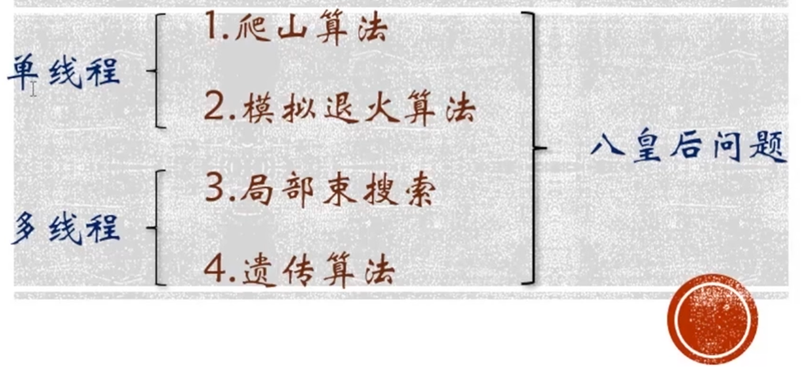
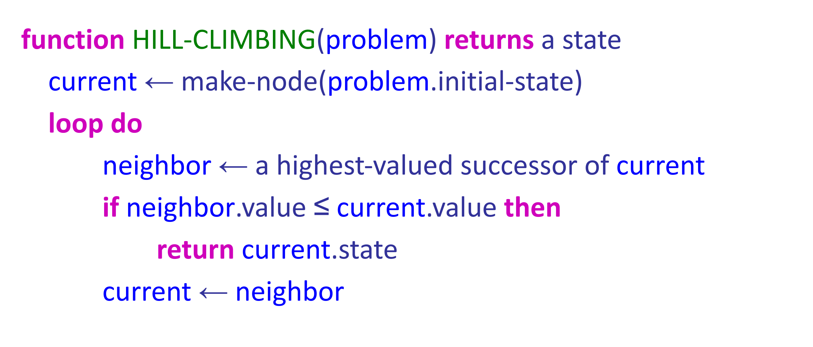
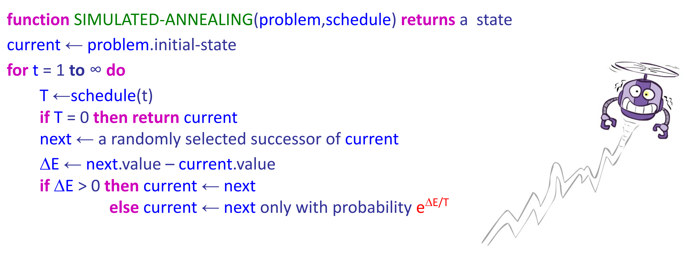
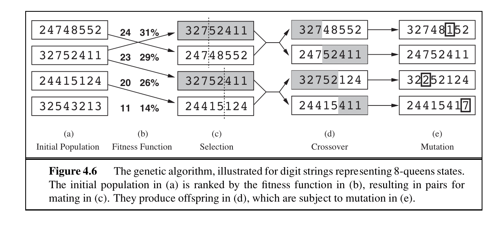
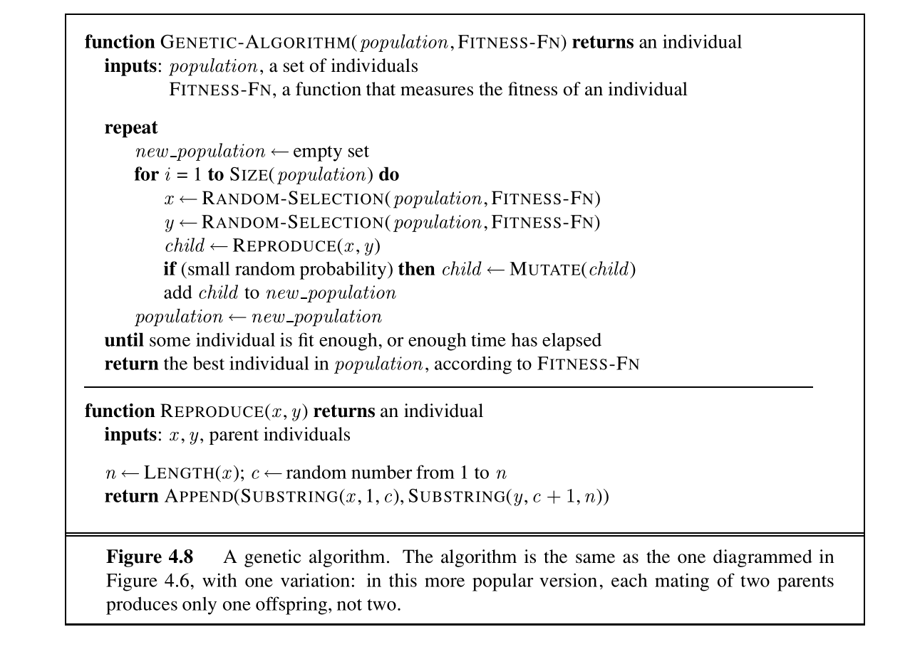

- [Agents](https://inst.eecs.berkeley.edu/~cs188/textbook/search/agents.html)
- [Uninformed Search](https://inst.eecs.berkeley.edu/~cs188/textbook/search/state.html)

- https://inst.eecs.berkeley.edu/~cs188/sp26/assets/lectures/cs188-sp26-lec02.pdf
- https://inst.eecs.berkeley.edu/~cs188/sp26/assets/lectures/cs188-sp26-lec03.pdf
- https://inst.eecs.berkeley.edu/~cs188/sp26/assets/lectures/cs188-sp26-lec04.pdf
- https://gemini.google.com/app/1910f28380aa30da
- 【人工智能概论（导论），搜索算法 启发式搜索 八数码问题 搜索树和open表close表的构造】 https://www.bilibili.com/video/BV1BVN2zZEU2/?share_source=copy_web&vd_source=27abef6992749c2b76e3f7b2a2c835b5

- 

# CS 188: Artificial Intelligence (人工智能导论)

## 课程核心笔记精整版：从经典搜索到对抗博弈

## 第一部分：人工智能导论与智能体设计

### 1.1 什么是人工智能 (What is AI?)

人工智能的研究方向通常可以分为以下四个象限。CS 188 的核心关注点在于**理性行动（Acting Rationally）**。

| 维度                | 关注人类行为/思维 (Human-centric)                                     | 关注理性 (Rationality-centric)                                                                    |
| ------------------- | --------------------------------------------------------------------- | ------------------------------------------------------------------------------------------------- |
| **思考 (Thinking)** | **像人一样思考 (Thinking humanly)**· 关注认知科学与人类大脑决策过程。 | **理性地思考 (Thinking rationally)**· 关注“思维法则”（Laws of Thought），即形式逻辑与推理。       |
| **行动 (Acting)**   | **像人一样行动 (Acting humanly)**· 典型代表：图灵测试 (Turing Test)。 | **理性地行动 (Acting rationally)**· **理性智能体 (Rational Agent)**：在给定环境下最大化期望效用。 |


### 1.2 理性智能体 (Rational Agent)

#### 1.2.1 理性 (Rationality) vs 成功 (Success)

- **成功 (Success)**：基于**实际结果 (Actual Outcome)**。实际结果可能会受到环境中不可控、不可知因素的影响（例如运气）。
- **理性 (Rationality)**：基于**期望结果 (Expected Outcome)**。理性是指在当前智能体拥有的信息（感知历史）下，选择能最大化其期望效用（Expected Utility）的行动。

> 💡 **知识点例题 1：理性与成功的区别**
>
> **【题目】** 假设你面临一个选择：
>
> - 选择 A：抛一枚均匀的硬币。如果是正面，你获得 100 元；如果是反面，你失去 10 元。
> - 选择 B：直接获得 10 元。
>
> 1. 从理性决策的角度，你应该选择 A 还是 B？请写出计算过程。
> 2. 假设你选择了 A，但硬币抛出后是反面，你失去了 10 元。这说明你的决策是不理性的吗？请结合“理性”与“成功”的区别进行解释。
>
> **【解析与答案】**
>
> 1. **理性选择分析**： 我们通过计算每个选择的期望效用（Expected Utility, $EU$）来进行决策：
>
>    $$EU(A) = P(\text{正面}) \cdot 100 + P(\text{反面}) \cdot (-10) = 0.5 \cdot 100 + 0.5 \cdot (-10) = 50 - 5 = 45 \text{ 元}$$
>
>    $$EU(B) = 10 \text{ 元}$$
>
>    因为 $EU(A) > EU(B)$（$45 > 10$），根据理性决策原理，**应该选择 A**。
>
> 2. **理性与成功的关系**： 这**并不**说明决策是不理性的。
>    - **理性（Rationality）**是基于决策时已知的概率和预期收益进行评估的。在抛硬币前，选择 A 的期望效用最大，因此选择 A 是完全理性的。
>    - **成功（Success）**是基于实际发生的结果（Actual Outcome）。由于不确定性的存在，理性的决策也有可能导致失败的结果。我们不能用“事后诸葛亮”的实际结果去否定事前决策的合理性。

### 1.3 智能体结构：反射型 vs 规划型

1. **反射型智能体 (Reflex Agent)**：
   - **机制**：直接根据当前的感知（Percept）或极短的历史信息，通过“条件-动作”（Condition-Action）规则选择行动。
   - **特点**：不考虑未来的变化，不进行前瞻（No looking ahead）。
   - **Pacman 示例**：如果 Pacman 的右侧有食物，它就向右走；如果旁边有幽灵，它就立即向相反方向逃跑。
2. **规划型智能体 (Planning Agent)**：
   - **机制**：利用世界模型（World Model）预测未来的状态变化，通过搜索算法评估一系列动作组合（Path/Plan）产生的长远后果，从而选择当前最佳的行动。
   - **特点**：具备前瞻性（Foresight），以目标为导向。
   - Pacman **示例**：Pacman 会计算一条能够吃掉所有食物且避开幽灵的最短路径，并严格按照规划好的步骤行进。


## 第二部分：搜索问题与无启发式搜索 (Uninformed Search)

### 2.1 搜索问题的形式化定义 (Search Problem Formulation)

一个经典的搜索问题由以下五大要素构成：

1. **状态空间 (State Space)**：世界上所有可能状态的集合 $S$。

2. **初始状态 (Start State)**：智能体开始搜索的起点 $s_0 \in S$。

3. **后继函数 (Successor Function)** $Succ(s)$：输入当前状态 $s$，返回一个三元组列表：

   $$\{\langle a, s', c \rangle \}$$

   其中 $a$ 是可行操作（Action），$s'$ 是新状态（Successor State），$c$ 是单步代价（Step Cost）。

4. **目标测试 (Goal Test)**：一个布尔函数，用于判断给定的状态 $s$ 是否为目标状态。

5. **路径代价 (Path Cost)**：通常是路径上所有单步代价的累加和 $g(n)$。


### 2.2 状态空间图 (State Space Graph) vs 搜索树 (Search Tree)

- **状态空间图 (State Space Graph)**：
  - 每个物理状态在图中**仅出现一次**。
  - 可能存在环路（Cycles）。

  

- **搜索树 (Search Tree)**：
  - 树中的每个节点（Search Node）代表一条**从起点出发的路径**。
  - 同一个物理状态可以在不同的树节点中**重复出现**（因为可以从不同的路径到达该状态）。


#### 2.2.1 搜索节点 (Search Node) 的内部数据结构

每个搜索树节点 $n$ 在代码实现中通常包含以下字段：

- `n.state`：该节点对应的物理状态。
- `n.parent`：指向父节点的指针（用于在找到解后回溯路径）。
- `n.action`：从父节点到达当前节点所执行的动作。
- `n.path_cost`（即 $g(n)$）：从起点到该节点的累计总代价。
- `n.depth`：节点在搜索树中的深度。

### 2.3 盲目搜索算法 (Uninformed Search Algorithms)

盲目搜索（又称无启发式搜索）不利用任何关于目标位置的领域知识，仅依赖问题定义本身进行扩展。

#### 2.3.1 核心算法性质对比汇总

设 $b$ 为分支因子（Branching Factor），$d$ 为最浅目标节点的深度，$m$ 为状态空间的最大深度。

> All these search algorithms are the same except for **expansion strategies**
>
> ▪ Conceptually, all fringes are priority queues (i.e. collections of nodes with attached priorities)
>
> ▪ Practically, for DFS and BFS, you can avoid the log(n) overhead from an actual priority queue by using stacks and queues
>
> ▪ Can even code one implementation that takes a variable queuing object

| 算法               | Fringe 数据结构                 | 时间复杂度                                  | 空间复杂度                                  | 完备性 (Complete)?                             | 最优性 (Optimal)?            |
| ------------------ | ------------------------------- | ------------------------------------------- | ------------------------------------------- | ---------------------------------------------- | ---------------------------- |
| **DFS (深度优先)** | LIFO Stack (栈)                 | $O(b^m)$                                    | $O(bm)$                                     | 树搜索：否（无限深时）图搜索：是（有限状态下） | 否                           |
| **BFS (广度优先)** | FIFO Queue (队列)               | $O(b^d)$                                    | $O(b^d)$                                    | 是（分支因子 $b$ 有限）                        | 是（仅当单步代价全相等时）   |
| **IDS (迭代加深)** | LIFO Stack (逐层限制)           | $O(b^d)$                                    | $O(bd)$                                     | 是（分支因子 $b$ 有限）                        | 是（仅当单步代价全相等时）   |
| **UCS (一致代价)** | Priority Queue (按 $g(n)$ 升序) | $O(b^{1 + \lfloor C^* / \epsilon \rfloor})$ | $O(b^{1 + \lfloor C^* / \epsilon \rfloor})$ | 是（若单步代价 $\ge \epsilon > 0$）            | **是**（适用于任意单步代价） |

_(其中 $$C^_$$ 是最优解的总代价，$$\epsilon$$ 是单步最小代价上限边界。)\*

> 💡 **知识点例题 2：盲目搜索过程详解 (BFS, DFS, UCS, IDS)**
>
> **【题目】** 给定如下有向图状态空间，起点为 $S$，目标点为 $G$。边上的数字表示单步代价。
>
> ```
>      [ A ] --( 2 )--> [ B ]
>     ^     \            / ^
>    /       \          /  |
> (1)         (4)    (2)  (1)
>  /           v    v      |
> [ S ] --(4)----> [ C ] ----/
>  \             |
> (5)           (3)
>    \           v
>     \-------> [ G ]
> ```
>
> 请分别写出使用 **BFS、DFS（树搜索版本，邻接点按照字母顺序 [A, B, C, G] 压栈/入队）**、**IDS** 以及 **UCS（图搜索版本）** 从 $S$ 搜索到 $G$ 的：
>
> 1. 节点的展开顺序（Expansion Order）。
> 2. 最终找到的路径。
> 3. 最终路径的总代价。
>
> **【解析与答案】**
>
> 在开始前，我们先写出每个节点的后继（按字母表排序）：
>
> - $Succ(S) = \{\langle A, 1\rangle, \langle C, 4\rangle, \langle G, 5\rangle\}$
> - $Succ(A) = \{\langle B, 2\rangle, \langle C, 4\rangle\}$
> - $Succ(B) = \{\langle C, 2\rangle\}$
> - $Succ(C) = \{\langle B, 1\rangle, \langle G, 3\rangle\}$
>
> #### 1. BFS (广度优先搜索)
>
> - **Fringe 变化过程（FIFO 队列，记录格式为 `[节点(路径)]`）**：
>   - 初始：`[S]`
>   - 展开 $S$，将后继加入末尾：`[A(S-A), C(S-C), G(S-G)]`
>   - 展开 $A$，后继加入末尾：`[C(S-C), G(S-G), B(S-A-B), C(S-A-C)]`
>   - 展开 $C(S-C)$，后继加入末尾：`[G(S-G), B(S-A-B), C(S-A-C), B(S-C-B), G(S-C-G)]`
>   - 取队首 $G(S-G)$。由于 $G$ 是目标节点，搜索结束。
> - **节点展开顺序**：$S \rightarrow A \rightarrow C$ （在展开 $G$ 之前已被判定或从队列取出）
> - **找到的路径**：$S \rightarrow G$
> - **路径总代价**：$5$
>
> #### 2. DFS (深度优先树搜索)
>
> - **Fringe 变化过程（LIFO 栈，后继按字母升序入栈，意味着先展开字母小的，即右侧先出栈者为字母小的：入栈顺序为** $G, C, A$**，则栈顶为** $A$**）**：
>   - 初始：`[S]`
>   - 展开 $S$（后继 $A, C, G$ 压栈，栈顶为 $A$）：`[G(S-G), C(S-C), A(S-A)]`
>   - 弹出并展开 $A$（后继 $B, C$ 压栈，栈顶为 $B$）：`[G(S-G), C(S-C), C(S-A-C), B(S-A-B)]`
>   - 弹出并展开 $B$（后继 $C$ 压栈）：`[G(S-G), C(S-C), C(S-A-C), C(S-A-B-C)]`
>   - 弹出并展开 $C(S-A-B-C)$（后继 $B, G$ 压栈，栈顶为 $B$）：`[G(S-G), C(S-C), C(S-A-C), G(S-A-B-C-G), B(S-A-B-C-B)]`
>   - 弹出并展开 $B(S-A-B-C-B)$（后继 $C$ 压栈）：`[G(S-G), C(S-C), C(S-A-C), G(S-A-B-C-G), C(S-A-B-C-B-C)]`
>   - 弹出并展开 $C(S-A-B-C-B-C)$：由于是树搜索，这里会陷入死循环（$B-C-B-C$ 无限循环）。
>   - _注意：如果限制了深度或有重复检测，我们会弹出_ $G(S-A-B-C-G)$_。为了展示正常 DFS 的回溯，假设我们避开了显而易见的环，直接弹出_ $G(S-A-B-C-G)$_。_
>   - 假设不考虑死循环，DFS 沿着最左侧最深的分支搜索：
> - **节点展开顺序**：$S \rightarrow A \rightarrow B \rightarrow C \rightarrow B \dots$ (因环路死循环)
> - _纠正：若使用图搜索版本的 DFS（记录 visited）：_
>   - 展开 $S$，Visited = $\{S\}$，Fringe = `[G(S-G), C(S-C), A(S-A)]`
>   - 展开 $A$，Visited = $\{S, A\}$，Fringe = `[G(S-G), C(S-C), C(S-A-C), B(S-A-B)]`
>   - 展开 $B$，Visited = $\{S, A, B\}$，Fringe = `[G(S-G), C(S-C), C(S-A-C), C(S-A-B-C)]`
>   - 展开 $C(S-A-B-C)$，Visited = $\{S, A, B, C\}$，Fringe = `[G(S-G), G(S-A-B-C-G)]` （重复的 $C, B$ 节点不入栈）
>   - 弹出并检测 $G(S-A-B-C-G)$，为目标状态，搜索成功！
> - **图搜索 DFS 最终路径**：$S \rightarrow A \rightarrow B \rightarrow C \rightarrow G$
> - **路径总代价**：$1 + 2 + 2 + 3 = 8$
>
> #### 3. IDS (迭代加深搜索)
>
> - **深度限制** $L=0$：仅测试起点 $S$，未找到目标。
> - **深度限制** $L=1$：
>   - 展开 $S$。Fringe = `[G(S-G), C(S-C), A(S-A)]`。由于深度达到 1，不再向下扩展。
>   - 依次弹出 $A, C, G$，检测到 $G$ 为目标。
> - **节点展开顺序**：$S \rightarrow (A \rightarrow C \rightarrow G)$
> - **找到的路径**：$S \rightarrow G$
> - **路径总代价**：$5$
>
> #### 4. UCS (一致代价图搜索)
>
> 我们用一个表格来清晰追踪优先队列（Fringe）以及已关闭集合（Closed Set / Visited List）的变化：
>
> 
>
> | 步骤 | 展开节点 | 当前路径代价 $g$ | 此时的 Fringe (按 $g(n)$ 排序)                | Closed Set          |
> | ---- | -------- | ---------------- | --------------------------------------------- | ------------------- |
> | 0    | -        | -                | `[(S, g=0)]`                                  | $\emptyset$         |
> | 1    | $S$      | 0                | `[(A, g=1), (C, g=4), (G, g=5)]`              | $\{S\}$             |
> | 2    | $A$      | 1                | `[(B, g=3), (C, g=4), (G, g=5)]`              | $\{S, A\}$          |
> | 3    | $B$      | 3                | `[(C, g=4), (C, g=5, 路径S-A-B-C), (G, g=5)]` | $\{S, A, B\}$       |
> | 4    | $C$      | 4                | `[(G, g=5), (C, g=5), (G, g=7, 路径S-C-G)]`   | $\{S, A, B, C\}$    |
> | 5    | $G$      | 5                | 弹出目标节点，搜索结束！                      | $\{S, A, B, C, G\}$ |
>
> - **节点展开顺序**：$S \rightarrow A \rightarrow B \rightarrow C \rightarrow G$
> - **找到的路径**：$S \rightarrow G$ （注意：虽然路径和 BFS 一样是 $S \rightarrow G$，但 UCS 是依据累计代价最优原则确定的。如果 $S \rightarrow C \rightarrow G$ 的代价是 $4+1=5$，且 $S \rightarrow G$ 代价为 $8$，UCS 就会选择 $S \rightarrow C \rightarrow G$）。
> - **最优路径代价**：$5$

## 第三部分：启发式搜索与 $A^*$ 搜索 (Informed Search & $A^*$)

### 3.1 启发式函数 (Heuristic Function)

- **定义**：启发式函数 $h(n)$ 估算从当前节点 $n$ 到目标节点的最便宜路径代价。
- **特点**：
  - 高度依赖于具体的应用场景和领域知识（Problem-specific）。
  - 在目标节点 $G$ 处，必须满足 $h(G) = 0$。

  

### 3.2 贪婪最佳优先搜索 (Greedy Best-First Search)

- **策略**：每次都优先展开估计距离目标最近的节点。
- **Fringe 优先级度量**：仅依据 $h(n)$ 进行升序排序。
- **缺点**：不考虑已经付出的实际路径代价 $g(n)$，极易走入死胡同或找到代价极高的次优解。

### 3.3 $A^*$ 搜索算法


- **核心思想**：结合 UCS 关注“历史代价”与 Greedy BFS 关注“未来期望”的优势。

- **评估函数**：

  $$f(n) = g(n) + h(n)$$
  - $g(n)$：从起点到当前节点 $n$ 的**实际路径代价**。
  - $h(n)$：从当前节点 $n$ 到目标的**预估剩余代价**。
  - $f(n)$：通过节点 $n$ 的整条路径的**估计总代价**。

### 3.4 启发式函数的数学性质

#### 3.4.1 可采纳性 (Admissibility)

启发式函数 $h(n)$ 是可采纳的，如果它**从不高估**到达目标的实际最小代价：

$$0 \le h(n) \le h^*(n)$$

其中 $h^*(n)$ 是从 $n$ 到目标的真实最优路径代价。这是一种“乐观”的估计。

#### 3.4.2 一致性 (Consistency / Monotonicity)

对于图中的任意两个相邻节点 $A$ 和 $B$（且 $B$ 是 $A$ 的后继），从 $A$ 采取动作 $a$ 转移到 $B$ 的实际代价为 $c(A, a, B)$，启发式函数必须满足：

$$h(A) \le c(A, a, B) + h(B)$$

这本质上是欧几里得空间中的**三角不等式**。

```
           [ A ] -------- c(A,a,B) --------> [ B ]
             \                                 /
              \                               /
             h(A)                           h(B)
                \                           /
                 v                         v
                [         目标状态 G         ]
```

- **一致性的重要结论**：若 $h(n)$ 是一致的，则沿着任意搜索路径，其估算总代价 $f(n)$ 必然是**单调非递减**的：

  $$f(B) = g(B) + h(B) = g(A) + c(A, a, B) + h(B) \ge g(A) + h(A) = f(A)$$

### 3.5 $A^*$ 的最优性定理 (Optimality Theorems)

1. **树搜索 (Tree Search) 下的最优性**：
   - 定理：如果 $h(n)$ 是**可采纳的 (Admissible)**，那么使用 $A^*$ 树搜索算法必定能找到最优解。
2. **图搜索 (Graph Search) 下的最优性**：
   - 定理：如果 $h(n)$ 是**一致的 (Consistent)**，那么使用 $A^*$ 图搜索算法必定能找到最优解。
   - _勘误说明：如果_ $h(n)$ _仅满足可采纳但不一致，在标准的图搜索中，由于一个节点一旦被加入 Closed Set（关闭列表）就不会被再次展开，可能会因此错过从更优路径再次到达该节点的机会，导致最终解非最优。要解决这个问题，必须在发现更短路径时“重新打开 (Re-open)”Closed Set 中的节点，这会增加算法的复杂度。_

> 💡 **知识点例题 3：可采纳但不一致的启发式函数导致图搜索失败的反例**
>
> **【题目】** 考虑如下有向图，起点为 $S$，目标点为 $G$：
>
> ```
>         [ A ] --( 1 )--> [ G ]
>        ^     \
>       /       \
>    (1)         (3)
>     /           v
> [ S ] --------> [ B ] --( 1 )--> [ G ]
> ```
>
> 各节点的真实最短路径代价 $h^*(n)$ 分别为：
>
> - $h^*(S) = 2$ （路径 $S \rightarrow A \rightarrow G$ 或 $S \rightarrow B \rightarrow G$）
> - $h^*(A) = 1$ （路径 $A \rightarrow G$）
> - $h^*(B) = 1$ （路径 $B \rightarrow G$）
>
> 设启发式函数 $h(n)$ 如下：
>
> - $h(S) = 2$
> - $h(A) = 1$
> - $h(B) = 0$
> - $h(G) = 0$
>
> 1. 证明 $h(n)$ 是可采纳的。
> 2. 证明 $h(n)$ 是不一致的。
> 3. 写出使用标准 $A^*$ 图搜索（已被扩展的节点放入 Closed Set 且不重复展开）的节点扩展和搜索过程，说明为何其找到了次优解。
>
> **【解析与答案】**
>
> 1. **可采纳性验证**：
>    - $h(S) = 2 \le h^*(S) = 2$ （满足）
>    - $h(A) = 1 \le h^*(A) = 1$ （满足）
>    - $h(B) = 0 \le h^*(B) = 1$ （满足）
>    - $h(G) = 0 \le h^*(G) = 0$ （满足） 因此，对所有节点都有 $h(n) \le h^*(n)$，该启发式函数是**可采纳的**。
> 2. **一致性验证**： 考察边 $A \rightarrow B$：
>    - 起点 $A$ 的启发值：$h(A) = 1$
>    - 单步代价：$c(A, B) = 3$
>    - 终点 $B$ 的启发值：$h(B) = 0$ 三角不等式检验：
>
>      $$h(A) \le c(A, B) + h(B) \implies 1 \le 3 + 0 = 3 \quad (\text{成立})$$
>
>      再考察边 $S \rightarrow B$：
>
>    - 起点 $S$ 的启发值：$h(S) = 2$
>    - 单步代价：$c(S, B) = 1$
>    - 终点 $B$ 的启发值：$h(B) = 0$ 三角不等式检验：
>
>      $$h(S) \le c(S, B) + h(B) \implies 2 \le 1 + 0 = 1 \quad (\mathbf{\text{不成立！}})$$
>
>      由于 $h(S) > c(S, B) + h(B)$，该启发式函数是**非一致的**。
>
> 3. $A^*$ **图搜索执行过程分析**：
>    - **初始**：Fringe = `[(S, g=0, f=2)]`, Closed = $\emptyset$
>    - **步骤 1**：扩展 $S$，将其加入 Closed。
>      - 后继节点：
>        - $A$：$g(A)=1, f(A)=g(A)+h(A)=1+1=2$
>        - $B$：$g(B)=1, f(B)=g(B)+h(B)=1+0=1$
>      - Fringe 更新后为：`[(B, g=1, f=1), (A, g=1, f=2)]`，Closed = $\{S\}$
>    - **步骤 2**：从 Fringe 中弹出 $f$ 值最小的 $B$。由于 $B$ 不在 Closed 中，将其扩展并加入 Closed。
>      - 后继节点：
>        - $G$：$g(G)=g(B)+c(B,G)=1+1=2, f(G)=2+0=2$
>      - Fringe 更新后为：`[(A, g=1, f=2), (G, g=2, f=2)]`，Closed = $\{S, B\}$
>    - **步骤 3**：从 Fringe 中弹出 $A$。将其扩展并加入 Closed。
>      - 后继节点：
>        - $B$：$g(B)=g(A)+c(A,B)=1+3=4$。但由于 $B \in \text{Closed}$，图搜索直接**忽略/丢弃**了此后继，不再重复处理。
>        - $G$：$g(G)=g(A)+c(A,G)=1+1=2$。Fringe 中已有一个代价为 $2$ 的 $G$。
>      - Fringe = `[(G, g=2, f=2)]`，Closed = $\{S, B, A\}$
>    - **步骤 4**：弹出 $G(S-B-G)$，代价为 $2$。搜索成功结束。
>
>    **【结论与启示】** 在此例中，虽然最优路径是 $S \rightarrow A \rightarrow G$（总代价为 $2$），但因 $h(n)$ 的非一致性，我们在第二步就早早地通过次优路径 $S \rightarrow B$ 扩展了 $B$ 并将其关闭。当在第三步从 $A$ 发现了通往 $B$ 的路线时，因为 $B$ 已经被关闭，算法没有重新评估它，从而锁死了最优解。这证明了**一致性对** $A^*$ **图搜索的最优性是极其必要的**。

### 3.6 启发式函数的设计与松弛问题 (Relaxed Problems)

- **支配关系 (Dominance)**： 若对于状态空间中的所有节点 $n$，均有 $h_2(n) \ge h_1(n)$，且两者都是可采纳的，则称 $h_2$ **支配** $h_1$。
  - **结论**：使用 $h_2$ 的 $A^*$ 算法所扩展的节点数必然少于或等于使用 $h_1$。因此，在保证可采纳的前提下，启发式函数的值**越大越好**（越接近真实值 $h^*$）。
- **松弛问题 (Relaxed Problems)**： 通过减少或消除原问题中的约束条件所形成的新问题。**松弛问题的最优解代价必然是原问题最优解代价的可采纳启发式函数**。

> 💡 **知识点例题 4：8 数码问题 (8-Puzzle) 启发式设计与计算**
>
> **【题目】** 给定 8 数码问题的初始状态和目标状态如下（“0”代表空格）：
>
> ```
>    初始状态 (Start State)           目标状态 (Goal State)
>          1   2   3                       1   2   3
>          0   4   6                       8   0   4
>          7   5   8                       7   6   5
> ```
>
> 现定义两种启发式估算函数：
>
> 1. $h_1(n)$：错位棋子数（Misplaced Tiles）——不包括空格。
> 2. $h_2(n)$：所有棋子移动到目标位置的曼哈顿距离总和（Manhattan Distance）。
>
> **请完成以下任务**：
>
> 1. 计算初始状态下的 $h_1(Start)$ 和 $h_2(Start)$，写出计算步骤。
> 2. 论证为什么 $h_2$ 支配 $h_1$。
>
> **【解析与答案】**
>
> 1. **启发式计算**：
>    - $h_1$**（错位棋子数）计算**： 对比初始状态和目标状态中的每个棋子（除空格 0 外）：
>      - 棋子 1：位置相同（未错位）
>      - 棋子 2：位置相同（未错位）
>      - 棋子 3：位置相同（未错位）
>      - 棋子 4：错位（初始在第二行第二列，目标在第二行第三列） $\rightarrow +1$
>      - 棋子 5：错位（初始在第三行第二列，目标在第三行第三列） $\rightarrow +1$
>      - 棋子 6：错位（初始在第二行第三列，目标在第三行第二列） $\rightarrow +1$
>      - 棋子 7：位置相同（未错位）
>      - 棋子 8：错位（初始在第三行第三列，目标在第二行第一列） $\rightarrow +1$ 因此：$h_1(Start) = 4$。
>    - $h_2$**（曼哈顿距离之和）计算**： 我们计算除 0 以外的错位棋子从当前网格坐标 $(r_1, c_1)$ 移动到目标网格坐标 $(r_2, c_2)$ 的步数 $|r_1 - r_2| + |c_1 - c_2|$：
>      - 棋子 1、2、3、7：曼哈顿距离均为 $0$。
>      - 棋子 4：从 $(1, 1)$ 到 $(1, 2)$，距离为 $|1-1| + |1-2| = 1$。
>      - 棋子 5：从 $(2, 1)$ 到 $(2, 2)$，距离为 $|2-2| + |1-2| = 1$。
>      - 棋子 6：从 $(1, 2)$ 到 $(2, 1)$，距离为 $|1-2| + |2-1| = 2$。
>      - 棋子 8：从 $(2, 2)$ 到 $(1, 0)$，距离为 $|2-1| + |2-0| = 3$。 总曼哈顿距离：$h_2(Start) = 1 + 1 + 2 + 3 = 7$。
> 2. **支配关系论证**：
>    - 对于任何单个错位的棋子 $i$，由于它至少需要移动 1 步才能到达目标位置，故其对应的曼哈顿距离 $md(i) \ge 1$。
>    - 因此，所有错位棋子的曼哈顿距离之和必然大于或等于错位棋子的个数：
>
>      $$h_2(n) = \sum_{i \in \text{错位}} md(i) \ge \sum_{i \in \text{错位}} 1 = h_1(n)$$
>
>    - 因为 $h_2(n) \ge h_1(n)$ 恒成立，且两者的松弛定义都确保了不会高估实际步数（均为可采纳的），所以 $h_2$ **支配** $h_1$。

## 第四部分：局部搜索算法 (Local Search)

局部搜索算法适用于**解的路径无关紧要**，而**目标状态（Goal State）本身就是答案**的问题（例如八皇后问题、大规模集成电路布线、旅行商问题等）。此类算法在执行过程中不保留完整的搜索树，内存占用极小。

- 【享6：局部搜索算法与最优化问题】 https://www.bilibili.com/video/BV1K44y137Ap/?share_source=copy_web&vd_source=27abef6992749c2b76e3f7b2a2c835b5
- 【AI 5：爬山优化算法】 https://www.bilibili.com/video/BV1bZ4y1y7rj/?share_source=copy_web&vd_source=27abef6992749c2b76e3f7b2a2c835b5
  

### 4.1 爬山法 (Hill Climbing)

- **策略**：不断地朝向邻域中评估值（或目标函数值）最高的上升方向移动。
- **缺点**：
  1. 局部极值 **(Local Maxima)**：卡在非全局最优的局部峰顶。
  2. **山脊 (Ridges)**：由于移动方向受限，智能体在窄峭的山脊处来回震荡，无法向上前进。
  3. **高原 (Plateaux / Flat local maximum)**：评估函数值完全平坦的区域，无法提供任何梯度指导。
     > 该算法迭代地移动到具有更高目标值的状态，直到无法进一步改进为止。
     > 爬山法是不完备的。
     > 另一方面，随机重启爬山法执行多次爬山搜索，每次从随机选择的初始状态开始，并且是平凡完备的，因为随机选择的初始状态最终会与全局最大值重合。
     > 

### 4.2 模拟退火算法 (Simulated Annealing)


通过引入随机扰动来跳出局部极值。以一定的概率接受“变差”的移动。

- **物理隐喻**：金属冶炼中的退火工艺。温度 $T$ 随着时间推移逐渐下降。

- **决策机制**：
  - 如果邻居状态比当前状态更好，**100% 接受**。

  - 如果邻居状态更差，则以概率 $P$ **接受**它：

    $$\text{若最大化目标函数 } E: \quad P = e^{\frac{\Delta E}{T}} \quad (\text{其中 } \Delta E = E_{next} - E_{current} < 0)$$

    $$\text{若最小化代价函数 } Cost: \quad P = e^{-\frac{\Delta Cost}{T}} \quad (\text{其中 } \Delta Cost > 0)$$

- 随着时间推进，$T \rightarrow 0$，接受坏移动的概率 $P \rightarrow 0$，算法最终收敛退化为普通的爬山法。
  

> 模拟退火旨在结合随机游走（随机移动到附近状态）和爬山法，以得到一种完备且高效的搜索算法。
> 在模拟退火中，我们允许移动到可能降低目标值的状态。具体来说，该算法在每个状态随机选择一个移动。如果该移动导致目标值增加，则总是被接受。
> 另一方面，如果导致目标值减小，则以一定概率接受该移动。
> 该概率由温度参数决定，初始温度较高（允许更多“不良”移动），并按照某种调度逐渐降低。如果温度降低得足够慢，那么模拟退火算法将以接近1的概率达到全局最大值。
> 💡 **知识点例题 5：模拟退火接受概率计算**
>
> **【题目】** 在一个最大化目标函数 $E(s)$ 的模拟退火问题中：
>
> 1. 当前状态的评估值 $E(current) = 150$，随机选择的邻居状态评估值 $E(next) = 120$。
> 2. 当系统温度 $T = 100$ 时，求接受该邻居状态的概率 $P$。
> 3. 当系统温度下降到 $T = 10$ 时，求此时接受该邻居状态的概率 $P'$，并解释温度下降对搜索行为的影响。 _(注：已知_ $e^{-0.3} \approx 0.74$_，_$e^{-3} \approx 0.05$_)_
>
> **【解析与答案】**
>
> 1. **计算** $\Delta E$：
>
>    $$\Delta E = E(next) - E(current) = 120 - 150 = -30$$
>
> 2. **在** $T = 100$ **时的接受概率**：
>
>    $$P = e^{\frac{\Delta E}{T}} = e^{\frac{-30}{100}} = e^{-0.3} \approx 0.74 \quad (74\%)$$
>
> 3. **在** $T = 10$ **时的接受概率**：
>
>    $$P' = e^{\frac{\Delta E}{T}} = e^{\frac{-30}{10}} = e^{-3} \approx 0.05 \quad (5\%)$$
>
> 4. **物理意义分析**： 在搜索前期（高温度 $T=100$ 时），系统具有很强的随机探索能力，即使质量下降很多的点也有 $74\%$ 的概率接受，这能有效帮助系统跳出局部最优。而在搜索后期（低温 $T=10$ 时），接受变差状态的概率下降到了 $5\%$，此时系统主要进行细致的局部开发（Exploitation），倾向于收敛到最终的极值点。

### 4.3 局部束搜索 (Local Beam Search)

- **机制**：在内存中同时保留 $k$ 个状态。
- **步骤**：
  1. 随机生成 $k$ 个初始状态。
  2. 生成这 $k$ 个状态的所有后继状态（Successors）。
  3. 如果后继状态中包含目标状态，则停止。
  4. 否则，从所有后继状态中选择评估值最高（最优秀）的 $k$ 个状态作为下一步的当前状态。
- **与** $k$ **次独立爬山法的区别**：多路搜索之间存在**信息共享**。表现不佳的分支会被直接遗弃，优秀的子节点会被重点复制和发扬。

### 4.4 遗传算法 (Genetic Algorithms)

遗传算法是局部束搜索的一个高度随机化的变体，它通过模拟生物演化中的“杂交”来生成后继状态。

- **状态表示**：每个状态被编码为一个字符串（称为染色体或基因）。
- **核心操作流程**：
  1. **适应度评估 (Fitness)**：对群体中的每个个体计算适应度值（越优秀的值越高）。
  2. **选择 (Selection)**：根据适应度大小，按比例决定个体被保留作为双亲（Parents）的概率（如轮盘赌法）。
  3. **交叉 (Crossover)**：随机选择染色体的某一个或多个截断点，交换双亲的基因片断生成下一代（Offspring）。
  4. **变异 (Mutation)**：以极小的概率随机改变后代染色体中的某些字符/位点，以维持种群多样性。
     
     
     > 💡 **知识点例题 6：遗传算法核心演化步骤**
     >
     > **【题目】** 假设一个个体的状态由 4 位二进制串表示，当前种群及每个个体的适应度 $f(x) = (\text{二进制数值})^2$ 如下：
     >
     > - 个体 A: `1001` (十进制 9, $f(A) = 81$)
     > - 个体 B: `0110` (十进制 6, $f(B) = 36$)
     > - 个体 C: `1100` (十进制 12, $f(C) = 144$)
     > - 个体 D: `0011` (十进制 3, $f(D) = 9$)
     >
     > 1. 计算每个个体在“选择”阶段被选中的概率（轮盘赌法）。
     > 2. 假设在交叉阶段，选择了**个体 A** 与**个体 C** 进行杂交，设交叉点（Crossover Point）在第 2 位后面（即 `xx|xx` 的位置）。请写出产生的两个后代基因串。
     > 3. 对其中一个后代基因串在最后一位（第 4 位）进行变异（取反），写出最终结果。
     >
     > **【解析与答案】**
     >
     > 1. **计算选择概率**：
     >    - 总适应度 $\sum f = 81 + 36 + 144 + 9 = 270$
     >    - $P(A) = 81 / 270 = 0.3 \quad (30\%)$
     >    - $P(B) = 36 / 270 \approx 0.133 \quad (13.3\%)$
     >    - $P(C) = 14
