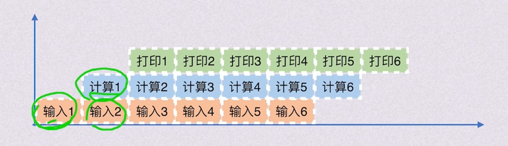
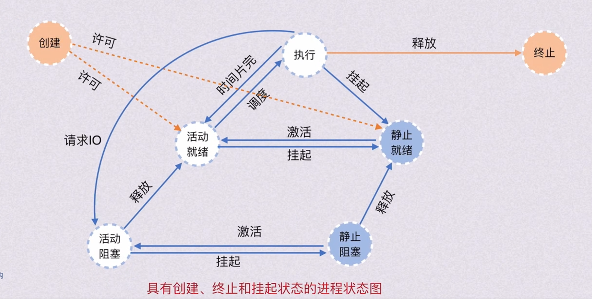

- https://tingwu.aliyun.com/doc/transcripts/3kprqlaw2dyz9xgd?sl=1# 《2-1 进程 720P》




# 进程控制与通信核心笔记

## 学习导言（抓大放小，重在思想）

在操作系统中，“进程”是程序执行的实体。在学习本章时，切忌对具体的某一种操作系统源码实现“吹毛求疵”，而应重点体会操作系统的**设计思路**和**资源管理思想**。对于修考而言，理解进程的特征、状态转换、内存映像及进程通信，是拿到高分的关键。

## 一、 进程的基本概念与特征

### 1.1 进程的定义

- **程序**：是存放在磁盘等外存上的静态指令和数据的集合，**无生命周期**。
- **进程**：是**运行中的程序**。是操作系统让静态的程序字节在内存中“活起来”的执行实体，是系统进行资源分配和调度的一个独立单位。

### 1.2 进程的四大特征

1. **动态性**（最基本特征）：进程由创建而产生，由调度而执行，由撤销而消亡，拥有完整的生命周期。
2. **并发性**：多个进程实体共存于内存中，在一段时间内同时运行（微观上分时交替，宏观上同时推进）。
3. **独立性**：进程是一个能独立运行、独立获得资源、独立接受调度的基本单位。
4. **异步性**：进程按各自独立的、不可预知的速度向前推进。

### 1.3 核心解惑：并发带来的新挑战与应对机制

并发提高了系统的吞吐量，但也引入了三大核心问题：**间断性**、**失去封闭性**和**不可再现性**。

```
【手写笔记疑问思考一】：
“既然有并发，那为什么多个进程共享变量时，会失去封闭性并导致不可再现？为什么要上锁？”
```

#### 1.3.1 失去封闭性（Loss of Closure）与不可再现性（Irreproducibility）

- **封闭性**：指进程运行的结果只取决于进程本身，不受外界影响。
- **不可再现性**：指在相同的初始条件下，重复执行相同的程序，却可能得到不同的运行结果（结果与进程推进的速度有关）。

#### 💡 典型场景推导：共享变量并发修改冲突

设进程 $A$ 与进程 $B$ 共享同一个变量 $x$（初始值 $x = 5$）。两个进程的指令序列如下：

- **进程** $A$：

  $$\text{Instruction } A_1: x = 100$$

  $$\text{Instruction } A_2: x++$$

  $$\text{Instruction } A_3: \text{printf}(x)$$

- **进程** $B$：

  $$\text{Instruction } B_1: x = 5$$

  $$\text{Instruction } B_2: x--$$

  $$\text{Instruction } B_3: \text{printf}(x)$$

**轨迹 1（理想状态：B先执行完毕，A后执行）**

1. 执行 $B_1 \rightarrow B_2 \rightarrow B_3$：$x$ 被减至 $4$，打印输出 $x = 4$。
2. 执行 $A_1 \rightarrow A_2 \rightarrow A_3$：$x$ 被赋值 $100$，加至 $101$，打印输出 $x = 101$。

**轨迹 2（并发导致失去封闭性与不可再现性）** 由于单核 CPU 采用**时间片轮转机制**快速切换，指令执行顺序可能被打乱：

1. 进程 $B$ 启动：执行 $B_1$（$x=5$），执行 $B_2$（$x$ 变为 $4$）。
2. 发生系统调度（时间片用完或打印机等资源暂不可用）：进程 $B$ 暂停在 $B_2$ 与 $B_3$ 之间，等待进入打印队列。
3. 进程 $A$ 启动并抢占 CPU：执行 $A_1$（$x=100$），执行 $A_2$（$x$ 自增变为 $101$）。
4. 进程 $B$ 的打印资源就绪，重新获得 CPU，执行 $B_3$ 打印 $x$。此时，由于 $x$ 的值已被进程 $A$ 修改为 $101$，进程 $B$ 打印出的结果是 $x = 101$！

**结论**：相同的初始条件，由于并发执行时指令交错顺序不同，导致进程 $B$ 打印出完全不同的结果（$4$ 或 $101$）。这就是**失去封闭性**和**不可再现性**。 **解决方案**：引入**同步机制（如互斥锁、信号量）**，当一个进程在对共享资源进行操作时，限制其他进程访问，以恢复程序的“封闭性”。

## 二、 进程在内存中的映像（Process Image）

在 32 位操作系统中，虚拟化技术为每个进程抽象出了一个巨大的、私有的 $4\text{GB}$ **虚拟内存空间**（地址范围：`0x00000000` ~ `0xFFFFFFFF`）。进程以为自己独占了整个物理内存，但实际上由操作系统（通过 MMU 页表）秘密地复用物理内存和外存。

### 2.1 32位进程虚拟地址空间布局结构

自高地址向低地址依次分布如下：

```
+-----------------------------------+  0xFFFFFFFF
|       操作系统内核区 (Kernel)       |
|      (1GB, 用户代码对其不可见)      |  0xC0000000
+-----------------------------------+
|             用户栈 (Stack)         |  <-- %esp (栈指针，向低地址增长)
|        (存放局部变量、函数参数等)    |
+-----------------------------------+
|               |  (空闲区)          |
|               v                    |
+-----------------------------------+
|      共享库存储映射区 (Shared Lib)  |  (存放如 printf 等动态链接库)
+-----------------------------------+
|               ^                    |
|               |  (空闲区)          |
+-----------------------------------+
|             动态生成的堆 (Heap)     |  (通过 malloc 动态分配，向高地址增长)
+-----------------------------------+
|        读/写数据段 (.data/.bss)    |  (存放全局变量和静态变量)
+-----------------------------------+
|      只读代码段 (.text/.rodata)    |  (存放二进制指令，多个进程可共享物理副本)
+-----------------------------------+
|            未使用区/保留区         |  0x08048000
+-----------------------------------+  0x00000000
```

### 2.2 核心要点解析

1. **内核区（**$0\text{xC}0000000 \sim 0\text{xFFFFFFFF}$**）**：
   - **为什么每一个用户进程的地址空间中都映射了相同的内核区？** 方便进程通过系统调用（System Call）快速切换到内核态，执行内核代码，而无需进行高成本的进程页表切换。用户进程对该区域仅有“感知权”而无“读写权”（受硬件保护）。
2. **栈与堆的增长方向**：
   - **栈（Stack）**：从高地址向低地址增长，用于实现函数嵌套调用、局部变量保存。
   - **堆（Heap）**：从低地址向高地址增长，通过 `malloc()` 或 `new` 动态向高地址空间申请。
3. **代码段的共享**：
   - 代码段是**只读**的。多个运行相同程序的进程，其虚拟地址空间的代码段可以映射到物理内存中的**同一份副本**，从而大幅节省主存资源。

## 三、 进程的状态与转换

```
【手写笔记疑问思考三】：
“挂起（Swapped/Suspended）状态有必要吗？我一直以为阻塞就是挂起。”
```

- **纠错与澄清**：
  - **阻塞（Blocked）**：进程仍在**物理内存**中，只是由于等待某事件（如 I/O、锁）而暂时无法运行。它占用了内存资源。
  - **挂起（Swapped Out / Suspended）**：由于内存资源极度紧张，操作系统将进程的物理内存映像（代码段、数据段等）兑换（Swap Out）到外存（磁盘对换区）中，以腾出物理内存给其他进程。它不占用物理内存。
  - 因此，**阻塞并不等于挂起**。引入挂起状态是为了进行内存的“对换”（Swapping）管理，优化系统整体的内存利用率。

### 3.1 进程的七状态模型转换图

结合“就绪、执行、阻塞”三态，“创建、终止”五态，以及引入对换技术后的“活动/静止（Swapped Out）”状态，构成了完整的七状态模型：

### 3.2 典型转换场景及触发原语

- **活动就绪** $\rightarrow$ **静止就绪**：内存紧张时，系统调用挂起原语 `Suspend` 将进程对换到外存，**不再参与 CPU 调度**。
- **静止阻塞** $\rightarrow$ **静止就绪**：在外存中等待的 I/O 事件已经完成，进程状态发生转变，但其内存映像仍在磁盘上，等待被激活（`Active`）调入内存。
- **创建态** $\rightarrow$ **静止就绪**：新建进程时，若当前系统内存极其紧张，系统可能在完成 PCB 初始化后，不为其分配物理内存，直接将其挂起存放在外存中。

## 四、 进程的控制（创建、终止、阻塞、唤醒）

进程控制由操作系统内核中的**原语（Primitive）\**实现。原语通过\**关中断**和**开中断**指令，保证其执行过程具有**原子性**（一气呵成，不可中断）。

### 4.1 进程创建：Linux 下的 `fork()` 与 `exec()` 机制

```
【手写笔记疑问思考四】：
“进程初始化的流程一定要熟练理解。之前 MIT 学习 xv6 时不理解 wait()，现在终于懂了。”
```

#### 4.1.1 `fork()` 与 `exec()` 机制图解

在 Unix/Linux 系统中，创建新进程采用“分裂并覆写”的模式：

```
+-----------------------------------------------------------------+
| 父进程 (Parent)                                                 |
| 调用 fork() ---------> [系统调用陷入内核]                       |
+-----------------------------------------------------------------+
                            |
                            v (完全拷贝一份进程映像，包含寄存器、PC、堆栈等)
+-----------------------------------------------------------------+
| 子进程 (Child, 初生)                                            |
| PC 紧跟父进程，拥有独立物理页面，fork() 在子进程中返回 0          |
+-----------------------------------------------------------------+
                            |
                            v (子进程调用 exec())
+-----------------------------------------------------------------+
| 新进程 (New Program)                                            |
| 加载全新可执行程序，覆写代码段、静态数据，重新初始化堆和栈       |
+-----------------------------------------------------------------+
```

- **`fork()` 的奇妙之处**： 调用一次，返回两次。在父进程中返回子进程的 PID（便于管理），在子进程中返回 $0$。
- **`wait()` 的作用**： 子进程终止时会进入“僵尸状态（Zombie）”，保留其退出状态码供父进程收集。父进程通过调用 `wait()` 或 `waitpid()` 系统调用来读取该状态码，并允许系统彻底回收子进程的 PCB。如果不调用 `wait()`，子进程就会变成**孤儿进程**或**僵尸进程**。

#### 4.1.2 进程初始化 PCB 的三大步骤

1. **申请空白 PCB**：分配唯一的数字标识符（PID）。
2. **分配资源**：为新进程分配物理内存、I/O 设备等。若内存不足，则转入“静止就绪（Swapped Out）”状态。
3. **初始化 PCB**：
   - 初始化标志信息（PID、父进程 PID）。
   - 初始化处理机状态（将 PC 指向程序入口，SP 指向栈顶）。
   - 初始化进程控制信息（状态设为就绪/静止就绪，**优先级设为最低**防止抢占）。

## 五、 进程管理中的数据结构：PCB

**进程控制块（PCB）是进程存在的唯一标志**。操作系统正是通过感知 PCB 来感知进程的存在。

### 5.1 PCB 中包含的信息

1. **进程标识符**：
   - **外部标识符**：由字母、数字组成，方便用户或父进程访问。
   - **内部标识符**：操作系统内部使用的唯一数字序号，即 **PID**。
2. **处理机状态信息（CPU 上下文）**：
   - 寄存器内容：通用寄存器、程序计数器（PC）、状态字（PSW）、堆栈指针（SP）。
   - *注：进程通常有两个栈，用户态运行时使用“用户栈（User Stack）”，发生系统调用进入内核态时使用“内核栈（Kernel Stack）”*。
3. **进程调度信息**：进程状态、优先级、调度算法所需的计时指标（等待时间、已运行时间）、事件（阻塞原因）。
4. **进程控制信息**：程序段/数据段的物理/虚拟起始地址、资源清单（打开的文件、占用的 I/O 设备）、进程同步与通信机制指针。

### 5.2 PCB 的组织方式

- **线性方式**：所有 PCB 存储在一张连续的线性表中。适合进程数较少的微型系统，查找效率低（$O(N)$）。
- **链接方式**：根据进程状态不同（就绪、阻塞、空闲），将相同状态的 PCB 通过指针链接成独立的队列（如就绪队列、因不同事件引起的多个阻塞队列）。
- **索引方式**：系统根据进程状态建立索引表，索引表的表项指向对应状态 PCB 的物理/虚拟首地址。

## 六、 进程通信（Inter-Process Communication, IPC）

```
【手写笔记疑问思考五】：
“共享存储器系统中，内存中有一段不是共享区域吗？是在这里通信吗？”
```

- **纠错与澄清**：
  - 进程的地址空间在物理上是严格**隔离**的，默认不能相互访问（为了系统的安全与稳定）。
  - 所谓的“共享存储器系统”，是指操作系统在内核的调度下，**特意将同一块物理内存区域，同时映射（Map）到两个进程各自的虚拟地址空间中**。
  - 进程 $A$ 对该共享区（如映射数组或存储区块）进行读写，进程 $B$ 即可瞬间感知，从而实现极其高效的高级通信。这块区域在分配前是各自独立的，映射后才成为共享区域。

### 6.1 三大高级进程通信机制比较

| 通信机制                          | 核心特征                                                     | 读写控制者                                                   | 双向交互能力                                                 | 适用场景                                        |
| --------------------------------- | ------------------------------------------------------------ | ------------------------------------------------------------ | ------------------------------------------------------------ | ----------------------------------------------- |
| **共享存储区系统**(Shared Memory) | 在主存中开辟一块公共区域，直接读写。传输速度极快。           | 进程自身直接控制（无需 OS 干预，通常需要信号量配合实现互斥）。 | 可配置成双向（同一个内存块）。                               | 大数据量、高并发的本地进程通信。                |
| **管道通信系统**(Pipe)            | 共享文件（磁盘或内存中的缓冲区）。写满时写进程阻塞，读空时读进程阻塞。 | 操作系统（提供互斥、同步和对方存在性验证的三大协调能力）。   | **严格单向（半双向）**。若需双向通信，必须建立**两个管道**。 | 命令行流数据处理（如 Linux 下的 `ls | grep`）。 |
| **消息传递系统**(Message Passing) | 以格式化的消息（报文）为单位进行传输，分为直接通信和间接通信（信箱）。 | 操作系统（通过发送/接收原语进行封包和解包控制）。            | 通常为双向机制。                                             | 分布式系统、网络通信、微内核系统。              |

## 七、 典型真题与例题精析

### 💡 例题一：进程并发执行与不可再现性分析

**【题目】**：进程 $P_1$ 和 $P_2$ 共享一个初始值为 $0$ 的变量 $Count$。$P_1$ 对 $Count$ 进行加一操作，对应的机器指令序列为：

- $I_1: \text{R}_1 = Count$ （将 $Count$ 读入寄存器）
- $I_2: \text{R}_1 = \text{R}_1 + 1$
- $I_3: Count = \text{R}_1$ （将结果写回内存）

$P_2$ 对 $Count$ 进行减一操作，对应的机器指令序列为：

- $J_1: \text{R}_2 = Count$
- $J_2: \text{R}_2 = \text{R}_2 - 1$
- $J_3: Count = \text{R}_2$

若 $P_1$ 与 $P_2$ 并发执行，请问最后 $Count$ 可能的值有哪些？并给出一组导致异常结果的指令交错执行序列。

**【解析】**： $P_1$ 期望将 $Count$ 加 $1$，$P_2$ 期望将 $Count$ 减 $1$。如果串行执行，最终结果必然为 $0$。 但是在并发乱序执行的情况下，最终结果可能有 $-1$**,** $0$**,** $1$。

- **结果为** $-1$ **的执行序列**：
  1. 执行 $I_1$：$P_1$ 读入 $Count$ 初始值 $0$ 到寄存器 $\text{R}_1 = 0$。
  2. 执行 $I_2$：$\text{R}_1 = 1$。
  3. 此时发生**进程切换**，CPU 调度给 $P_2$。
  4. $P_2$ 连续执行完 $J_1 \rightarrow J_2 \rightarrow J_3$：
     - $J_1$: $\text{R}_2 = Count = 0$
     - $J_2$: $\text{R}_2 = -1$
     - $J_3$: 内存中 $Count = -1$
  5. 此时重新调度回 $P_1$。
  6. $P_1$ 执行 $I_3$: 将其之前的计算结果 $Count = \text{R}_1 = 1$ 写回内存。此时内存中 $Count = 1$。
  7. 最终由于 $P_1$ 的写回操作覆盖了 $P_2$ 的结果，导致最终 $Count = 1$。反之，若 $P_2$ 最后执行，则最终结果为 $-1$。

### 💡 例题二：进程状态转换的正确性辨析（经典 408 考点）

**【题目】**：下列关于进程状态转换的叙述中，正确的是（ ）。 
A. 运行态的进程在时间片完时直接进入阻塞态。 
B. 阻塞态的进程在等待的 I/O 事件完成后直接进入运行态。
C. 当处于就绪队列中的进程由于主存不足被移出到外存时，状态转为静止就绪态。 
D. 原语具有原子性，执行过程中绝对不能发生硬件中断。

**【答案】**：**C** **【解析】**：

- **A 项错误**：运行态时间片完，说明进程只缺少 CPU 资源，应直接转为**就绪态**（若在内存中，则是活动就绪态）。
- **B 项错误**：阻塞态事件完成，进程获得了除 CPU 以外的所有所需资源，应进入**就绪态**重新排队，等待调度程序分配 CPU。
- **C 项正确**：由于主存不足被移出到外存，属于“挂起（Swapped Out）”操作，进程由活动就绪转为**静止就绪态**。
- **D 项错误**：虽然原语具有原子性（一般通过关中断实现），但在某些允许嵌套中断或特定级别的硬件中断（如不可屏蔽中断 NMI）下，硬件中断仍可发生，但原语的指令在逻辑上是不允许剥夺和分步完成的。

### 💡 例题三：Linux 下 `fork()` 创建进程链计算

**【题目】**：在 Linux 系统中，有如下一段 C 程序：

```
#include <stdio.h>
#include <unistd.h>

int main() {
    fork(); // 创建第一个子进程
    fork(); // 每个已有进程再次创建子进程
    printf("BOK\n");
    return 0;
}
```

请问该程序运行后，共会输出多少次 `"BOK"`？共存在多少个进程？

**【解析】**： 我们可以画出进程创建树：

```
         [祖先进程] (Main)
           /      \
       fork()     fork()
        /            \
     [Parent]      [Child 1]
     /      \       /      \
  fork()   fork() fork()  fork()
   /          \     /        \
 [P1]        [P2]  [C1_1]   [C1_2]
```

1. 初始状态下只有 $1$ 个进程（主进程）。
2. 执行第一个 `fork()` 后，主进程创建了子进程 $1$。此时系统内共有 $2$ 个进程。
3. 执行第二个 `fork()` 时，当前的 $2$ 个进程（主进程和子进程 $1$）都会调用 `fork()`。
   - 主进程创建子进程 $2$。
   - 子进程 $1$ 创建孙子进程 $1\_1$。
4. 此时系统内总共拥有 $2 \times 2 = 4$ 个进程。
5. 这 $4$ 个进程都会向下执行 `printf("BOK\n")` 指令。 **【答案】**：共存在 $4$ **个进程**，共会输出 $4$ **次** `"BOK"`。
