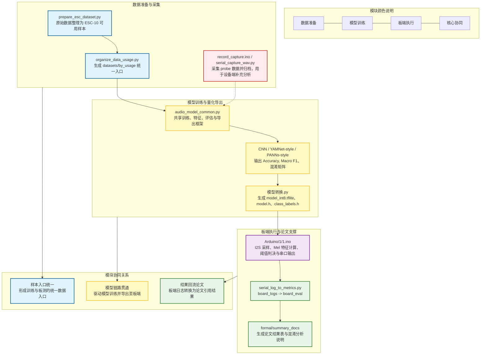
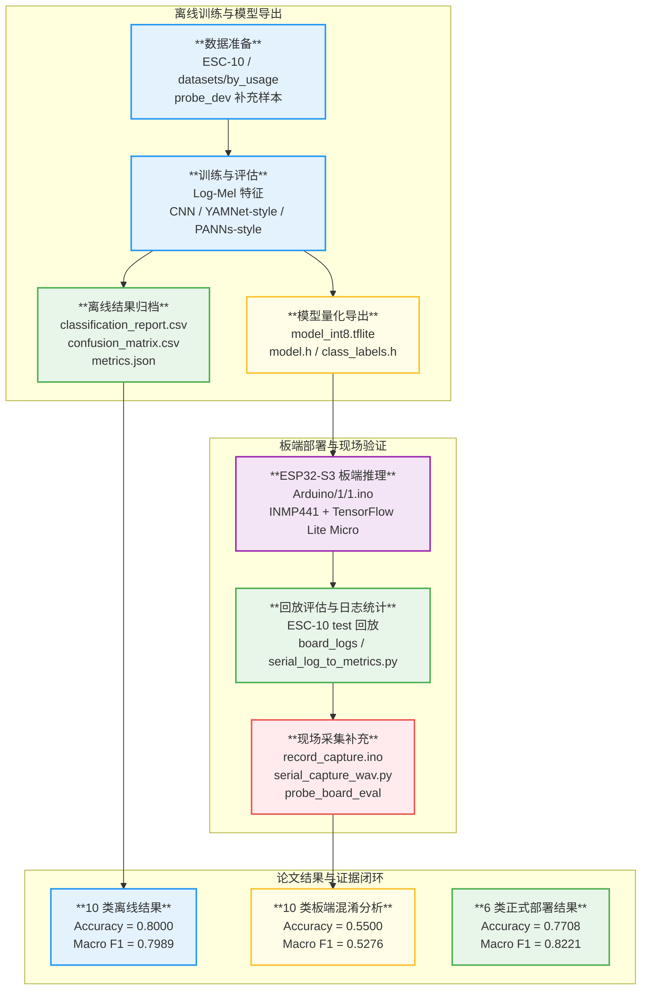

## 这篇文章想解决什么问题

AAO

过去问

psd

## 正文

AAO 通过了审查，但是居然要发到研究院和教授那里去。

没有仔细看ai写的内容，不知道结果怎么样。

PSD居然还发邮件告诉我让我修改内容，让我上传 GPA的计算方式，但是我已经上传了一张成绩里附带GPA的文件。

不知道PSD在干什么。

如果赶不上就算了，为了这件事情，这几周提心吊胆。

实在不行，我就准备其他学校。

今天做了计组的过去问，做的特别慢，后来的复盘也很慢，但是我感觉抓住了方向。

总体而言是好的。

