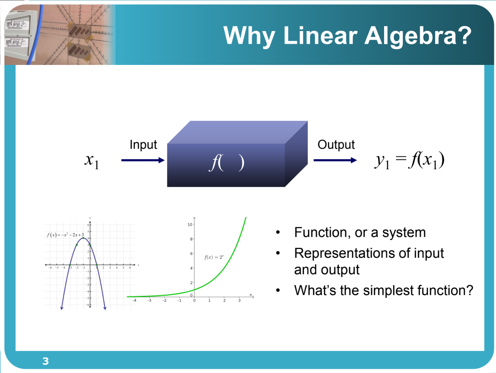
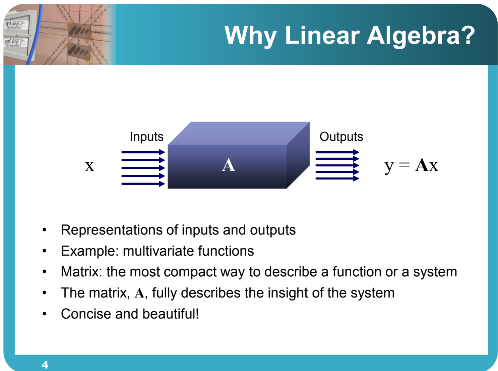
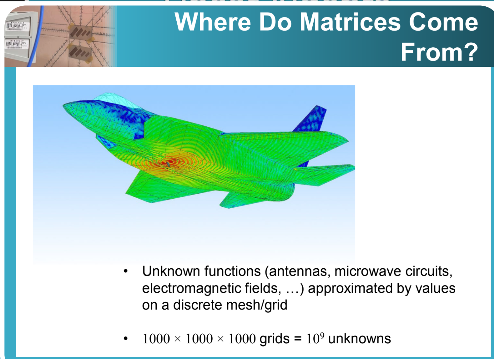

### **1. 元数据 (Metadata)**

*   **标题:** 线性代数 (Linear Algebra) / 矩阵代数与应用 (Matrix Algebra and Its Applications) - Chapter 0: Overview
*   **作者:** 陈晏笙 教授 (Prof. Yen-Sheng Chen) | 国立台北科技大学 电子工程系
*   **来源链接:** [單元 1．線性代數課程導論 - YouTube](https://www.youtube.com/watch?v=FwV5hoXJ8C8&list=PL68D2uCy1WTNz4hadNnAXaFmb9_0fvDzg)
* [Title Unavailable \| Site Unreachable](https://drive.google.com/file/d/1Rw-zOKOfk60Ga0tvH7UXp0RHABGUu_uU/view)

---

### **2. 概览 (Overview)**

本课程名为“矩阵代数与应用”，实际上是针对研究生及高年级本科生开设的进阶“线性代数”课程。陈晏笙教授在课程综述中指出，虽然大多数工科学生在大一或大二都修过线性代数，但往往因其抽象的数学证明而忽略了其在实际工程中的强大应用。本课程的核心宗旨在于“去抽象化”，通过具体的应用场景（如影像处理、电磁波模拟、机器学习等）和具有逻辑性的架构，重新诠释矩阵与向量的意义。课程将以高斯消去法为起点，贯穿向量空间、正交性、行列式、特征值与特征向量，最终汇聚于“奇异值分解 (SVD)”这一核心主题，旨在培养学生以矩阵代数为工具解决复杂工程问题的能力。

---

### **3. 主题详解 (Thematic Breakdown)**

#### **3.1 课程定位与核心理念：为什么要再学一次线性代数？**

*   **课程名称的由来：**
    虽然课程名为“矩阵代数与应用”，但其本质就是线性代数（Linear Algebra）。改名的原因在于强调**应用 (Applications)** 与**具体化 (Concrete)**，区别于传统数学系或大一基础课中侧重抽象定义与繁琐证明的教学方式。
*   **线性代数的双重层面：**
    *   **内部层面 (Internal):** 线性代数本身是一个纯净、优美且逻辑严密的学科。它具有极高的完整性，各个章节环环相扣。
    *   **外部层面 (External):** 它是所有工程领域的基石。无论是微积分、微分方程，还是现代的信号处理、电磁学、AI，都需要矩阵和向量作为基础语言。
*   **教授的个人经历：**
    陈教授坦言自己在学生时代也曾痛恨线性代数，认为其充斥着抽象的矩阵运算和证明。直到博士班时期，为了解决研究问题（如电波工程中的数值模拟），被迫重新审视这门学科，才发现其真正的价值。本课程的设计目标，就是为了让那些曾经对线性代数感到困惑或痛苦的学生，能通过全新的、具象的视角重新掌握这一工具。

#### **3.2 为什么要学习线性代数？(从函数到矩阵)**

陈教授通过“系统”与“函数”的概念来解释线性代数的必要性：

> [!note]
> 本质上这是一个**信号与系统**的问题
> 一个输入，与一个输出之间的关系，被我们称为系统

*   **系统的本质：**
    在工程与科学中，我们关注的是“输入 (Input)”与“输出 (Output)”之间的关系。描述这种关系的过程或系统，数学上称为**函数 (Function)**。
    *   记作：$y = f(x)$，其中 $x$ 是输入，$y$ 是输出。

*   **最简单的函数——线性函数：**
    回顾数学学习历程，我们会遇到各种函数：
    *   二次函数 ($y=x^2$)
    *   立方函数 ($y=x^3$)
    *   根号函数 ($y=\sqrt{x}$)
    *   三角函数 ($y=\sin x$)
    *   指数函数 ($y=e^x$)
    *   **线性函数 ($y=ax+b$)**：这是所有函数中最基础、最简单的一种，仅由**乘法**与**加法**组成。
> [!note]
> 最简单的函数就是**线性方程**
> 但是已经足够有用，能够线性近似，能够预测事件

*   **非线性问题的线性化 (Linearization):**
    即使面对复杂的非线性曲线（如不规则波动），如果我们只关注某一个微小的局部区间，该曲线可以用一条切线（直线）来近似。
    *   **核心思想：** 只要范围足够小，复杂的非线性关系都可以用线性关系来近似。如果你连最简单的线性关系（输入与输出成比例或线性组合）都无法掌握，就更不可能理解复杂的非线性系统。

*   **多变量系统与矩阵的引入：**
    现实世界的问题通常不是单变量的，而是多输入、多输出的。
    *   **例子：** 一个教室内的温度 ($T$) 和压力 ($P$) 可能会随着位置 ($x, y, z$) 和时间 ($t$) 变化。这涉及多个输入变量。
    *   **线性组合 (Linear Combination):** 当有多个输入 ($x_1, x_2, \dots, x_m$) 和多个输出 ($y_1, y_2, \dots, y_n$)，且它们之间满足线性关系（即输出是输入的加权和）时，我们可以用一个紧凑的数学工具来描述这种关系——**矩阵 (Matrix)**。
    *   公式化表达：$y = Ax$。在这里，$A$ 就是矩阵，它包含了系统将输入转换为输出的所有转换系数。了解矩阵 $A$，就等于了解了整个系统。
> [!note]
> 在很多时候，我们的变量是多变量
> 比如教室刚刚开空调，那么空间中温度并不是均匀的。

#### **3.3 矩阵的实际应用场景**

为了证明矩阵无处不在，教授列举了几个具体的工程应用：

> [!note]
> 这就是一个从**系统**角度来理解线性代数的地方
> 现在有一个雷达发射信号x，然后通过飞机进行特殊反射A，那么电流就会改变，另一个天线就会得到信号y

1.  **电磁波与雷达模拟 (Electromagnetics & Radar):**
    *   在模拟隐形战机或天线时，需要计算电磁波在金属表面的散射。
    *   **网格化 (Mesh):** 工程师会将连续的物体表面切割成无数个微小的网格（例如 1000 x 1000 x 1000 个网格）。
    *   每个网格上的电流分布就是一个未知数。要解出这 $10^9$ 个未知数，本质上就是在解一个巨大的线性方程组（矩阵运算）。这对应了马克斯威方程组 (Maxwell's Equations) 的离散化版本。

2.  **影像处理 (Image Processing):**
    *   **数据量级：** 一张 4K (UHD) 图片的分辨率约为 $3840 \times 2160$，即约 800 万个像素。如果是视频，每秒可能有 24 或 60 帧。
    *   **数据压缩：** 面对每秒数亿笔的数据（例如从火星传回地球），不可能直接传输原始数据。我们需要通过线性代数的方法（如 SVD），找出数据中的关键特征，用极少量的数据（如从 2 亿笔压缩到 30 万笔）来近似原始图像，同时保持高保真度。

3.  **统计与机器学习 (Statistics & Machine Learning):**
    *   **鉴往知来：** 统计学的核心是利用历史数据预测未来。
    *   **最小二乘法 (Least Squares):** 当我们有 40 笔历史数据，想要预测第 41 笔时，我们需要建立一个模型。这通常涉及到在数据点中拟合一条直线或曲线，其背后的数学工具正是线性代数中的投影与最小二乘解。这也是现代 AI 和机器学习训练过程的基础。

#### **3.4 课程大纲与架构 (Syllabus)**

本课程分为六个紧密相连的章节，形成一个完整的逻辑闭环：

1.  **矩阵与高斯消去法 (Matrices and Gaussian Elimination):**
    *   这是基础中的基础（相当于篮球的运球）。
    *   学习如何系统性地解线性方程组。
    *   **LU 分解 (Factorization of A=LU):** 理解矩阵运算的底层逻辑。

2.  **向量空间 (Vector Spaces):**
    *   探讨矩阵的四个基本子空间 (Four Fundamental Subspaces)。
    *   这是理解矩阵“内涵”的关键，从几何角度理解线性方程组的解的结构。

3.  **正交性 (Orthogonality):**
    *   探讨向量之间的垂直关系。
    *   **核心应用：** 投影 (Projection) 与 最小二乘法 (Least Squares)。这是解决无解方程组（如数据拟合）的最佳策略。

4.  **行列式 (Determinants):**
    *   教授认为这是现代线性代数中“相对不重要”的章节，但在传统教材中必须提及。
    *   它是一个过渡章节，主要用于后续特征值的计算。

5.  **特征值与特征向量 (Eigenvalues and Eigenvectors):**
    *   这是矩阵分析的分水岭，进入更深层次的系统特性分析。
    *   探讨对角化 (Diagonalization) 及其应用。

6.  **奇异值分解 (Singular Value Decomposition, SVD):**
    *   **课程的高潮 (Climax):** SVD 是线性代数的“大一统”理论。
    *   它可以处理任何矩阵（无论是否方阵、是否可逆），并将其分解为最本质的成分。
    *   前五个章节的所有知识最终都将汇聚于此，SVD 是许多工程应用（如影像压缩、主成分分析 PCA）的核心算法。

#### **3.5 评分标准与教学资源**

*   **评分策略 (Grading Policy):**
    *   **期中考 (Midterm):** 50%
    *   **期末考 (Final):** 50%
    *   **补救机制：** 教授实施“期末考覆盖制”。如果期末考成绩高于期中考，期末考分数可以取代期中考分数（即期末考占 100%）。这鼓励学生即使前半段没学好，只要最后融会贯通（掌握 SVD），依然可以获得高分。

*   **教材 (Texts):**
    *   主要参考：Gilbert Strang, *Introduction to Linear Algebra* (及 *Linear Algebra and Its Applications*).
    *   教授深受 MIT 教授 Gilbert Strang 的影响，课程设计逻辑与其 OCW (OpenCourseWare) 课程高度一致。

*   **致谢 (Acknowledgement):**
    *   特别致谢台大工工所的陈正刚教授 (Prof. Argon Chen)。陈晏笙教授表示，正是陈正刚教授在他博士班期间不仅通过线性代数启蒙了他，还在研究上给予了无私的指导，改变了他对这门学科的看法。本课程的讲义编制深受陈正刚教授教学逻辑的启发。

---

### **4. 框架与思维模型 (Frameworks & Mental Models)**

#### **4.1 输入-系统-输出 模型 (Input-System-Output Model)**

*   **概念：** 将任何工程问题视为一个处理信息的“盒子”。
*   **应用：**
    *   **输入 ($x$):** 无论是时间、电压、像素值还是历史数据，都将其向量化（排列成列向量）。
    *   **系统 ($A$):** 系统对输入的处理规则（放大、缩小、旋转、投影等）被封装在一个矩阵 $A$ 中。
    *   **输出 ($y$):** 处理后的结果。
*   **价值：** 通过研究矩阵 $A$ 的性质（如是否可逆、特征值、奇异值），我们可以直接预测系统的行为，而无需每次都代入具体的数字去计算。

#### **4.2 线性近似思维 (Linear Approximation Mindset)**

*   **概念：** 世界上大部分问题是非线性的（复杂的曲线），直接求解非常困难。但如果我们聚焦于微小的局部，非线性问题可以被视为线性问题。
*   **组件：**
    *   **切线/切面：** 用直线代替曲线，用平面代替曲面。
    *   **迭代：** 通过不断的线性求解来逐步逼近非线性解。
*   **应用：** 这是微积分、数值分析以及工程模拟（如电磁场网格计算）的核心思想。线性代数提供了处理这些局部线性化问题的工具。

#### **4.3 大一统视角 (Grand Unification via SVD)**

*   **概念：** 学习是一个从碎片化到系统化的过程。线性代数的许多概念（行空间、列空间、特征值、正交基）在学习初期看似独立。
*   **模型：** **奇异值分解 (SVD)** 是将所有这些概念串联起来的终极框架。
*   **应用：** 教授建议学生在学习过程中，以前面的章节为积木，最终目标是构建出 SVD 这座大厦。一旦掌握了 SVD，就意味着掌握了矩阵最本质的特征，前面的所有知识点都会变得清晰且具有关联性。

