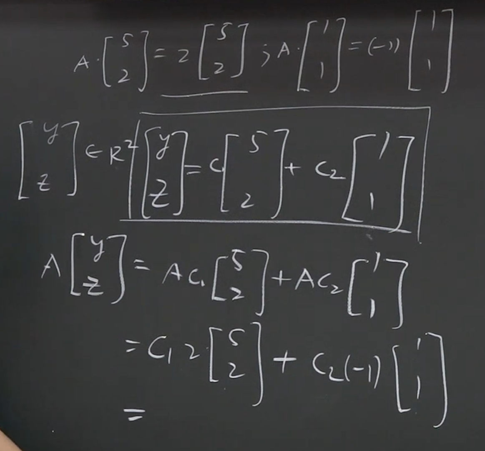
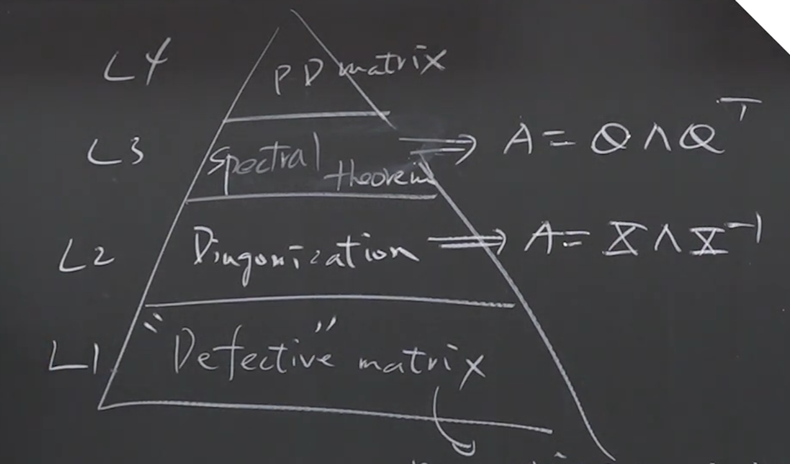
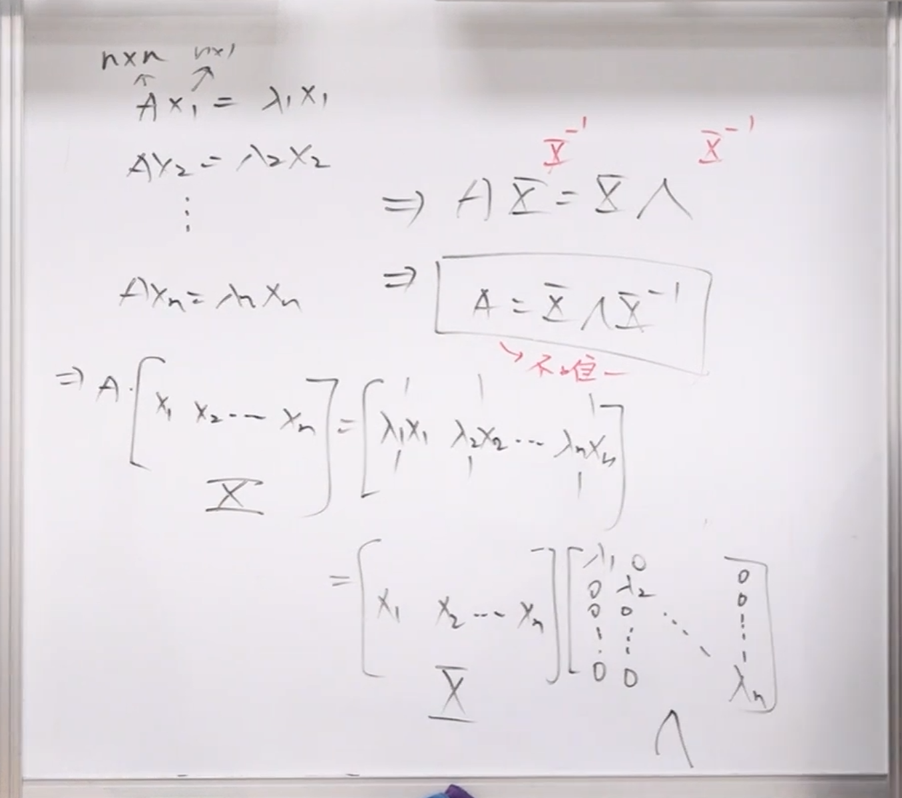
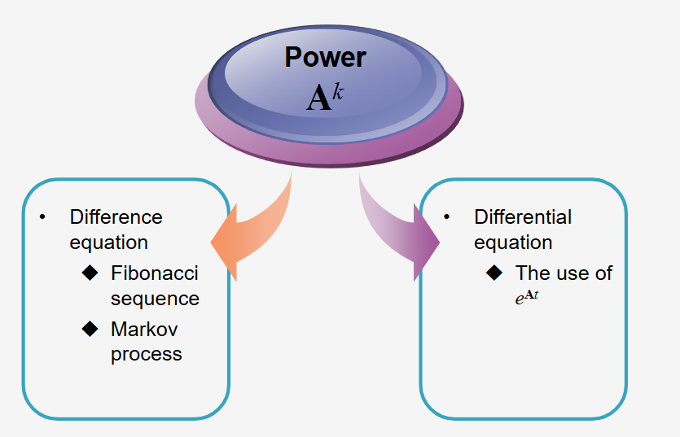

### 1. 核心元数据
*   **标题:** 线性代数 - 特征值与特征向量 (Eigenvalues and Eigenvectors)
*   **讲者:** 陈晏笙 教授 (国立台北科技大学 电子工程系)
*   **URL:** [單元 11．特徵值與特徵向量–目的及對角化 - YouTube](https://www.youtube.com/watch?v=sNT67zPKvFI)
* [Chapter5](assets/台北科技大学%20单元11%20特征值与特征向量–目的及对角化/file-20260313101453865.pdf)

---

### 2. 内容概述
本节课进入线性代数第五章的核心主题：**特征值 (Eigenvalues)** 与 **特征向量 (Eigenvectors)**。
陈教授指出，这往往是初学者最容易感到困惑的章节。本课的核心动机在于“化繁为简”：探索如何将庞大、复杂的矩阵线性转换（$Ax = b$），简化为单纯的标量乘法（$Ax = \lambda x$）。
通过寻找矩阵中具有特殊性质的输入向量（特征向量），我们可以极大降低计算复杂度。
课程详细推导了特征值与特征向量的代数求解过程（特征方程式与零空间），剖析了它们的关键数学性质，并最终引出了本章的终极目标——矩阵的对角化（Diagonalization），以及根据对角化能力对矩阵进行的“阶级划分”。

---

### 3. 主题深度解析

#### 主题一：引入与核心动机 —— 为什么要学特征值？
在过去的三分之二个学期中，线性代数主要探讨的是线性转换系统：$Ax = b$。
*   **痛点：** 假设 $A$ 是一个现实世界中巨大的矩阵（例如 $1000 \times 1000$ 甚至更大），为了得到输出响应 $b$，我们需要将巨大的矩阵 $A$ 作用在输入变量 $x$ 上，这需要进行海量的内积运算，计算成本极高。
	* 
> [!note]
> 在现实世界中，所谓的二维矩阵的空间变换几乎是不存在的，上千维度的矩阵规模更为常见。
> 所以我们如果能够找到一个常数$\lambda$ 来代替多次内积的线性转换，将会极大的呃降低运算复杂度
> [file-20260313101453865, p.4](./台北科技大学 单元11 特征值与特征向量–目的及对角化.assets/file-20260313101453865.pdf)

<mark style="background:#b1ffff">特别注意，只能在方阵中使用</mark>
*   **破局思路：** 我们能否找到某种**非常特殊的输入变量 $x$**，使得它在经过庞大的矩阵 $A$ 转换后，其结果仅仅等同于原来的自己乘上一个简单的倍数？
*   **核心公式：** $Ax = \lambda x$
    *   庞大的矩阵线性转换被简化为了一个单一常数 $\lambda$ 乘上自身。
    *   这个神奇的常数 $\lambda$ 就被称为 **特征值 (Eigenvalue)**。
    *   那个满足此特殊条件的输入向量 $x$ 就被称为 **特征向量 (Eigenvector)**。
    *   *注：术语中的 "Eigen" 源自德文，意为“自身的、固有的、内在的”。它表示这是该矩阵本身所固有的特质。*
    * [file-20260313101453865, p.5](./台北科技大学 单元11 特征值与特征向量–目的及对角化.assets/file-20260313101453865.pdf)

#### 主题二：特征值与特征向量的代数求解法 (The Two-Step Method)
如果 $Ax = \lambda x$ 成立，且 $x$ 不能是零向量（零向量没有意义），我们该如何求解 $\lambda$ 和 $x$？陈教授给出了一套标准推导与求解流程：

**第一步：求特征值 $\lambda$ (特征方程式)**
1.  将公式移项：$Ax - \lambda x = 0$。
2.  提取公因式 $x$。由于 $A$ 是矩阵，$\lambda$ 是常数，不能直接相减，需要引入单位矩阵 $I$ (Identity Matrix)：$(A - \lambda I)x = 0$。
3.  要让这个方程式有非零的 $x$ 解（非平凡解），矩阵 $(A - \lambda I)$ 必须是**奇异矩阵 (Singular Matrix)**，即它必须包含零空间 (Nullspace)，且不可逆。
4.  奇异矩阵的充要条件是其行列式为零。因此得出 **特征方程式 (Characteristic Equation)**：
    $$\det(A - \lambda I) = 0$$
    解这个多项式方程式，就能得到所有的特征值 $\lambda$。

**第二步：求特征向量 $x$ (零空间向量)**
1.  求出 $\lambda$ 后，将其逐一代入回矩阵 $(A - \lambda I)$ 中。
2.  此时，求解 $(A - \lambda I)x = 0$ 中的 $x$，本质上就是**去寻找矩阵 $(A - \lambda I)$ 的零空间 (Nullspace)**。
3.  利用高斯消去法求出该零空间的基底向量，这些向量就是对应于该特征值的 **特征向量 (Eigenvector)**。
    *   *要点提示：* 特征向量代表的是一个“方向”。因此，求出的特征向量乘上任何非零倍数，依然是该特征值的特征向量（因为它只看重方向，不在乎长度）。
特别注意Nullspace的求法，[[台北科技大学 单元4 列空间与零空间]]
知道如何求零空间变得格外重要

##### Why Eigenvectors Are Useful?
<mark style="background:#b1ffff">世界上最好的bases</mark>
1. 正交bases
2. 特征向量bases
因为使用特征向量作为bases，那么一个由这些bases组成的$x$,在进行$AX$ 的时候，运算会变得非常简单。

所以，这产生了一个更加重要的问题，<mark style="background:#ff4d4f">特征向量需要能够span整个空间</mark>
在这个新的世界里，Singular和Nonsingular变得没有那么重要。
重要的事情是<mark style="background:#ff4d4f">特征向量需要足够多，多到能够支持</mark>$R^n$ 
> [!PDF|red] [[pages/assets/台北科技大学 单元11 特征值与特征向量–目的及对角化/file-20260313101453865.pdf#page=8&selection=27,0,49,2&color=red|file-20260313101453865, p.8]]
> > • If you can find n independent eigenvectors that span Rn, what can you do for all the vectors in this space? 
> > • These eigenvectors form a basis, and the space spanned by these basis vectors is called “eigenspace”
> 
> 

##### 保证找到$n$条Vector的方式
1. 如果特征值都distinct：也就是所有特征值都不一样，那么是ok的。因为一个 $n \times n$ 的方阵一定会产生 $n$ 个特征值,每个特征值至少有一个vector
2. 如果有重根，那么一个根有多条vector，最后加起来有n条，也行
<mark style="background:#b1ffff">所以说，在这里面Singular matrix没那么可怕</mark>

##### 另一种理解
除了简化计算这一种对于特征值和特征向量的理解之外。
还有一种更为传统的理解。
也就是认为这是对一个向量 $x$ ，进行$A$ 线性变换之后
大小可能会改变为$\lambda x$  ，但是方向不会改变的一种变换。
这种向量是一种本质，是属于空间的一种**不变性**
#### 主题三：特征值的重要性质 (Key Properties)
对于一个 $n \times n$ 的方阵 $A$ （只有方阵才有特征值和特征向量），存在以下重要性质：

1.  **数量：** 一个 $n \times n$ 的方阵一定会产生 $n$ 个特征值（这 $n$ 个特征值可能重复，也可能是复数）。
2.  **当特征值为 0 时：** 如果求出的特征值中包含 $0$，说明 $\det(A - 0I) = 0$，即 $\det(A) = 0$。这直接证明了 **原矩阵 $A$ 是一个奇异矩阵 (Singular)**。特征值为 0 的数量，等同于该矩阵的零度 (Nullity，即自由变量的个数)。非零特征值的数量则与矩阵的秩 (Rank) 相关。
3.  **反矩阵 ($A^{-1}$)：** 如果 $A$ 可逆，其反矩阵的特征值是原特征值的倒数（$1/\lambda$），但**特征向量保持完全不变**。
4.  **矩阵的次方 ($A^k$)：** $A^k$ 的特征值是原特征值的 $k$ 次方（$\lambda^k$），且**特征向量同样保持完全不变**。这在解差分方程等高阶运算时极其重要。
5.  **转置矩阵 ($A^T$)：** $A^T$ 与原矩阵 $A$ 拥有**完全相同的一组特征值**，但是它们的**特征向量是不同的**。
6.  **迹数与行列式 (Trace & Determinant)：**
    *   所有特征值的总和 = 矩阵对角线元素之和 = **Trace (迹)**。
    *   所有特征值的乘积 = 矩阵的 **Determinant (行列式)**。

#### 主题四：终极目标 —— 矩阵的对角化与金字塔阶级
陈教授强调，学习这一章的真正目的并非只是算出 $\lambda$ 和 $x$ 的数值，而是为了判断矩阵能否被**对角化 (Diagonalization)**。基于特征向量的表现，矩阵被划分为一个严阶级的“金字塔”：

*   **金字塔底层：瑕疵矩阵 (Defective Matrix)**
    *   **定义：** 虽然能算出特征值（通常伴随重复的特征值），但在求零空间时，**找不到 $n$ 条线性独立的特征向量**的矩阵。
    *   **后果：** 这种矩阵“残缺不全”，无法凑齐构成 $n$ 维空间的基底 (Basis)。因此，**它无法被对角化**，在应用上最难处理。

*   **金字塔中层：可对角化矩阵 (Diagonalizable Matrix)**
    *   **定义：** 如果一个 $n \times n$ 矩阵能够提供 **$n$ 条线性独立的特征向量**。
    *   **优势：** 这 $n$ 条特征向量可以组成 $n$ 维空间的基底。我们可以将这些特征向量排成一个矩阵 $X$（特征向量矩阵），从而将原矩阵 $A$ 分解为：
        $$A = X \Lambda X^{-1}$$
        （其中 $\Lambda$ 是由特征值组成的对角矩阵）。所有复杂的 $A$ 的运算，都可以转化为极简的 $\Lambda$ 对角矩阵的运算。

*   **金字塔顶层：完美矩阵 (具有谱定理 Spectral Theorem 的矩阵)**
    *   **定义：** 例如对称矩阵 (Symmetric Matrix)。
    *   **优势：** 这种矩阵不仅能找到 $n$ 条独立的特征向量，而且这 $n$ 条特征向量**天然互相垂直 (Orthogonal)**。
    *   此时对角化公式会进化为 $A = Q \Lambda Q^T$（其中 $Q$ 是正交矩阵，反矩阵 $Q^{-1}$ 直接等同于转置矩阵 $Q^T$），这在工程和纯数学中都是最优美、最好算的形态。
- 最上层
	- PD matrix: 天龙人
#### 5. 对角化分解

##### 对角化的条件
> [!Requirements for diagonalization]
> [[pages/assets/台北科技大学 单元11 特征值与特征向量–目的及对角化/file-20260313101453865.pdf#page=20|file-20260313101453865, p.20]]
> Independent eigenvectors 
>  If all eigenvalues are distinct, all eigenvectors are independent the matrix can be **diagonalized** 
>  However, for repeated eigenvalues, it is still possible to find independent eigenvectors ^n33a

##### 对角化的应用

###### 求解幂次问题
几乎所有求$x^n$的题目都可以用来

如果一个矩阵 $A$ 可以对角化，它可以表示为：

$$A = X \Lambda X^{-1}$$
其中，$X$ 的列是特征向量，$\Lambda$ 是对角线上为特征值的对角矩阵。
当我们计算 $A^k$ 时：
$$A^k = (X \Lambda X^{-1})(X \Lambda X^{-1}) \dots (X \Lambda X^{-1})$$
中间的 $X^{-1}X$ 会相互抵消（等于单位矩阵 $I$），最终简化为：
$$A^k = X \Lambda^k X^{-1}$$
> **结论：** 只需要将中间对角矩阵的特征值进行 $k$ 次方运算即可。

---

### 4. 核心思维模型与框架提取

#### 1. "等效替换" 降维打击模型 ($Ax \rightarrow \lambda x$)
*   **模型描述：** 面对一个高维度、高复杂度的系统（巨大的矩阵 $A$ 乘以向量 $x$），不直接进行蛮力运算。而是去寻找系统的“固有频率/内在方向”（特征向量）。
*   **应用启示：** 在这个特定的方向上，复杂系统的作用被降维成了一个最简单的拉伸或压缩操作（乘以标量 $\lambda$）。这在工程计算、图像处理（如特征脸分离）、物理震动分析中，是用来大幅降低计算量（降维）的基础心法。

#### 2. "矩阵金字塔" 分类模型
*   **模型描述：** 评估一个线性系统（矩阵）的好坏，不看它的数值大小，而是看它“能否提供足够多独立的特有视角（特征向量）”。
    *   *无用视角 (Defective)*：无法提供描述完整空间所需的足够特征向量。
    *   *合格视角 (Diagonalizable)*：提供了足够的独立视角，可以重构整个空间（对角化）。
    *   *完美视角 (Symmetric/Orthogonal)*：提供的视角不仅足够，而且彼此完全不干涉（互相垂直），计算成本降至最低。
*   **应用启示：** 这是一个系统健康度评估模型。我们在设计工程系统时，总是期望系统矩阵能够落在金字塔的顶端或中端，极力避免遇到“瑕疵矩阵”。

#### 3. 代数求解的双步框架
*   **步骤一 (找倍率)：** 令 $\det(A - \lambda I) = 0$，解出所有的特征值（寻找系统可能的“放大/缩小倍率”）。
*   **步骤二 (找方向)：** 将倍率代回，求 $(A - \lambda I)$ 的零空间 (Nullspace) 得到特征向量（寻找在这个特定倍率下，系统到底在哪个“方向”上起作用）。
*   **结合点：** 此框架将第四章（行列式）与第二章（零空间求解）完美串联，是解决线性代数核心问题的标准SOP。

---
