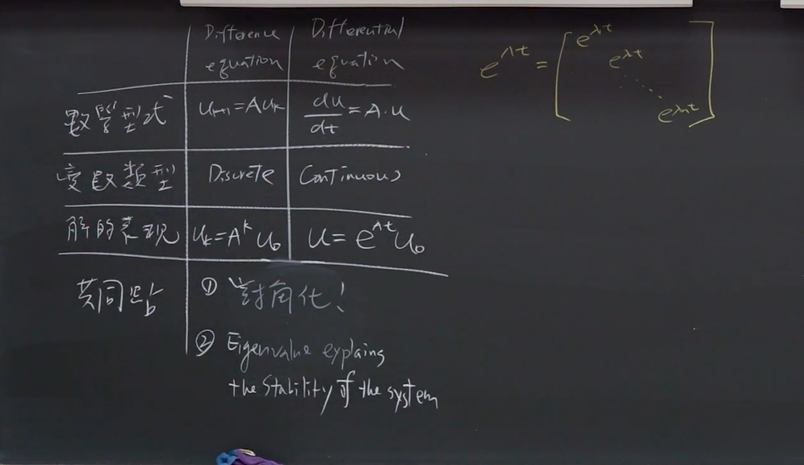

**标题：** 线性代数：特征值与特征向量的应用（差分方程、马可夫过程与矩阵指数）
**作者：** 陈晏笙 教授 (国立台北科技大学 电子工程系)
**影片连结：** [單元 12．特徵值與特徵向量–對角化的應用 - YouTube](https://www.youtube.com/watch?v=eWv-IPfQkIk)

---

### 内容概述

本课程深入探讨线性代数中「特征值（Eigenvalues）」与「特征向量（Eigenvectors）」的实际应用。陈晏笙教授首先回顾了特征值与特征向量的核心动机——将高维度矩阵的线性转换，简化为纯量乘法，大幅降低计算复杂度。接著，课程展示了如何透过矩阵「对角化（Diagonalization）」来求解动态系统问题，包括离散时间的「差分方程（Difference Equations）」（如费波那契数列与马可夫过程），以及连续时间的「微分方程（Differential Equations）」（涉及矩阵指数的计算）。最后，教授总结了如何透过特征值来判断系统的稳定性，并分享了快速寻找特征值的实用数学技巧。

---

### 主题拆解与详细内容

#### 1. 特征值与特征向量的核心动机
在线性代数中，我们经常需要处理输入向量 $x$ 经过矩阵 $A$ 的线性转换，得到输出向量 $Ax$。当矩阵 $A$ 非常庞大（例如 $1000 \times 1000$）且需要进行多次转换（例如 $A^k x$）时，直接相乘的计算量会非常惊人。

特征值与特征向量的发明正是为了解决这个问题。对于一个矩阵 $A$，如果我们能找到特定的向量 $x$（即**特征向量**），使得 $A$ 作用在 $x$ 上时，其效果等同于纯量 $\lambda$（即**特征值**）乘上 $x$：
$$Ax = \lambda x$$
那么，高维度的矩阵乘法就被简化成了简单的纯量倍数放大或缩小。
<mark style="background:#ff4d4f">但是，仅仅能够对eigenvector实现这种简化计算实在是太过与特殊化。</mark>
<mark style="background:#ff4d4f">所以我们想到了将eigenvector作为bases来组成其他的空间中的向量。</mark>
<mark style="background:#ff4d4f">这样，任一能够被组合的向量都能够享受到大规模矩阵变换的简化运算。</mark>
<mark style="background:#ff4d4f">在这个世界中，Singular不再是评价一个矩阵优劣的标准，而是是否有足够的eigenvector能够覆盖整个空间变得更加重要。</mark>
**对角化的关键前提：**
*   对于一个 $n \times n$ 的矩阵 $A$，必定存在 $n$ 个特征值。
*   但这 $n$ 个特征值**不一定**能对应到 $n$ 个「线性独立（Linearly Independent）」的特征向量。
*   如果我们找不到 $n$ 个独立的特征向量，该矩阵被称为 **「瑕疵矩阵（Defective Matrix）」**。此类矩阵无法享有特征值系统带来的简化优势，属于对角化金字塔中最底层、最难处理的特例。
*   反之，若能找到 $n$ 个独立的特征向量，它们就能组成该 $n$ 维空间的**基底（Basis）**。此时，空间中的任何输入向量 $x$ 都可以写成这些特征向量的线性组合：
    $$x = c_1 x_1 + c_2 x_2 + \dots + c_n x_n$$
    经过 $A$ 转换后，输出即为：
    $$Ax = c_1 \lambda_1 x_1 + c_2 \lambda_2 x_2 + \dots + c_n \lambda_n x_n$$
    这将原本复杂的变换彻底简化。
本质上是要<mark style="background:#b1ffff">实现一个线性转换的简化</mark>
#### 2. 应用一：差分方程（Difference Equations）
差分方程用于描述离散时间下，状态如何从这一步演进到下一步（即旧状态与新状态的更新）。其一般形式为：
$$u_{k+1} = A u_k$$
给定初始状态 $u_0$，经过 $k$ 次迭代后，第 $k$ 个状态为：
$$u_k = A^k u_0$$
如果手动计算 $A^k$，计算量极大。但若运用对角化与特征向量基底的概念，我们将 $u_0$ 写成特征向量的线性组合（$u_0 = c_1 x_1 + \dots + c_n x_n$），则第 $k$ 步的解可以直接写为：
$$u_k = c_1 (\lambda_1)^k x_1 + c_2 (\lambda_2)^k x_2 + \dots + c_n (\lambda_n)^k x_n$$
其中，系数矩阵 $c$ 的求法为：$c = X^{-1} u_0$（$X$ 为特征向量组成的矩阵）。如此一来，$A^k$ 的计算就转化为求特征值的 $k$ 次方，瞬间解决了计算难题。
<mark style="background:#ff4d4f">对于这种题目有两种解法</mark>
1. 矩阵对角化，使用公式拆为特征矩阵和特征值矩阵的乘积
2. 线性组合：更加**推荐**，因为可以展现本质，也就是认为是eigen vector作为bases，求系数的一种方法。
#### 3. 案例分析：费波那契数列与黄金比例
费波那契数列（Fibonacci sequence：0, 1, 1, 2, 3, 5, 8...）是一个经典的差分方程应用。其规则为「前两项相加等于下一项」：$F_{k+2} = F_{k+1} + F_k$。
[file-20260313101453865, p.26](./台北科技大学 单元12 对角化的应用.assets/file-20260313101453865.pdf)
为了将其转化为矩阵形式，我们引入一个平庸方程式（<mark style="background:#ff4d4f">Trivial equation</mark>）$F_{k+1} = F_{k+1}$，建构出以下系统：【这个方程是构建整个等式的关键】
$$ \begin{bmatrix} F_{k+2} \\ F_{k+1} \end{bmatrix} = \begin{bmatrix} 1 & 1 \\ 1 & 0 \end{bmatrix} \begin{bmatrix} F_{k+1} \\ F_k \end{bmatrix} $$
此时，矩阵 $A = \begin{bmatrix} 1 & 1 \\ 1 & 0 \end{bmatrix}$。
透过求解特征方程式 $\det(A - \lambda I) = \lambda^2 - \lambda - 1 = 0$，可以得到两个特征值：
*   $\lambda_1 = \frac{1 + \sqrt{5}}{2} \approx 1.618$ （此即著名的**黄金比例 Golden Ratio**）
*   $\lambda_2 = \frac{1 - \sqrt{5}}{2} \approx -0.618$

**数学与自然的奇妙巧合：**
当 $k$ 趋近于无穷大时，由于 $|\lambda_2| < 1$，$(\lambda_2)^k$ 会收敛至 0，可忽略不计。因此，相邻两项费波那契数的比例 $\frac{F_{k+1}}{F_k}$ 最终会由主导特征值 $\lambda_1$ 决定，亦即收敛于黄金比例 $1.618$。这解释了为何向日葵种子排列、黄金螺旋（Golden Spiral）等自然现象中，总是出现费波那契数列与黄金比例的关联。

#### 4. 案例分析：马可夫过程（Markov Process）
马可夫矩阵用来描述系统在不同状态之间转移的机率。
**马可夫矩阵的两大特性：**
1.  **各行元素相加皆等于 1**（Column sums to 1）：代表机率守恒。
2.  **矩阵中必定有一个特征值为 1**（$\lambda = 1$）。
<mark style="background:#40a9ff">这个性质可以泛化</mark>
也就是如果每一行相加都等于同一个数值，那么这个数就必定是特征值
**范例解析（人口迁徙问题）：**
假设每年有 10% 的台北市外人口搬入台北市，有 20% 的台北市内人口搬出。这可以写成矩阵：
$$ A = \begin{bmatrix} 0.9 & 0.2 \\ 0.1 & 0.8 \end{bmatrix} $$
*註：第一行为台北外，第二行为台北内。*
运用上述特性，我们不需解特征方程式就能知道：
*   $\lambda_1 = 1$（马可夫矩阵必有此特征值）。
*   利用「特征值之和等于矩阵对角线元素之和（迹数 Trace = 0.9 + 0.8 = 1.7）」的技巧，可知 $\lambda_2 = 0.7$。

**系统的稳定状态（Steady State）：**
当时间 $k$ 非常大时，由于 $\lambda_2 = 0.7 < 1$，对应的项 $(0.7)^k$ 会衰减至 0。系统最终的状态完全由 $\lambda_1 = 1$ 对应的特征向量决定。这代表经过极长时间后，台北内外的人口比例将达到一个动态平衡（例如：总人口的 2/3 在外，1/3 在内），不再随时间改变。

#### 5. 应用二：微分方程与矩阵指数（Matrix Exponential）

[file-20260313101453865, p.36](./台北科技大学 单元12 对角化的应用.assets/file-20260313101453865.pdf)
有别于差分方程的离散时间，**微分方程**处理的是连续时间系统：
$$ \frac{du}{dt} = Au $$
这是一阶线性常微分方程组。其解的形式为：
$$ u(t) = e^{At} u(0) $$
这里的难点在于：**如何计算一个矩阵的指数 $e^{At}$？**

我们必须利用泰勒展开式（Taylor Series）来定义矩阵指数：
$$ e^{At} = I + At + \frac{(At)^2}{2!} + \frac{(At)^3}{3!} + \dots $$
同样地，透过对角化 $A = X \Lambda X^{-1}$，可以将矩阵指数转化为对角矩阵的指数：
$$ e^{At} = X e^{\Lambda t} X^{-1} $$
其中，$e^{\Lambda t}$ 是一个对角矩阵，其对角线元素即为 $e^{\lambda_1 t}, e^{\lambda_2 t}, \dots$。
最终系统的通解为：
$$ u(t) = c_1 e^{\lambda_1 t} x_1 + c_2 e^{\lambda_2 t} x_2 + \dots + c_n e^{\lambda_n t} x_n $$
只要找出特征值与特征向量，就能完美解出连续时间的动态系统。

#### 6. 系统稳定性分析总结（System Stability）
特征值的大小直接决定了系统（无论是离散还是连续）在时间推移下的稳定性。

*   **离散时间系统（差分方程 $A^k$）：**
    *   **稳定（Stable / 衰减至 0）：** 所有特征值的绝对值均小于 1 ($|\lambda| < 1$)。
    *   **中性稳定（Neutrally Stable / 达到稳态不变）：** 最大特征值的绝对值等于 1 ($|\lambda| = 1$)。
    *   **不稳定（Unstable / 发散爆掉）：** 存在至少一个特征值的绝对值大于 1 ($|\lambda| > 1$)。

*   **连续时间系统（微分方程 $e^{\lambda t}$）：**
    *   **稳定（Stable / 衰减至 0）：** 所有特征值的**实部**均小于 0 ($Re(\lambda) < 0$)。
    *   **中性稳定（Neutrally Stable / 震荡或达到稳态）：** 所有特征值实部小于等于 0，且至少有一个为 0 ($Re(\lambda) \le 0$ 且存在 $Re(\lambda) = 0$)。虚部则决定其是否呈弦波震荡。
    *   **不稳定（Unstable / 发散爆掉）：** 存在至少一个特征值的**实部**大于 0 ($Re(\lambda) > 0$)。

#### 7. 找特征值与特征向量的捷径与技巧
在面对工程与大考的矩阵时，教授提供了一些不需硬解特征方程式（$\det(A - \lambda I) = 0$）的捷径：

1.  **迹数与行列式定理：**
    *   所有特征值之和 = 矩阵的迹数（Trace，主对角线元素之和）。
    *   所有特征值之乘积 = 矩阵的行列式值（Determinant）。
2.  **零空间（Null Space）判断法：**
    *   如果矩阵 $A$ 是奇异矩阵（Singular matrix，例如某行与某行线性相依，或各行相加等于特定常数时，透过列运算会出现全零列），则 $\det(A) = 0$，这意味著必定有**至少一个特征值 $\lambda = 0$**。
    *   若能找到非零的 $x$ 使得 $(A - \lambda I)x = 0$，则该 $\lambda$ 即为特征值，而 $x$ 是零空间向量（即特征向量）。例如：马可夫矩阵各列加总为 0 时，可知其必定奇异，进而推导出 $\lambda=1$ 为其特征值。
3.  **对称矩阵（Symmetric Matrix）特性：**
    *   只要 $A^T = A$，该矩阵必可对角化。
    *   对应于不同特征值的**特征向量彼此必然正交（Orthogonal）**。这在计算反矩阵 $X^{-1}$ 时，能将其简化为转置矩阵 $X^T$，大幅节省计算时间（将在后续单元详述）。

---

### 框架与思维模型：特征值对角化解题框架

本课程展示了一个用以解决线性动态系统的标准化思维模型：**「对角化解题四步法」**。

不论面对的是离散时间（差分方程）还是连续时间（微分方程），都可依循以下框架求解：

*   **Step 1: 建立系统矩阵模型**
    *   将问题的文字描述转化为矩阵形式。例如将前两项相加转化为 $u_{k+1} = A u_k$，或将微分关系转化为 $du/dt = Au$。
*   **Step 2: 提取系统特征（寻找特征值与特征向量）**
    *   利用 $\det(A - \lambda I) = 0$ 或上述的实用捷径（Trace、Determinant、Markov特性等）找出所有的特征值 $\lambda$。
    *   解出 $(A - \lambda I)x = 0$ 对应的特征空间（零空间），找出 $n$ 个独立的特征向量 $x$。
*   **Step 3: 转换初始条件（分解向量）**
    *   将给定的初始状态 $u_0$ 投影到特征向量构成的基底上。
    *   即求解线性组合：$u_0 = c_1 x_1 + c_2 x_2 + \dots + c_n x_n$。可以利用矩阵反运算 $\mathbf{c} = X^{-1} u_0$ 求出常数系数 $c_i$。
*   **Step 4: 写出时间演进的通解**
    *   对于差分方程，通解为：$u_k = \sum c_i (\lambda_i)^k x_i$
    *   对于微分方程，通解为：$u(t) = \sum c_i e^{\lambda_i t} x_i$
    *   观察 $\lambda_i$ 的数值，直接判断当 $k \to \infty$ 或 $t \to \infty$ 时，系统中哪些项会衰减至 0、哪些项会保留成为稳态，进而完成系统行为预测。

----
