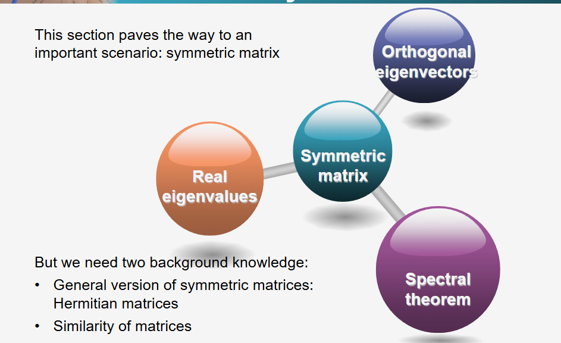
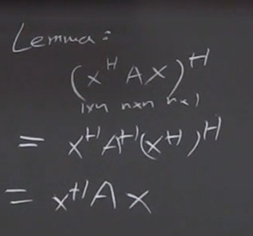
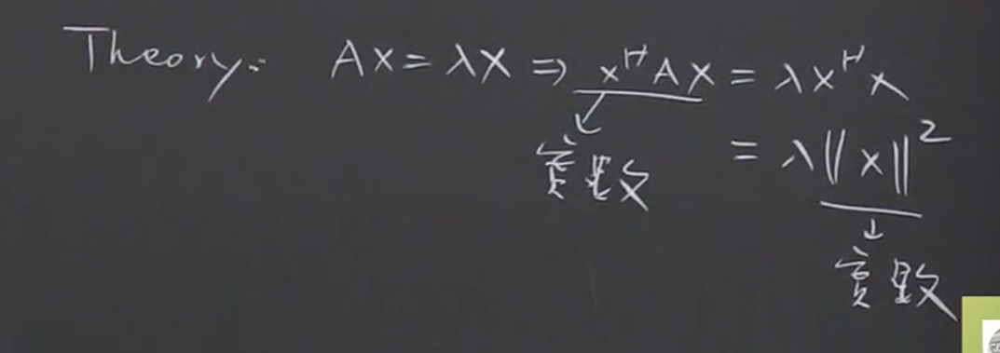
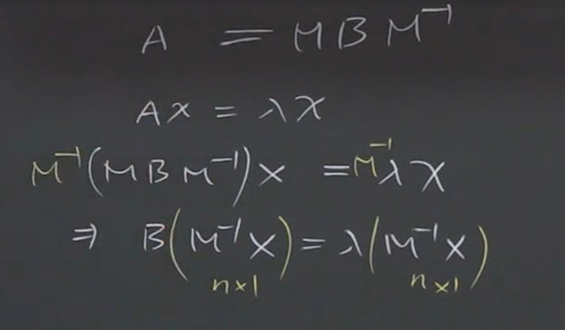
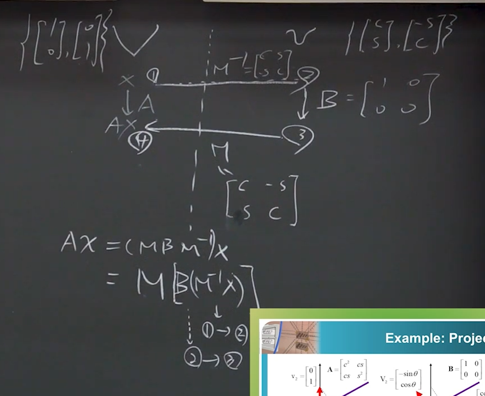
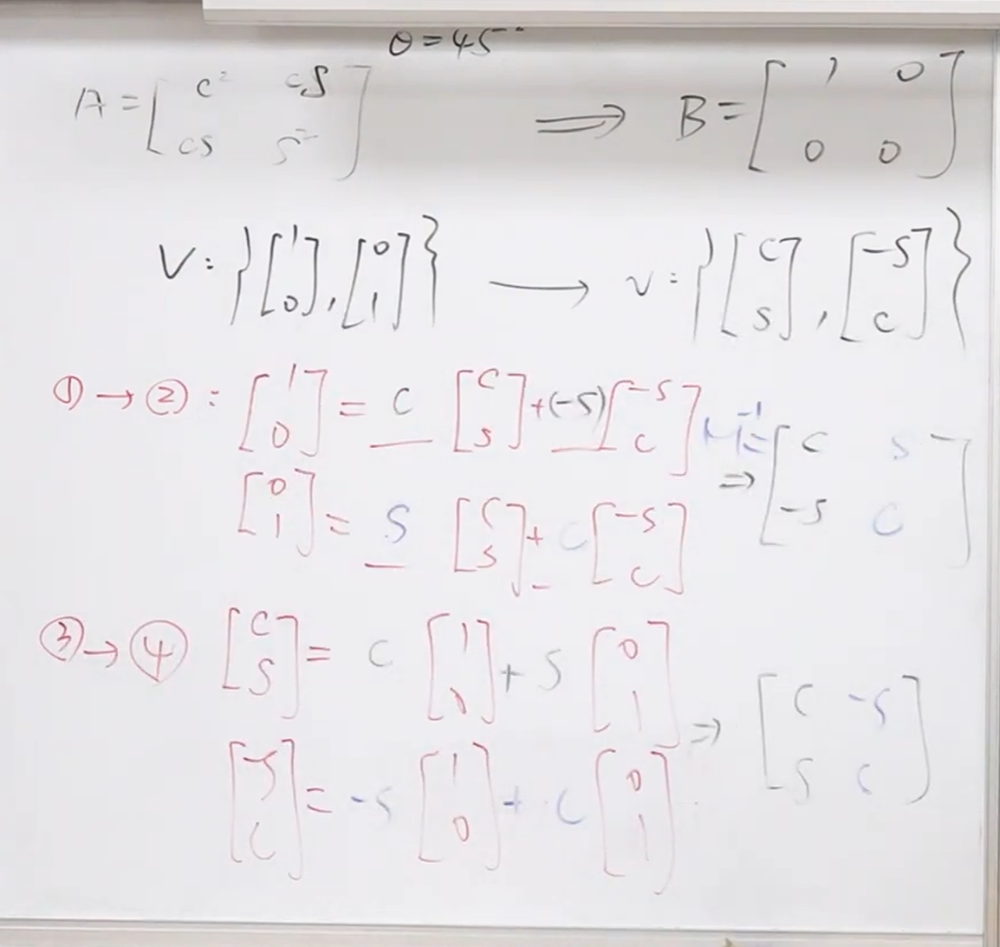

**作者：** VidBee_原文 / 课程讲师
**链接：** [單元 13．特徵值與特徵向量–頻譜定理 - YouTube](https://www.youtube.com/watch?v=vayj4ljDH8U)

## 视频概述
本课程深入探讨了线性代数中特征值（Eigenvalue）与特征向量（Eigenvector）的顶级应用——**谱定理（[[谱定理|Spectral Theorem]]，也称频谱定理）**。

讲师首先通过“矩阵金字塔”模型回顾了矩阵对角化的层级，指出谱定理所代表的第三层矩阵不仅能被对角化，其特征向量还绝对正交。
为了推导谱定理，课程引入了两个关键的前置知识：第一是将实数域空间（$R^n$）拓展到复数域空间（$C^n$），引入了埃尔米特（Hermitian）转置与三种特殊的复矩阵；
> 之所以推广到复数域，更重要的是确保对**任一数**都满足这些条件

第二是相似矩阵（Similar Matrices）的物理意义。
最终，通过[[舒尔引理]]（Schur's Lemma）的证明，水到渠成地揭示了谱定理的核心本质：对称矩阵（或正规矩阵）不仅可以拥有相互正交的特征向量基底，还能被分解为按特征值加权的秩为1的投影矩阵之和，宛如三棱镜将白光色散为不同波长的光谱。

---

## 主题内容拆解

### 1. 矩阵特征向量的“世界观”金字塔
为了理解特征向量的价值，讲师提出了一个三层的“金字塔世界观”。输入向量能否写成特征向量的线性组合，决定了矩阵在线性系统中的应用价值。
*   **底层（Layer 1）：缺陷矩阵（Defective Matrices）。** 这类方阵虽然有 $N$ 个特征值，但无法找到 $N$ 条线性独立的特征向量，应用场景极少。
*   **中层（Layer 2）：可[[矩阵对角化]]矩阵。** 只要矩阵拥有 $N$ 条独立的特征向量，它就能被对角化，写成 $A = X \Lambda X^{-1}$ 的形式（$\Lambda$ 为特征值组成的对角阵，$X$ 为特征向量矩阵）。斐波那契数列、马尔可夫矩阵、矩阵指数等应用皆源于此。
*   **顶层（Layer 3）：满足谱定理的矩阵。** 某些特殊的矩阵不仅能找到 $N$ 条独立的特征向量，而且**这些特征向量彼此正交（垂直）**。正交化后的特征向量构成了正交矩阵 $Q$。因为正交矩阵的逆等于其转置（$Q^{-1} = Q^T$），矩阵可以被优雅地写成 $A = Q \Lambda Q^T$。

### 2. 前置准备一：进入复数域空间（$C^n$ 空间）
要彻底理解谱定理，必须先跨越实数域（Real number, $R$），进入复数域（Complex number, $C$）。
*   **共轭的必要性：** 在实数系中，一个数的平方或绝对值的平方就是自己乘自己。但在复数系中，求复数绝对值的平方（以及计算向量的长度/范数 Norm），必须是 **该复数与其共轭复数（Complex Conjugate）相乘**。
*   **埃尔米特转置（Hermitian Transpose）：** 过去求实数向量的内积或范数使用的是转置（Transpose, $u^T v$）。进入复数域后，**所有涉及到转置的操作，都必须同时伴随“取共轭”**。这种“先取共轭再转置”的操作被称为埃尔米特转置（通常记作 $A^H$）。
*   **复数内积的计算：** 在复向量空间中，两个向量 $u$ 和 $v$ 的内积不再是 $u^T v$，而是 $u^H v$。需注意的是，在复数域中，$u^H v \neq v^H u$，两者相差一个共轭。
[file-20260313101453865, p.42](./台北科技大学 单元13 特征值与特征向量–频谱定理.assets/file-20260313101453865.pdf)
### 3. 三种特殊的复数矩阵及其特征性质
实数域中的三种特殊矩阵（对称矩阵、反对称矩阵、正交矩阵），在复数域中有其对应的高阶版本：

| **类别**              | **对称性质 (Symmetric)**                              | **反对称性质 (Skew-symmetric)**                        | **正交/酉性质 (Orthogonal/Unitary)**                   |
| ------------------- | ------------------------------------------------- | ------------------------------------------------- | ------------------------------------------------- |
| **实数版本**            | 对称矩阵 (Symmetric)                                  | 反对称矩阵 (Skew-symmetric)                            | 正交矩阵 ($Q$)                                        |
| **复数版本**            | 埃尔米特矩阵 (Hermitian)                                | 反埃尔米特矩阵 (Skew-Hermitian)                          | 酉矩阵 ($U$)                                         |
| **定义**              | $A^H = A$                                         | $A^H = -A$                                        | $U^H = U^{-1}$                                    |
| **特征值 ($\lambda$)** | 实数 (Real)                                         | 纯虚数 (Purely imaginary)                            | 模长为 1                                             |
| **特征向量**            | 不同特征值对应的特征向量**必定垂直** ($\lambda_1 \neq \lambda_2$) | 不同特征值对应的特征向量**必定垂直** ($\lambda_1 \neq \lambda_2$) | 不同特征值对应的特征向量**必定垂直** ($\lambda_1 \neq \lambda_2$) |
| **分解 (第三层)**        |                                                   | $A = Q \Lambda Q^T$ $A = U \Lambda U^H$           |                                                   |
> [!PDF|yellow] [[pages/assets/台北科技大学 单元11 特征值与特征向量–目的及对角化/file-20260313101453865.pdf#page=49&selection=0,0,74,31&color=yellow|file-20260313101453865, p.49]]
> > • Eigenvalue of a Hermitian matrix: real, which represents decay 
> > • Eigenvalue of a skew-Hermitian: purely imaginary, which represents oscillation 
> 
> 
#### A. 埃尔米特矩阵 (Hermitian Matrix)
*   **定义：** 满足 $A^H = A$ 的矩阵。它是实对称矩阵在复数域的推广。对角线元素必须是实数。
*   **性质 1：** 对于任意复数向量 $x$，二次型 $x^H A x$ 必定是实数。
	* 
*   **性质 2（核心）：** 其**特征值必定是实数**。即使矩阵元素是复数，其特征值也绝对是实数。
	* 
*   **性质 3（核心）：** 来自**不同特征值的特征向量必定互相正交**。
	* $A=Q\lambda Q^T$ 

• Symmetric complex matrix 
• A real symmetric matrix is a special case of Hermitian matrices 
• The diagonal must be purely real
> [!note]
> 一个反直觉的事实是，对称矩阵在现实生活中的应用比人们想象的更广
> 在统计学和通信领域，对称关系都是非常重要的。

#### B. 反埃尔米特矩阵 (Skew-Hermitian Matrix)
*   **定义：** 满足 $A^H = -A$ 的矩阵。对角线元素必须是纯虚数或零。
*   **性质：** 二次型 $x^H A x$ 必定是纯虚数。其**特征值必定是纯虚数**。同样，来自不同特征值的特征向量必定互相正交。
> [!note]
> 任意一个矩阵都可以表示为一个[[Hermitian Matrices]]与一个[[Skew-hermitian matrix]]之和。
* 虽然我认为这个表述有些像[[奇信号]]和[[偶信号]]可以组成任意信号一样

#### C. 酉矩阵 (Unitary Matrix)
*   **定义：** 满足 $U^H U = I$（即 $U^{-1} = U^H$）的矩阵。它是实[[正交矩阵]]在复数域的推广。
*   **性质 1（保角与保长）：** 向量被酉矩阵作用后，其长度（范数）不变，两个向量之间的夹角（内积）不变。
*   **性质 2：** 其**特征值的绝对值（大小）必定为 1**。
*   **性质 3：** 来自不同特征值的特征向量必定互相正交。

### 4. 前置准备二：[[相似矩阵]]（Similarity）及其物理意义
判定两个矩阵是否“同源”，就像查验DNA一样，而**矩阵的DNA就是特征值**。
*   **代数定义：** 如果存在一个可逆矩阵 $M$，使得 $A = M B M^{-1}$，则称矩阵 $A$ 与 $B$ 互为**相似矩阵**。相似矩阵拥有完全相同的特征值。
	* 
*   **物理（几何）意义：**<mark style="background:#b1ffff"> 相似矩阵本质上是在执行**完全相同的线性转换**（例如都在做投影操作）</mark>，**区别仅仅在于选择的基底（Basis）不同**。
*   **操作流程理解：** $A = M B M^{-1}$ 可以理解为：先用 $M^{-1}$ 将当前空间的向量转换到另一个容易处理的基底空间中；在该空间下用 $B$ 执行实际的线性转换；转换完成后，再用 $M$ 把结果转换回原来的基底空间。改变基底，可以让原本复杂的矩阵运算（如复杂的投影阵）变成包含大量零的极简矩阵。
	* [[Circuit Theory 台北科技大学 lec36 拉普拉斯转换的电路分析 - 复频域简介及其电路法则]]
	* [[傅立叶级数]]
		* <mark style="background:#b1ffff">结论：如果两个矩阵互相相似，那么它们执行的操作是完全一样的线性转换，只是组成它们的beses不同而已</mark>
		* <mark style="background:#d3f8b6">应用：通过这个公式，相当于，我们能够在无限个平行世界里创造新的**洛基**</mark>
	* 
#### 4.1 投影矩阵作为范例
> 先将1-2，进入到另一个域中（因为这样可能会使得操作更加简便，就和拉普拉斯变换一样）
> 然后2-3，在这个domain中进行运算
> 最后3-4，转回到原本的domain中
[file-20260313101453865, p.53](./台北科技大学 单元13 特征值与特征向量–频谱定理.assets/file-20260313101453865.pdf)

### 5. 舒尔引理 (Schur's Lemma)
这是推导谱定理的终极工具。舒尔引理揭示了任何矩阵都有一个极其优秀的“变体”（相似矩阵）。
*   **定理内容：** 对于**任何**方阵 $A$（无需是对称或正交矩阵），都存在一个酉矩阵（正交矩阵）$U$，使得 $U^H A U = T$。其中 $T$ 是一个**上三角矩阵（Upper Triangular Matrix）**。
*   **深刻内涵：** 
    1. 任何矩阵都可以通过正交基底的转换，变成一个上三角矩阵。
    2. 这个上三角矩阵的对角线元素，正是原矩阵 $A$ 的**特征值**。
*   **证明思路：** 利用数学归纳法与[[Gram-Schmidt 正交化]]过程（Gram-Schmidt Process）。通过找出一个特征向量，将其扩充为空间的正交基，将原矩阵转换为块上三角形式，然后对右下角的子矩阵不断递归该过程，最终由一连串正交矩阵相乘得到最终的酉矩阵 $U$。

### 6. 谱定理 / 频谱定理 (The Spectral Theorem)
当舒尔引理遇到“对称矩阵”（或埃尔米特矩阵）时，奇迹发生了，这就是谱定理的由来。
*   **推导逻辑：** 舒尔引理说明 $U^H A U = T$。如果 $A$ 是埃尔米特矩阵（$A = A^H$），我们对等式两边取埃尔米特转置，左边 $(U^H A U)^H$ 依然等于 $U^H A U$；但右边的上三角矩阵 $T$ 转置后应该变成下三角矩阵。一个矩阵既是上三角又是下三角，说明它**只能是对角矩阵（Diagonal Matrix）**。
*   **核心结论：** 任何对称矩阵/埃尔米特矩阵，不仅一定能被对角化（即便特征值有重复，也保证能找到足够多且相互独立的特征向量），而且其**特征向量保证可以相互正交**。即：$A = Q \Lambda Q^T$（实数域）或 $A = U \Lambda U^H$（复数域）。
[file-20260313101453865, p.56](./台北科技大学 单元13 特征值与特征向量–频谱定理.assets/file-20260313101453865.pdf)
#### 谱定理的“光谱拆解”视角（为什么叫Spectral Theorem）
利用矩阵乘法的列观点（Building Blocks），$A = Q \Lambda Q^T$ 可以被展开为：
$$A = \lambda_1 q_1 q_1^T + \lambda_2 q_2 q_2^T + \dots + \lambda_n q_n q_n^T$$
其中 $q_i q_i^T$ 是一个秩为 1 的投影矩阵。
**物理隐喻：** 就像牛顿用三棱镜将白光色散成不同波长（频率）的彩虹光谱一样，一个复杂的对称矩阵 $A$，被完美地“拆解”成了若干个基础子成分（投影矩阵）的叠加，而每个子成分的“权重”或“波长”，正是对应的特征值 $\lambda$。这也是特征值（Eigenvalue）在数学中被赋予希腊字母 $\lambda$（代表波长）的深刻历史原因。

### 7. 正规矩阵 (Normal Matrix)
在金字塔第三层的矩阵（具备谱定理性质）不仅仅是对称矩阵，只要满足特定条件的矩阵都处于这一层。
*   **定义：** 凡是满足 $A^H A = A A^H$ 的矩阵，统称为**正规矩阵**。
*   **包容性：** 埃尔米特矩阵、反埃尔米特矩阵、酉矩阵，全部满足这个定义，因此它们都是正规矩阵，它们的特征向量都相互正交，都适用谱定理。

---

## 核心框架与思维模型 (Frameworks & Mental Models)

### 1. 矩阵特征向量的“世界观金字塔”模型
这个模型用于评估方阵在线性代数系统中的“优劣”与可用性：
*   **底层：有缺陷（Defective）。** 特征向量数量不足，无法张成全空间，无法对角化。
*   **中层：可对角化（Diagonalizable）。** 拥有足够数量的独立特征向量作为基底，可实现 $A = X \Lambda X^{-1}$，极大简化矩阵的高次幂运算。前提通常是特征值互不相同。
*   **顶层：谱定理（Spectral/Normal）。** 不仅特征向量数量足够，而且自动相互垂直（正交）。矩阵可写成 $A = Q \Lambda Q^T$。此时即便特征值重复，也绝对不会跌入底层。

### 2. 矩阵的“DNA鉴定”与变体模型 (相似性理论)
*   **概念：** 两个表面数字完全不同的矩阵 $A$ 和 $B$，如果它们的特征值完全相同，它们就是“变体”（相似矩阵）。
*   **思维映射：** 永远不要把矩阵只当成一堆数字，要把矩阵看作是**一种特定的几何动作（如投影、旋转）**。数字的不同，仅仅是因为观察这个动作的“参考系（基底）”不同。通过 $M B M^{-1}$ 这个“过去-执行-回来”的三步走框架，我们可以通过切换参考系，让复杂的计算在最简单的形态（矩阵包含大量0）下完成。

### 3. 三棱镜色散模型 (谱定理的直观表达)
*   **模型机制：** 将复杂的对称矩阵运算，视为一束复合光。矩阵的特征向量 $q_i$ 构成了基础的投影维度（相当于不同颜色的光轨：$q_i q_i^T$），而特征值 $\lambda_i$ 则是该维度上的强度/波长。
*   **应用价值：** 在现实工程中（如统计学中的主成分分析 PCA、通信工程中的多端口网络 S参数），我们经常遇到对称阵（协方差矩阵等）。谱定理允许我们将极其庞大复杂的数据交互阵列，无损地拆解为几个相互独立、毫不干涉的特征维度的线性叠加，从而提取主要特征，滤除噪音。

----
