## **1. 元数据 (Metadata)**

*   **Title:** 线代代数：矩阵的特征阶层架构、乔登标准型与正定矩阵
*   **Author:** [[陈晏笙]] 教授 (国立台北科技大学 电子工程系)
*   **URL:** [單元 14．特徵值與特徵向量–正定矩陣 - YouTube](https://www.youtube.com/watch?v=BWhmlvI75W0)

---

## **2. 内容概述 (Overview)**

本节课程是线性代数第五章的总结，陈晏笙教授从“特征值（Eigenvalue）与特征向量（Eigenvector）”的视角出发，独创性地提出了一个“矩阵阶层金字塔”模型，将所有的方阵按照其性质的优劣和特征向量的独立性划分为不同的层级。课程详细探讨了金字塔的最底层——无法被对角化的“瑕疵矩阵（[[Defective Matrix]]）”及其替代方案“乔登标准型（Jordan Form）”的求解方法；随后跨越至金字塔的顶端，深入剖析了最完美的“正定矩阵（Positive Definite Matrix）”的代数判定条件（如特征值、枢轴、行列式）及其对应的几何物理意义（如椭球体）。本课不仅梳理了代数运算的逻辑，更建立了代数与几何空间转换的直觉架构。

---

## **3. 主题拆解与详细内容 (Thematic Breakdown)**

### 主题一：矩阵的特征阶层金字塔模型 (The Matrix Hierarchy Pyramid)

教授为了让学生直观理解不同方阵在特征值体系下的表现，构建了一个分为四个层级的金字塔模型（此为教授根据教学经验总结的框架）。所有 $n \times n$ 的方阵必定拥有 $n$ 个特征值，但并非所有方阵都拥有 $n$ 个独立的特征向量。
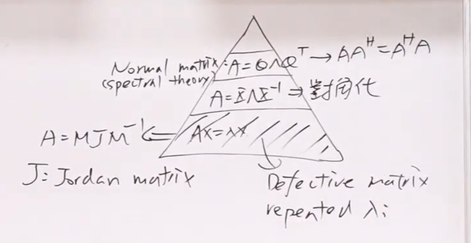
*   **第一层（底层）：瑕疵矩阵 ([[Defective Matrix]])**
    *   这类矩阵**无法找到** $n$ 条独立的特征向量。其必然包含重复的特征值（Repeated Eigenvalues），且重复特征值对应的特征空间维度不足。
    *   这类矩阵无法被对角化（Diagonalization），只能退而求其次，寻找其“乔登标准型（Jordan Form）”。
*   **第二层：可对角化矩阵 (Diagonalizable Matrix)**
    *   若矩阵的 $n$ 个特征值完全相异（Distinct），则必定能找到 $n$ 条独立的特征向量。
    *   这类矩阵可以完美进行对角化，即写成 $A = S \Lambda S^{-1}$ 的形式，以此将庞大的线性转换简化为对角线上的纯量乘法。
*   **第三层：正規矩陣 (Normal Matrix)**
    *   不仅可以对角化，其特征向量之间还保证**相互正交（Orthogonal）**。
    *   判断条件为：$A^H A = A A^H$（其中 $A^H$ 为共轭转置，即 Hermitian）。
    *   该层级包含了对称矩阵（Symmetric Matrix）、反对称矩阵（Skew-symmetric Matrix）以及正交矩阵（Orthogonal Matrix）。该层级的矩阵拥有谱定理（Spectral Theory）的强大性质：即使特征值重复，也必定能找到互相垂直的特征向量，且如果矩阵是对称的，其特征值必定为实数。
*   **第四层（顶层）：[[正定矩阵]] (Positive Definite Matrix)**
    *   除了拥有第三层对称矩阵的所有完美性质外，它还附加了一个极其苛刻的条件：所有的特征值必须**严格大于零（实数且为正）**。
    *   这是整个方阵体系中最完美、最具应用价值的矩阵。

---

### 主题二：底层探究 —— 乔登标准型 ([[Jordan Form]]) 与广义特征向量

当矩阵落入金字塔底层（瑕疵矩阵），即遇到特征值重复且独立特征向量不足时，数学家乔登（Jordan）发明了一种让矩阵“尽可能接近对角化”的表达形式，即 **$A = M J M^{-1}$**。
> 这是一种给底层仔-[[Defective Matrix]]一些对角化的假象。
> 就好像是给残疾人装上了假肢一样，看起来像是正常人，但实际上不是。
> 这也正是 金字塔 模型的残酷之处。
> [[[陈晏笙]]老师和我一样，都觉得这好像是一种施舍](https://youtu.be/BWhmlvI75W0)
> 这让layer2，3，4看起来都好像是[[Jordan Form]]的特殊形式，看起来大家都好像是平等的。
> [[矩阵对角化]]是有用的[[台北科技大学 单元12 对角化的应用]]
> 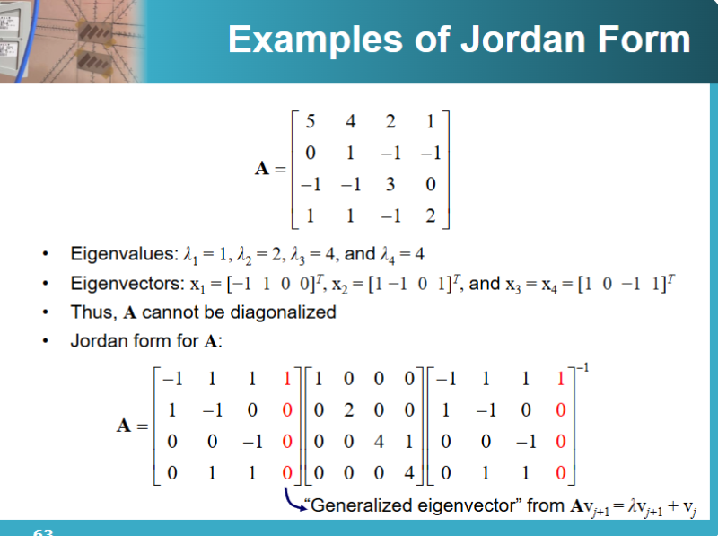
#### 1. 乔登矩阵 $J$ 的结构
$J$ 被称为乔登矩阵，它是由若干个“乔登区块（Jordan Block）”沿对角线排列而成的块状对角矩阵。
*   如果一个特征值没有重复，其乔登区块就是一个 $1 \times 1$ 的标量。
*   如果一个特征值<mark style="background:#d3f8b6">重复</mark>了 $k$ 次，且只有一个对应的特征向量，那么它对应的乔登区块是一个 $k \times k$ 的矩阵。该区块的**主对角线全为该特征值 $\lambda$**，而**主对角线上方的次对角线（Superdiagonal）全为 1**，其余位置全为 0。
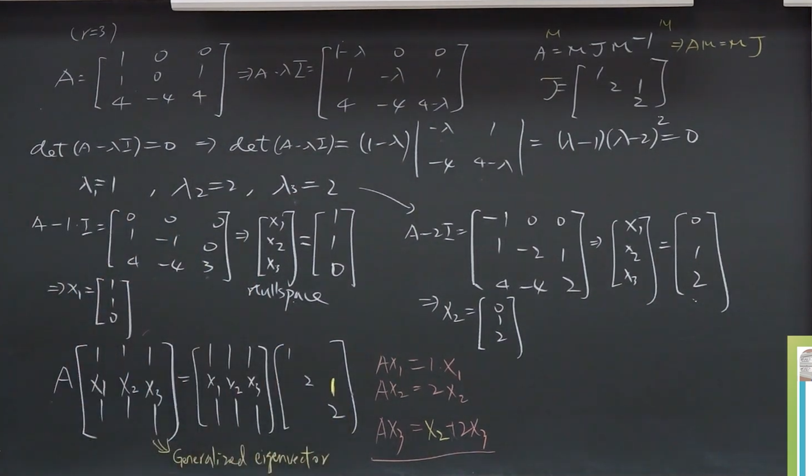
#### 2. 广义特征向量 ([[Generalized Eigenvector]]) 的求解步骤
由于常规的特征向量不足以构成转换矩阵 $M$，我们需要寻找“广义特征向量”来填补空缺。以寻找 $3 \times 3$ 乔登区块对应的三个向量为例：
*   **Step 1（寻找常规特征向量 $x_1$）：** 解 $(A - \lambda I)x_1 = 0$。此时 $x_1$ 位于 $(A - \lambda I)$ 的零空间（Nullspace）中，它是常规的特征向量。
*   **Step 2（寻找第一个广义特征向量 $x_2$）：** 设定方程式 $(A - \lambda I)x_2 = x_1$ 并求解 $x_2$。
*   **Step 3（寻找第二个广义特征向量 $x_3$）：** 设定方程式 $(A - \lambda I)x_3 = x_2$ 并求解 $x_3$。
*   **组装转换矩阵 $M$：** 将解得的 $x_1, x_2, x_3$ 按顺序排列作为列向量，即可形成转换矩阵 $M$。
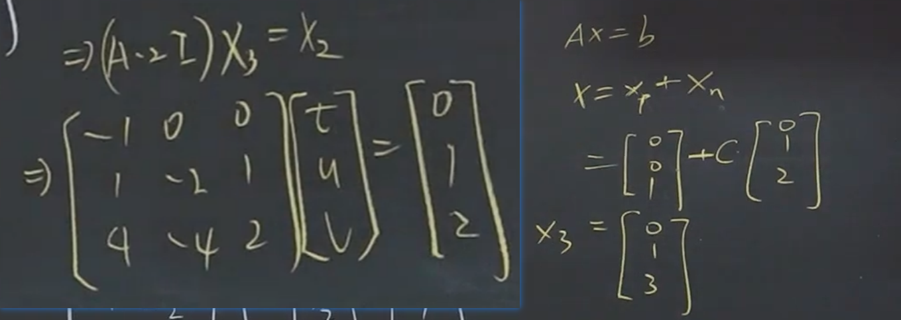
**注意：** $x_2$ 和 $x_3$ 本身并不是特征向量（乘以 $A$ 后方向会改变），它们的存在是为了配合乔登区块中那些“次对角线上的 1”，从而让矩阵结构得以完整保留。

---

### 主题三：顶层探究 —— [[正定矩阵]] (Positive Definite Matrix)

位于金字塔顶端的正定矩阵，必然是对称矩阵。它的核心定义并非仅仅通过特征值来判断，而是通过“[[Quadratic Form|二次型]]（Quadratic Form）”来严谨定义。
> 在前三章，我们认为的 `Good Matrix` 是 `nonsingular matrix`,也就是有唯一解的矩阵。
> 现在的[[正定矩阵|Positive Definite Matrix]]则是更加天龙人的存在，除了在特征值世界中能够满足对角化。
> 同样在那个只有 善恶 的二元世界中，也扮演者 Nonsingular 的友好角色。
> <mark style="background:#d3f8b6">PD是真正的完美矩阵</mark>
> 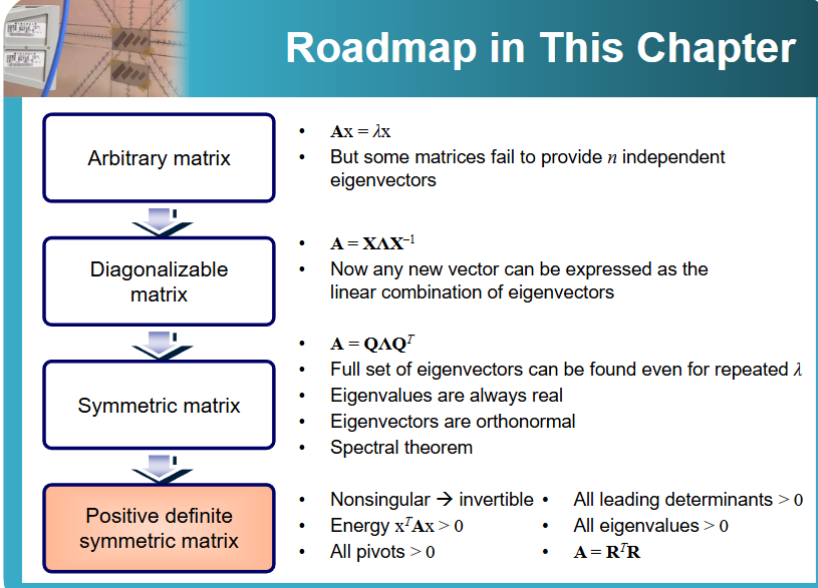

#### 1. 核心定义：二次型 (Quadratic Function)
对于任意非零向量 $x$，如果二次型函数 **$x^T A x > 0$** 恒成立，则对称矩阵 $A$ 即为正定矩阵。
*   *半正定 (Positive Semidefinite):* $x^T A x \ge 0$。
*   *负定 (Negative Definite):* $x^T A x < 0$。
*   *半负定 (Negative Semidefinite):* $x^T A x \le 0$。
*   *不定 (Indefinite):* $x^T A x$ 的值有正有负。
	* 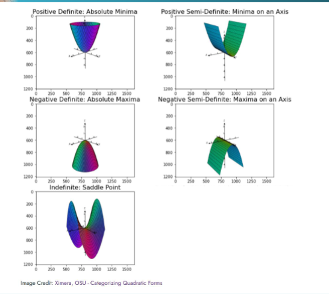

注意，所有的[[对称矩阵]]都可以写成二次函数。
> 为什么需要是$X_T,X$ 
> 因为是二次型，所以要凑成平方
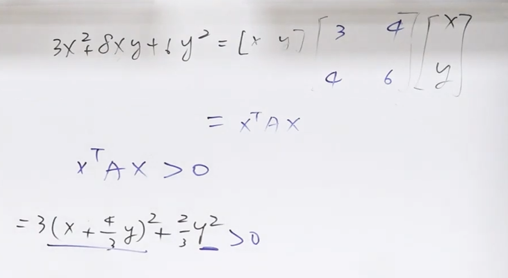
#### 2. 正定矩阵的五种等价判定方法
要证明一个对称矩阵是正定矩阵，除了使用定义外，还可以通过以下四种完全等价的检验方法（只要满足其一，其余必然成立）：
1. 定义法：二次型函数 **$x^T A x > 0$
2.  **特征值检验：** 所有的特征值（Eigenvalues） $\lambda_i$ 必须严格大于 0。
3.  **行列式检验：** 所有从左上角开始的“主子矩阵行列式（Leading Principal Determinants）”必须严格大于 0。
4.  **Pivot检验：** [[高斯消元法]]过程中的所有枢轴（Pivots）必须严格大于 0。
> 这个是最简单的检验方法
5.  **分解检验：** 矩阵 $A$ 必定可以被拆解为 $A = R^T R$ 的形式，且其中 $R$ 必须是行满秩（Full Column Rank）的独立矩阵。
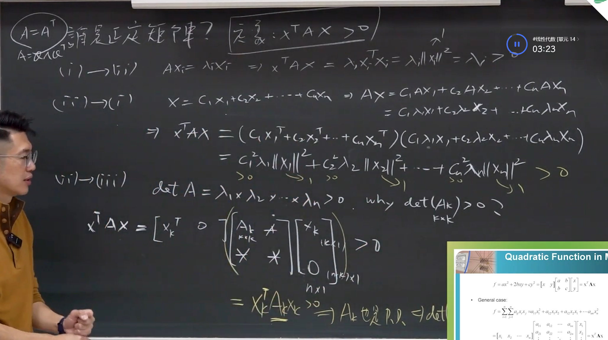
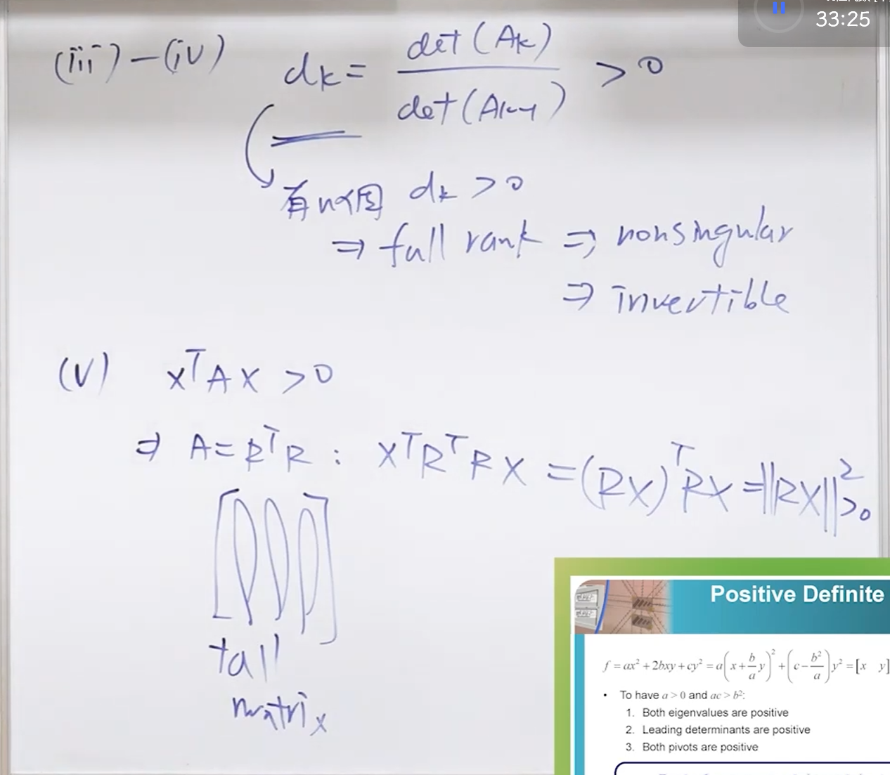

#### 3. 正定矩阵的几何意义：椭球体 (Ellipsoid)
正定矩阵在几何学上有极其直观的对应关系。当我们将二次型设定为定值，即 $x^T A x = 1$ 时，在多维空间中，这个方程式描绘的必然是一个闭合的**椭球体（Ellipsoid）**。
*   **主轴方向（Direction）：** 椭球体的各个主轴方向，正对应着正定矩阵 $A$ 的**特征向量（Eigenvectors）**。由于对称矩阵的特征向量相互正交，因此椭球体的主轴也是相互垂直的。
*   **主轴长度（Length）：** 椭球体在各个主轴上的半轴长度，正对应着 **$1 / \sqrt{\lambda_i}$**（特征值开根号的倒数）。
*   *几何延伸：* 
    *   如果特征值极大，则该方向上的椭球体会非常“扁”（半轴短）。
    *   如果是“半正定矩阵”（含有特征值 0），则某一个方向的轴长趋近于无限大，原本闭合的椭球体会变成两端无限延伸的“圆柱体（Cylinder）”。
    *   如果是“不定矩阵”（特征值有正有负），则图形不再是闭合的椭圆，而会变成呈现双曲线形状的“马鞍面（Saddle 面）”。
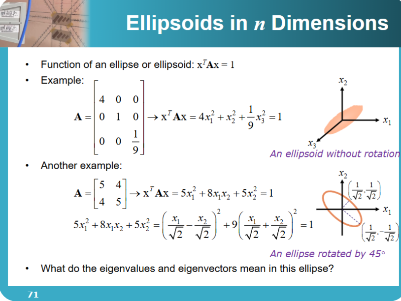
#### 4. [[Positive Semi-Definite]] 半正定矩阵
这是处于第三层[[对称矩阵|Symmetric Matrices]]和第四层[[正定矩阵|Positive Definite Matrix]]之间的**灰色地带**
> 当然，对称矩阵不只有PD和PSD,还有更加一般的情况

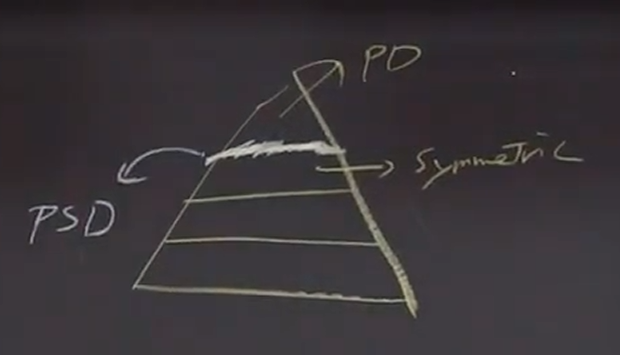

#### 5. 当前模型的限制
我们在Chapter5提到[[特征值|Eigenvalue]]和[[特征向量|eigenvector]]的时候就提到过，
必须要$A$是方阵。
>也就是说，输入和输出的数量是一样多的
>但这并不是一个合理的要求。
>我们在Circuit theory中并不会希望求得的Current和Voltage数量和独立电源一样多。

这会在Chapter6得到解决。

---

## **4. 核心框架与思维模型 (Frameworks & Mental Models)**

### 框架一：矩阵特征阶层金字塔 (The Matrix Eigen-Hierarchy Pyramid)
这是一个用于快速检索和判断方阵代数性质的思维模型。遇到任何一个方阵，可以通过自上而下的漏斗机制来判断其归属：
1.  **判定形状与对称性：** 若不是对称方阵，直接排除顶层和第三层。
2.  **判定二次型/特征值正负（Level 4）：** 若是对称阵，且特征值全正或 $x^T A x > 0$，为**正定矩阵**（拥有所有最完美代数与几何性质）。
3.  **判定正交性（Level 3）：** 满足 $A^H A = A A^H$，为 **[[正规矩阵]]**（特征向量相互正交，适用谱定理）。
4.  **判定对角化可能（Level 2）：** 具有 $n$ 个独立特征向量（如特征值全相异），为**可对角化矩阵**。
5.  **退回底层（Level 1）：** 特征向量数量不足 $n$ 个，为**瑕疵矩阵**，需引入广义特征向量降级使用**乔登标准型**处理。

### 框架二：代数-几何转换映射模型 (Algebra-Geometry Translation Model)
该模型用于将纯粹的代数公式直观映射为物理几何图像，常用于工程、物理和计算机图形学中的稳定性分析或空间转换。
*   **代数输入：** 二次型方程 $x^T A x = 1$（其中 $A$ 为对称正定矩阵）。
*   **转换中枢：** 对矩阵 $A$ 进行特征值分解（求取 $\lambda$ 和 $v$）。
*   **几何输出：**
    *   **核心骨架（旋转）：** 特征向量 $v_1, v_2...v_n$ 决定了该几何体在空间中的旋转角度和基底方向。
    *   **边界延伸（缩放）：** 特征值 $\lambda_i$ 决定了该方向上的扩张限制。半轴长度界定为 $1 / \sqrt{\lambda_i}$。
*   **模型应用意义：** 在控制系统中，正定矩阵形成的“碗状”或“闭合椭球”代表系统能量是收敛的、稳定的（因为无论变量怎么游走，其能量都被包裹在有限空间内）。反之，“不定矩阵”形成的马鞍面代表系统存在发散的风险方向。

---
