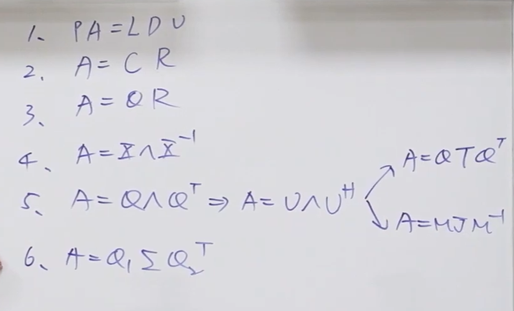
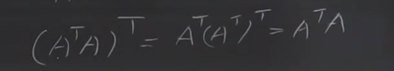
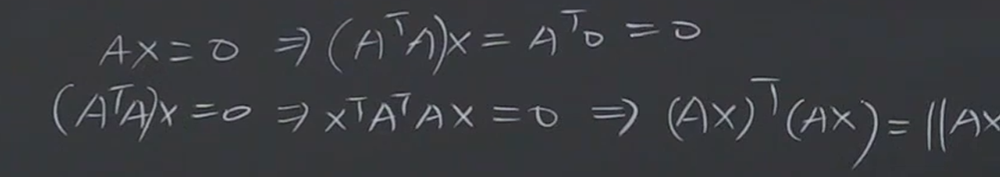
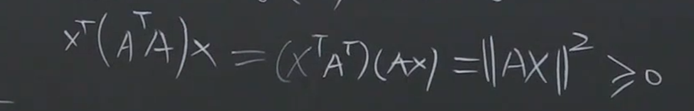
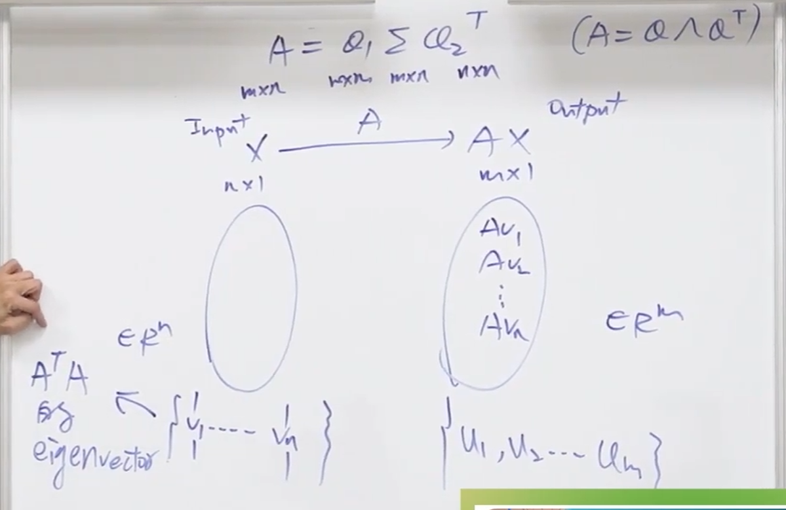
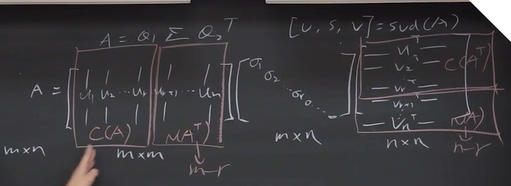
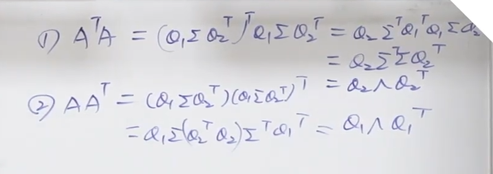
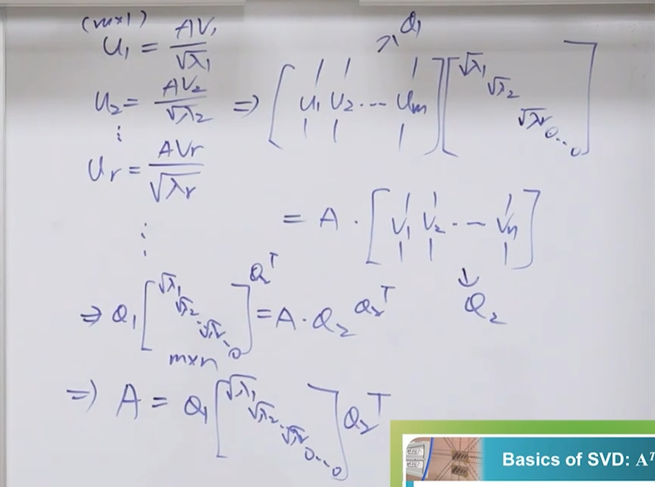

**标题：** 线性代数 - 奇异值分解 (Singular Value Decomposition, [[奇异值分解|SVD]])
**讲者：** [[陈晏笙]] 教授 (国立台北科技大学 电子工程系)
**链接：** [單元 15．奇異值分解–線性代數的大一統理論 - YouTube](https://www.youtube.com/watch?v=gH6cVt8_m9I&t=10s)
- [Chapter6](assets/台北科技大学%20单元15%20奇异值分解/file-20260321091222142.pdf)

---

### 概览 (Overview)

本节课是线性代数课程的最终章，重点介绍了被誉为线性代数界“瑞士军刀”的终极矩阵分解方法——**奇异值分解（Singular Value Decomposition, 简称 SVD）**。陈教授首先全面复习了过去学过的五种矩阵分解方法（LU、CR、QR、特征分解、谱定理）及其局限性。随后，详细推导了 SVD 的核心数学原理，特别是利用 $A^TA$ 和 $AA^T$ 这两个半正定对称矩阵的性质来求解正交矩阵 $Q_1$、$Q_2$ 以及对角矩阵 $\Sigma$。最后，教授深入探讨了 SVD 在实际工程中的三大核心应用：基于主成分分析（PCA）的数据与图像压缩、极分解（Polar Decomposition）以及利用伪逆矩阵（Pseudo-inverse）求解任意线性系统的最佳最小二乘解。

---

### 主题拆解 (Thematic Breakdown)

#### 一、 过去五种矩阵分解方法的复习与局限性

在引入 SVD 之前，我们需要了解为什么还需要一种新的分解方法。过去的五种方法虽然有效，但都带有严苛的前提条件：
[file-20260321091222142, p.4](./台北科技大学 单元15 奇异值分解.assets/file-20260321091222142.pdf)
1.  **LU 分解 ($PA = LDU$)：** 
    基于高斯消元法。用于解方程组，需要找出主元（Pivot），并能借此求出矩阵的秩（Rank）以及四个基本子空间（四大子空间）的基底。
    *   *局限：* 求出的零空间基底等通常不是正交的，不利于后续计算。
2.  **CR 分解 ($A = CR$)：**
    将矩阵分解为列空间（Column space）和行空间（Row space）的基底。
    *   *局限：* 只能得到列空间和行空间，无法直接看出零空间（Null space）和左零空间（Left null space），且基底非正交。
3.  **QR 分解 ($A = QR$)：**
    利用格拉姆-施密特正交化（Gram-Schmidt）将基底转化为规范正交基底（Orthonormal basis）。$Q$ 的列向量是正交且长度为 1 的。
    *   *局限：* 必须基于线性独立的列向量才能进行良好的正交化。
4.  **特征分解 ($A = X\Lambda X^{-1}$)：**
    如果 $n \times n$ 方阵有 $n$ 个线性独立的特征向量（Eigenvector），则可进行对角化。对于复数或对称矩阵，有更高级的扩展（如幺正矩阵 $U$）。
    *   *局限：* 仅适用于**方阵（Square matrix）**。如果是亏损矩阵（Defective matrix，即特征向量数量不足），则无法完全对角化，只能退而求其次使用若尔当标准型（Jordan Form）。
5.  **谱定理 ($A = Q\Lambda Q^T$)：**
    实对称矩阵（Symmetric matrix）的终极形态，保证特征值为实数，且特征向量互相正交。
    *   *局限：* 条件极其严苛，矩阵必须是**对称方阵**。

**总结过往痛点：** 
*   非方阵（长方形矩阵 $m \times n$）没有特征值和特征向量。
*   不存在逆矩阵的系统（奇异矩阵或长方形矩阵），无法将输出转换为输入。
*   要求最小二乘解（Least Squares）时，如果列向量非独立，导致 $A^TA$ 不可逆，传统方法失效。

#### 二、 SVD 奇异值分解的概念与数学基础
> 既然`SVD`可以大一统全部的内容，为什么我们还需要学习前面的内容，而不是只学`SVD` ？
> 因为SVD的计算成本太高了。
> **两次谱定理的手算量是一般考试不会原意使用的**

为了打破上述所有限制，SVD 应运而生。**SVD 可以无视矩阵是否为方阵、是否可逆、是否对称、是否亏损，它适用于世上任何一个矩阵。**
[file-20260321091222142, p.5](./台北科技大学 单元15 奇异值分解.assets/file-20260321091222142.pdf)
**SVD 标准式：**
$$A = Q_1 \Sigma Q_2^T$$
*注：文献中常写作 $A = U \Sigma V^T$，本质相同。本课使用 $Q$ 来强调它们是正交矩阵。*

要理解如何求出 $Q_1, \Sigma, Q_2$，必须分析两个派生矩阵：$A^TA$ 和 $AA^T$。

##### **$A^TA$ 与 $AA^T$ 的核心性质（Property of Rank 1 & 2）：**
1.  **对称性 (Symmetric)：** 
    $(A^TA)^T = A^T(A^T)^T = A^TA$。它们都是对称方阵（$A^TA$ 为 $n \times n$，$AA^T$ 为 $m \times m$）。因此，它们一定可以被完美对角化，且特征向量彼此正交。
    
2.  **半正定性 ([[Positive Semi-Definite]], PSD)：** 
    对于任意非零向量 $x$，$x^T(A^TA)x = (Ax)^T(Ax) = ||Ax||^2 \ge 0$。这意味着它们的特征值（Eigenvalues, $\lambda$）必然是**非负实数（$\lambda \ge 0$）**。
3.  **零空间关联 (Null Space)：** 
    $A^TA$ 的零空间等同于 $A$ 的零空间（$N(A^TA) = N(A)$）。同理，$AA^T$ 的零空间等同于 $A^T$ 的左零空间。
    
4.  **共享非零特征值：** 
    设 $\lambda$ 为 $A^TA$ 的非零特征值，对应特征向量为 $v$（即 $A^TAv = \lambda v$）。两边同乘 $A$，得到 $AA^T(Av) = \lambda (Av)$。
    这证明了 $\lambda$ 也是 $AA^T$ 的特征值，且其对应的特征向量为 $Av$。因此，$A^TA$ 与 $AA^T$ 拥有**完全相同的非零特征值**。
5. Rank 关联
	$A^TA$ 因为是[[对称矩阵|Symmetric Matrices]]，如果能够满足公式，则可以跃升为[[正定矩阵|Positive Definite Matrix]]
	此时发现也是 `norm` > 0, 和零空间联系起来，就能知道rank的关系
	如果 r = n, 也就是零空间不存在，则大于0，也就是可以构成PD
	如果 r != n , 也就是零空间存在，则 >= 0, 也就是可以构成 [[Positive Semi-Definite]]  即 PSD 
	

**奇异值（Singular Value, $\sigma$）的定义：**
特征值 $\lambda$ 的算术平方根即为奇异值：$\sigma = \sqrt{\lambda}$。对角矩阵 $\Sigma$ 的对角线上排列的正是依大小降序排列的奇异值 $\sigma_1, \sigma_2, \dots, \sigma_r$。
##### 1. SVD的物理意义

##### 2. 几何意义 (Transformation Model of SVD)
SVD 将一个极其复杂的线性变换 $A$（把输入向量转换为输出向量的过程）拆解为三个极其标准且纯粹的子动作：
*   **$Q_2^T$ (旋转/反射输入空间)：** 这是一个正交矩阵。它的作用是在输入空间（Input Domain）中转动坐标轴，找到最适合观察这个变换的正交视角。在这个视角下，原本互相正交的基底，在变换后依然保持正交。
*   **$\Sigma$ (沿坐标轴缩放)：** 这是一个对角矩阵。它的作用是在新的坐标轴上，对不同的维度进行纯粹的拉伸或压缩（对应奇异值 $\sigma_i$）。如果奇异值为 0，则意味着该维度的数据被抹除（进入零空间）。
*   **$Q_1$ (旋转/反射输出空间)：** 这也是一个正交矩阵。它将缩放后的向量再次旋转，对齐到最终的目标输出空间（Output Domain）中。

**思维映射：** 任何复杂的“扭曲+映射”，都可以被解构为：找对角度看问题 $\rightarrow$ 提取核心变量进行放大/缩小 $\rightarrow$ 拼装为最终结果。

##### 3. “四大子空间”的 SVD 基底框架
以往需要繁琐消元和正交化才能求出的四个基本子空间，SVD 矩阵中直接给出了它们完美的规范正交基底（Orthonormal Bases），假设矩阵秩为 $r$：
*   **行空间 (Row Space, $C(A^T)$)：** $Q_2$ 的前 $r$ 个列向量 ($v_1$ 到 $v_r$)。
*   **零空间 (Null Space, $N(A)$)：** $Q_2$ 剩下的 $n - r$ 个列向量 ($v_{r+1}$ 到 $v_n$)。
*   **列空间 (Column Space, $C(A)$)：** $Q_1$ 的前 $r$ 个列向量 ($u_1$ 到 $u_r$)。
*   **左零空间 (Left Null Space, $N(A^T)$)：** $Q_1$ 剩下的 $m - r$ 个列向量 ($u_{r+1}$ 到 $u_m$)。
这四个空间相互正交且互补，SVD 实现了一次计算，全景掌握矩阵的所有几何特征。

[file-20260321091222142, p.15](./台北科技大学 单元15 奇异值分解.assets/file-20260321091222142.pdf)

#### 三、 计算 SVD 的标准化流程
| **特性**                    | **$A^TA$**                                                                                                          | **$AA^T$**                                                                                                              |     |
| ------------------------- | ------------------------------------------------------------------------------------------------------------------- | ----------------------------------------------------------------------------------------------------------------------- | --- |
| **尺寸 (Size)**             | $n \times n$                                                                                                        | $m \times m$                                                                                                            |     |
| **结构 (Structure)**        | 对称矩阵 (Symmetric)                                                                                                    | 对称矩阵 (Symmetric)                                                                                                        |     |
| **秩的性质 (Rank)**           | 1. 与 $A$ 有相同的零空间 $N(A)$      2. 若 $r=n$，则为正定矩阵 (**PD**)      3. 若 $r < n$，则为半正定矩阵 (**PSD**) | 1. 与 $A^T$ 有相同的零空间 $N(A^T)$      2. 若 $r=m$，则为正定矩阵 (**PD**)      3. 若 $r < m$，则为半正定矩阵 (**PSD**) |     |
| **特征值 (Eigenvalue)**      | 两者具有相同的非零特征值。      包含 $n-r$ 个 $\lambda_i = 0$                                                           | 两者具有相同的非零特征值。      包含 $m-r$ 个 $\lambda_i = 0$                                                               |     |
| **单位特征向量**                | $v_i$ (满足 $\|v_i\| =$)                                                                                              | $u_i = \frac{Av_i}{\sqrt{\lambda_i}}$                                                                                   |     |
| **对角化 (Diagonalization)** | $Q_2 \Lambda Q_2^T$      其中 $Q_2 = [v_1, v_2, \dots, v_n]$                                              | $Q_1 \Lambda Q_1^T$      其中 $Q_1 = [u_1, u_2, \dots, u_m]$                                                  |     |
教授给出了求解任何矩阵 $A$ 的 SVD 的底层逻辑步骤（以手动计算概念为例）：

##### SVD计算SOP
1.  看大小：看$A^TA$，和$AA^T$哪一个更小，就用它来计算**特征值**
2. 优先计算 $A^TA$ 的正交特征向量 $v_i$，因为$A^TA$，和$AA^T$的**特征值是相等的**。
3.  找出 $AA^T$ 的特征向量 $u_i$。由于 $u_i$ 对应于 $Av_i$，进行长度规范化（使其长度为 1）后得出公式：$u_i = \frac{A v_i}{\sigma_i}$
4.  由此求得的 $u_i$ 组合起来构成正交矩阵 $Q_1$。
5.  针对特征值为 0 的部分（即零空间），只需找出与前面求出的向量正交的单位向量填补进 $Q_1$ 和 $Q_2$ 即可。
6. 将特征值按降序排列，其平方根即为奇异值 $\sigma_i$。这些 $v_i$ 组合起来构成正交矩阵 $Q_2$。
	特别注意，$\Sigma$的大小与$A$的大小是一样大的，所以不足的地方要补足0
最终将矩阵组装为 $A = Q_1 \Sigma Q_2^T$。

#### 四、 SVD 的三大工程应用 (Applications)

**应用 1：数据压缩与图像处理 (Image Processing & PCA)**
任何矩阵都可以通过 SVD 展开为多个“秩为 1 (Rank-1)”的矩阵的线性组合：
$$A = \sigma_1 u_1 v_1^T + \sigma_2 u_2 v_2^T + \dots + \sigma_r u_r v_r^T$$
*   **核心逻辑：** 奇异值 $\sigma_i$ 从大到小排列，代表了信息量/重要性的权重。前面的项（$\sigma$ 较大）包含了图像或数据的主要轮廓和主成分，后面的项（$\sigma$ 极小）通常是细节或噪声。
*   **主成分分析 (PCA)：** 保留前 $k$ 个最大的奇异值及其对应的向量（截断 SVD），就可以用极少的数据量（如 12% 的存储空间）高度还原原始矩阵（如 100万像素的图片）。

**应用 2：极分解 (Polar Decomposition)**
在力学、机器人学和计算机图形学中，任何一个方阵 $A$ 都可以分解为一个纯粹的旋转/反射动作与一个纯粹的拉伸动作。
*   推导：$A = Q_1 \Sigma Q_2^T = (Q_1 Q_2^T)(Q_2 \Sigma Q_2^T) = Q S$
*   **物理意义：** 
    *   $Q = Q_1 Q_2^T$ 是一个正交矩阵，代表物体的**旋转 (Rotation)**。
    *   $S = Q_2 \Sigma Q_2^T$ 是一个对称正定/半正定矩阵，代表物体的**形变/拉伸 (Stretching)**。

**应用 3：伪逆矩阵 (Pseudo-inverse, $A^+$) 与最佳最小二乘解**
[线性代数终极指南：利用奇异值分解（SVD）与伪逆矩阵（Pseudoinverse）破解所有 Ax=bAx=b问题](https://aistudio.google.com/prompts/1DLTWI07AXgDwT_GkAATTuAISt12fpVTh)
在现实世界中，线性系统 $Ax = b$ 常常遇到三种情况：唯一解、无解（需最小二乘解）、无限多解。SVD 提供了统一的解法。
*   **伪逆矩阵定义：** 
    $$A^+ = Q_2 \Sigma^+ Q_1^T$$
    （其中 $\Sigma^+$ 是将 $\Sigma$ 中的非零奇异值取倒数 $\frac{1}{\sigma_i}$ 并转置得到的矩阵）。
*   **终极解法 $x^+ = A^+ b$ 的意义：**
    *   如果系统可逆：$x^+$ 就是精确解 $x = A^{-1}b$。
    *   如果系统无解（$b$ 不在列空间）：$x^+$ 就是误差最小的**最小二乘解 (Least Squares Solution)**。
    *   如果有无限多组解（存在零空间）：$x^+$ 会在所有可能的解中，挑出**长度最短（$||x||$ 最小）**的那一个解。
    它是处理所有线性方程系统异常状态的“完美外挂”。
