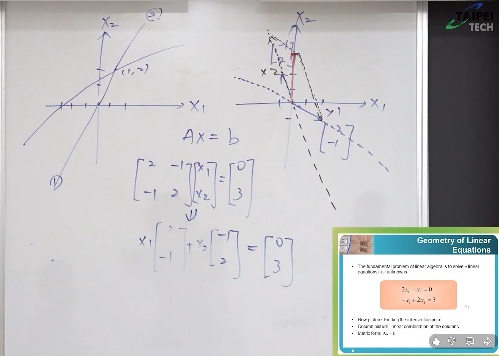
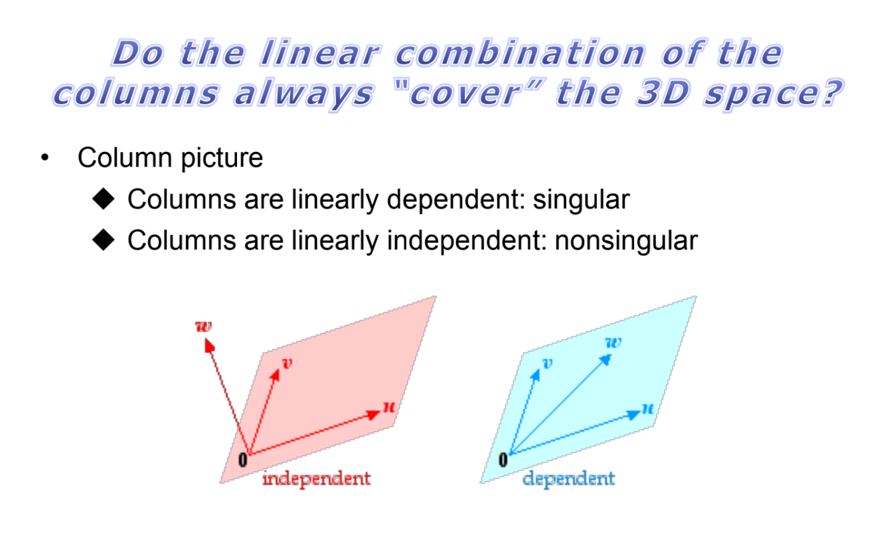
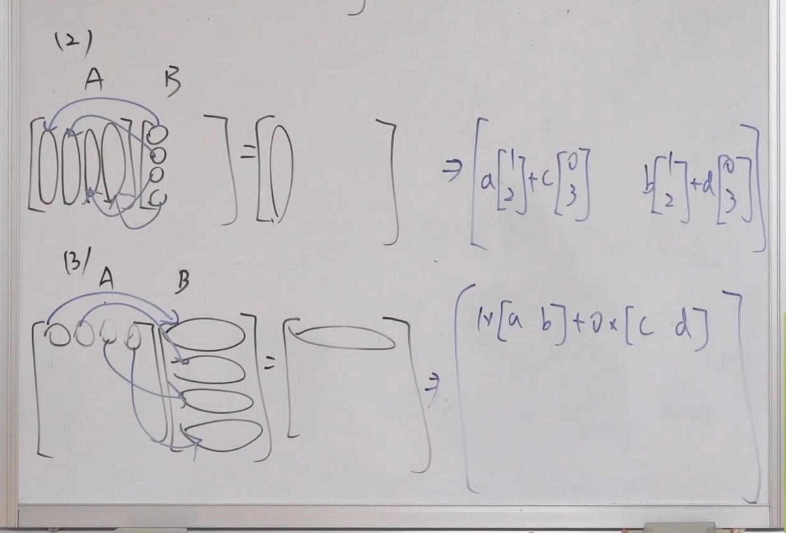
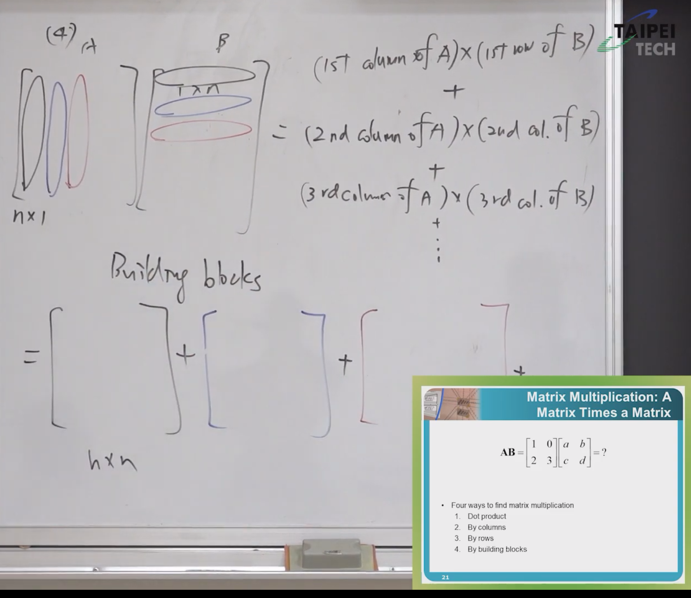
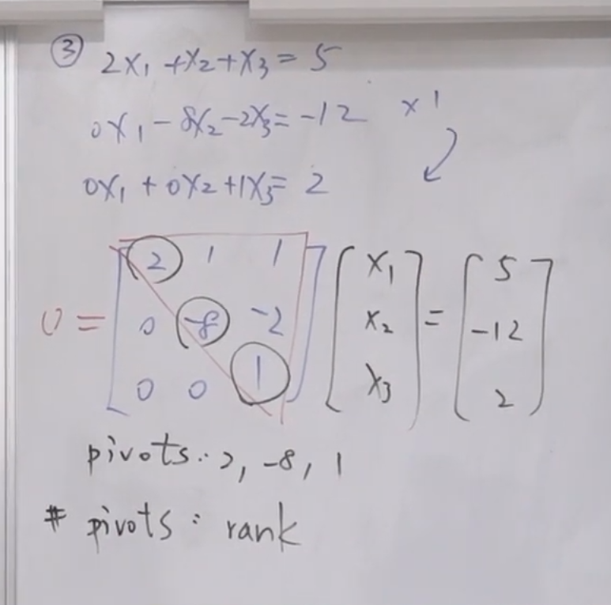

## **1. 元数据 (Metadata)**

*   **标题:** 线性代数：矩阵代数与高斯消去法 (Matrix Algebra and Gaussian Elimination)
*   **主讲人:** 陈晏笙 教授 (国立臺北科技大学 电子工程系)
*   **来源:** [單元 2．矩陣的基礎操作–高斯消去法 - YouTube](https://www.youtube.com/watch?v=279bZ60wV2E&t=6s)
* [Title Unavailable \| Site Unreachable](https://drive.google.com/file/d/1RbVzdeO4x9oEX8JaC_JvxWuQ-aHpbiAe/view)

## **2. 概述 (Overview)**

本讲座是线性代数课程的第一章，主要目的是建立矩阵代数的基本概念并进行“热身”。陈晏笙教授首先挑战了传统的矩阵认知，从简单的“数字集合”和“方程组”视角，转化为更具系统性的“行空间（Column Picture）”视角。课程详细阐述了矩阵乘法的四种不同理解方式，特别强调了“线性组合”在理解矩阵运算中的核心地位。随后，课程引入了线性代数中最重要的工具之一——高斯消去法（Gaussian Elimination），解释了其通过行运算将矩阵转化为上三角矩阵（Upper Triangular Matrix, U）的过程，并引出了主元（Pivot）、秩（Rank）、奇异性（Singularity）以及LU分解等核心概念。

---

## **3. 主题详解 (Thematic Breakdown)**
> [!note]
> 注意，台湾与大陆的 行列 的意思恰好相反

### 3.1 矩阵的两种视角：列图像与行图像 (Row Picture vs. Column Picture)

在接触线性代数之初，我们通常通过方程组来理解矩阵。例如求解 $2x_1 - x_2 = 0$ 和 $-x_1 + 2x_2 = 3$。

*   **基本认知（系统化第一步）：** 拿到一个矩阵，首先要判断其**尺寸（Size）**，即有多少列（Rows）和多少行（Columns）。通常描述为 $m \times n$（$m$列$n$行）。
> [!note]
> 如何认识一个矩阵
> 1. Size，有几行几列
> 2. 有先看列，矩阵是各列的组成
> 3. 判断矩阵的好坏，工程学上，我们一般关注**worse case**

*   **行图像（Row Picture - 传统视角）：**
    *   在二维平面上，每一个方程代表一条直线。
    *   求解方程组等同于寻找这些直线的**交点**。
    *   在三维空间中，每个方程代表一个平面，求解即寻找平面的交点（交线、点或无解）。
	    * 
> [!note]
> 在行图像，或者说通过画图求解的形式中，**worse case**指的是两条线平行的情况

*   **列图像（Column Picture - 进阶视角）：**
    *   这是本课程强调的核心观点：**列**（Column）比列**行（Row）更重要**。
    *   将矩阵视为**列向量（Column Vectors）的集合**。
    *   方程组 $Ax=b$ 的求解过程，实际上是寻找矩阵 $A$ 中各列向量的**线性组合（Linear Combination）**，使其等于向量 $b$。
    *   例如：$x_1 \begin{bmatrix} 2 \\ -1 \end{bmatrix} + x_2 \begin{bmatrix} -1 \\ 2 \end{bmatrix} = \begin{bmatrix} 0 \\ 3 \end{bmatrix}$。
    *   这意味着我们在问：如何通过缩放和相加 $A$ 的列向量，来“拼凑”出目标向量 $b$。
	    * **在该情况下，结果就是线性组合的系数**
> [!note]
> 在列图像中，我们一般认为 向量组合 无法得到另一向量，就是**worse case**

### 3.2 奇异性与线性无关 (Singularity and Linear Independence)

并非所有矩阵都是“好”矩阵，我们需要判断矩阵的性质：
> [!note]
> 我们关注 Singular case
> 所谓的Singular case就是多个列向量共面的时候，我们会将该**子空间**中的向量称为Singular case

*   **奇异矩阵（Singular Matrix）：**
    *   **几何意义：** 在列图像中，如果列向量平行（在同一直线上）或共面，它们无法张成完整的空间。此时方程组可能无解或有无穷多解。
    *   **代数意义：** 矩阵不可逆，没有唯一的解。
*   **非奇异矩阵（Non-singular Matrix）：**
    *   矩阵的列向量可以张成完整的空间。
    *   对于任意 $b$，方程组有唯一解。
*   **线性无关（Linear Independence）：**
    *   定义：如果 $k$ 个向量的线性组合要等于零向量，唯一的系数解是所有系数全为 0（即 $c_1=c_2=\dots=0$），则这组向量线性无关。
    *   反之，如果能找到一组**非全零**的系数使得线性组合为零，则它们是**线性相关（Linearly Dependent）**。这意味著其中某个向量可以由其他向量“拼凑”出来，没有提供新的信息。
> [!note]
> Singular matrix 的解 有哪些情况 
> 无穷解或者无解
> 注意，可以类比重叠原理，在子空间中能够得到该向量，同样向量之间因为**线性相关**，所以可以组合为0

### 3.3 矩阵乘法的四种方式 (Four Ways of Matrix Multiplication)

这是理解后续高斯消去法的关键基础。计算 $AB=C$，假设尺寸匹配。

1.  **点积法（Dot Product / By Rows and Columns）：**
    *   **操作：** $A$ 的第 $i$ 列（Row）与 $B$ 的第 $j$ 行（Column）做内积，得到 $C_{ij}$。
    *   **特点：** 这是最基础、最碎片化的方法，得到的是单个数值（Element）。通常用于手算，但难以看到整体结构。

2.  **以列操作行（By Columns - 线性组合视角）：**
    *   **操作：** $C$ 的第 $j$ 行（Column）是 $A$ 的各行向量的线性组合。组合的系数来自 $B$ 的第 $j$ 行。
    *   **公式：** $A \times [B的第j行] = [C的第j行]$。
    *   **意义：** 矩阵乘法可以看作是**后一个矩阵对前一个矩阵的行向量做线性组合**。

3.  **以行操作列（By Rows - 线性组合视角）：**
    *   **操作：** $C$ 的第 $i$ 列（Row）是 $B$ 的各列向量的线性组合。组合的系数来自 $A$ 的第 $i$ 列。
    *   **公式：** $[A的第i列] \times B = [C的第i列]$。
    *   **意义：** 矩阵乘法可以看作是**前一个矩阵对后一个矩阵的列向量做线性组合**。这也就是**行运算（Row Operation）**的矩阵形式。

4.  **积木法（Building Blocks / By Columns $\times$ Rows）：**
    *   **操作：** $A$ 的第 $k$ 行（Column）乘以 $B$ 的第 $k$ 列（Row）。注意是 $n \times 1$ 乘以 $1 \times n$，结果是一个 $n \times n$ 的大矩阵（Rank 1 矩阵）。
    *   **公式：** $\sum (Col_k of A) \times (Row_k of B)$。
    *   **意义：** 将结果矩阵 $C$ 拆解为多个秩为1的矩阵之和。这在后续的谱定理（Spectral Theorem）中非常重要。

> **核心结论：** 矩阵乘法不满足交换律（$AB \neq BA$），但满足结合律（$A(BC) = (AB)C$）和分配律。

### 3.4 高斯消去法 (Gaussian Elimination)

高斯消去法是线性代数中最核心的算法，用于求解方程组、求逆矩阵、求秩等。

*   **目标：** 将矩阵 $A$ 转化为**上三角矩阵（Upper Triangular Matrix, U）**。即对角线左下方的元素全部变为 0。
*   **操作步骤（SOP）：**
    1.  固定第一行，通过乘以特定倍数加到下方各行，消去第一列中下方的元素（如 $x_1$ 系数变为 0）。
    2.  固定第二行，重复上述步骤，消去第二列中更下方的元素。
    3.  以此类推，直到形成阶梯状的上三角矩阵 $U$。
*   **回代（Back Substitution）：**
    *   一旦得到 $U$，且方程组右侧也进行了相应变换，就可以从最后一行倒推求出最后一个变量（如 $x_3$），然后代回上一行求 $x_2$，以此类推解出所有未知数。

### 3.5 主元与秩 (Pivots and Rank)

在高斯消去法得到的上三角矩阵 $U$ 中：
*   **主元（Pivot）：** 对角线上非零的第一个元素。**主元不能为 0**。
*   **秩（Rank）：** 矩阵中主元的数量。
*   **满秩（Full Rank）：** 对于 $n \times n$ 矩阵，如果有 $n$ 个主元，则称为满秩。
    *   满秩 $\iff$ 非奇异（Non-singular） $\iff$ 可逆 $\iff$ 列向量线性无关 $\iff$ 方程组有唯一解。
*   **故障排除：** 如果消去过程中主元位置出现 0，需要进行**行交换（Row Exchange）**，将下方非 0 的行换上来。如果无法交换（下方全是 0），则说明矩阵是奇异的（Singular），存在线性相关。

### 3.6 逆矩阵与LU分解的雏形 (Inverse Matrix & Intro to LU)

*   **逆矩阵的物理意义：**
    *   将矩阵 $A$ 看作一个系统，它将输入（Input）转换为输出（Output）。
    *   逆矩阵 $A^{-1}$ 的作用是**逆转**这个过程，将输出还原回输入。
    *   即 $A^{-1}(Ax) = x$，等同于 $A^{-1}A = I$（单位矩阵）。
*   **消去法的矩阵形式：**
    *   高斯消去法的每一步行操作（如：第二列减去 2 倍的第一列），都可以表示为乘以一个**初等矩阵（Elimination Matrix, E）**。
    *   例如：$E_{21} A$ 表示对 $A$ 进行操作，消去位置 (2,1) 的元素。
    *   整个消去过程可以表示为一连串矩阵相乘：$G F E A = U$。
*   **LU分解 (LU Decomposition)：**
    *   如果我们将这些消去矩阵逆转并移到等式右边，即 $A = E^{-1} F^{-1} G^{-1} U$。
    *   这些逆矩阵的乘积形成一个**下三角矩阵（Lower Triangular Matrix, L）**。
    *   最终得到著名的分解：**$A = L U$**。
    *   这里 $L$ 记录了消去的过程（乘数），$U$ 是消去后的结果。
> [!note]
> 逆矩阵说明一个系统具有可逆性
> 能够将发生过的事情undo

---

## **4. 框架与思维模型 (Frameworks & Mental Models)**

*   **系统视角模型 (The System View of Matrices):**
    *   不要把 $Ax=b$ 仅仅看作解方程。试着建立这样的思维模型：
        *   $x$ 是**输入**（Input）或**原因**。
        *   $A$ 是**系统**（System）或**转换函数**。
        *   $b$ 是**输出**（Output）或**结果**。
    *   求解 $x$ 就是在问：“是什么样的输入经过系统 $A$ 后产生了结果 $b$？”
    *   求 $A^{-1}$ 就是在寻找一个“还原系统”，能把结果 $b$ 变回初始状态 $x$。

*   **积木思维 (Building Blocks Mental Model):**
    *   利用矩阵乘法的第四种方式（列 $\times$ 行），将复杂矩阵 $A$ 视为多个简单矩阵（Rank 1 矩阵）的叠加。
    *   这对于后续理解矩阵压缩、主成分分析（PCA）等数据科学应用至关重要。

*   **BEEF 投篮法则与高斯消去法:**
    *   教授用库里（Stephen Curry）练习投篮的 "BEEF" (Balance, Eyes, Elbow, Follow-through) 原则类比高斯消去法。
    *   **含义：** 复杂的技能（如解大型方程组）必须拆解为标准化的基本动作（Basic Operations）。高斯消去法就是这套标准动作，每一步都是简单的行运算，但组合起来能解决复杂问题。不要试图一步登天，要按部就班地执行算法。
