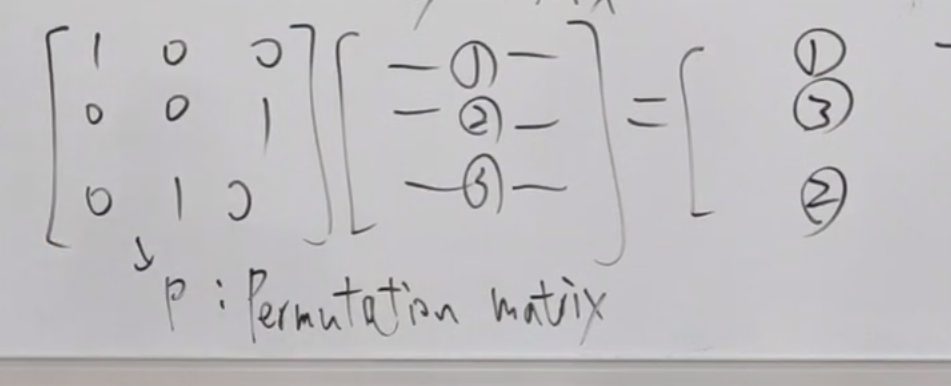
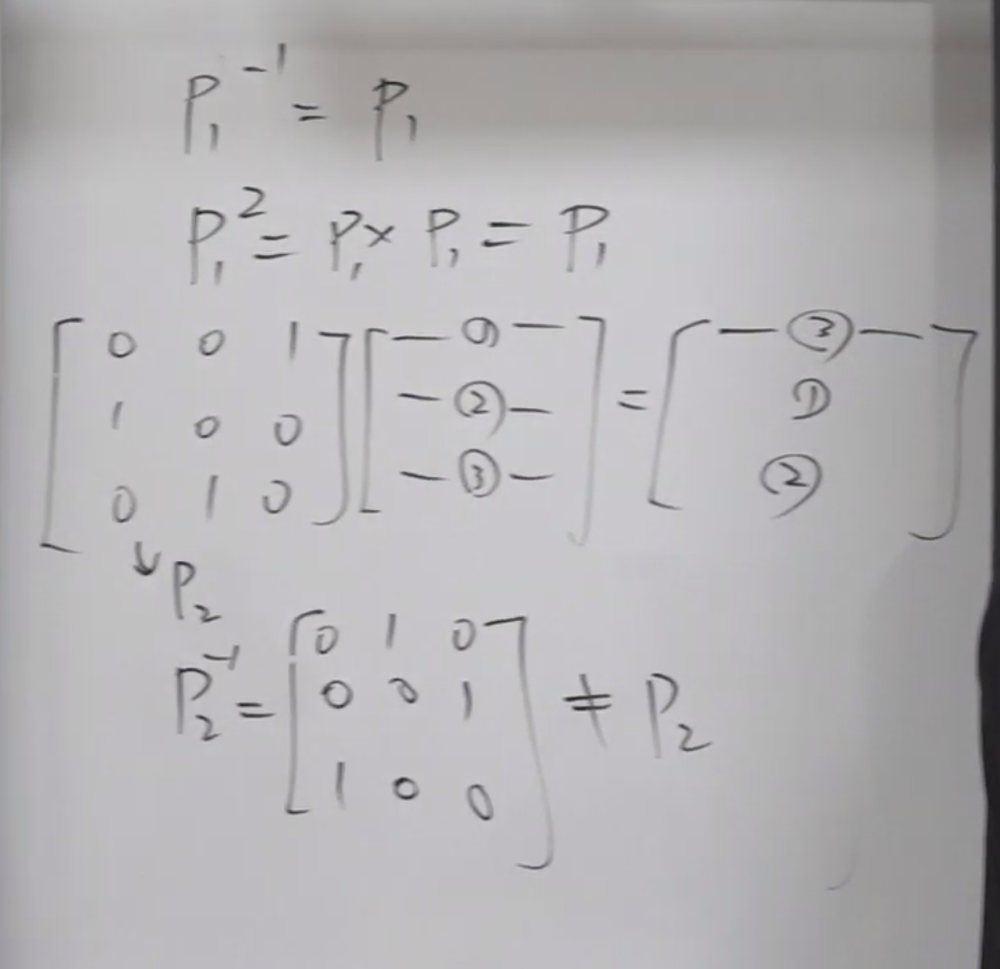
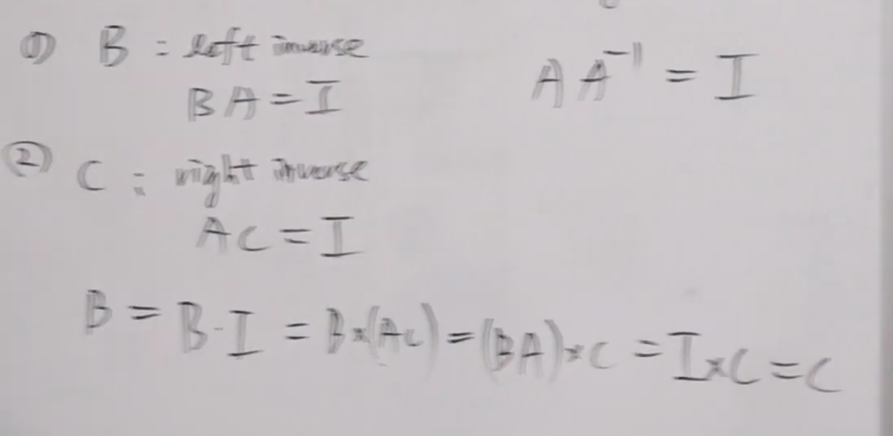
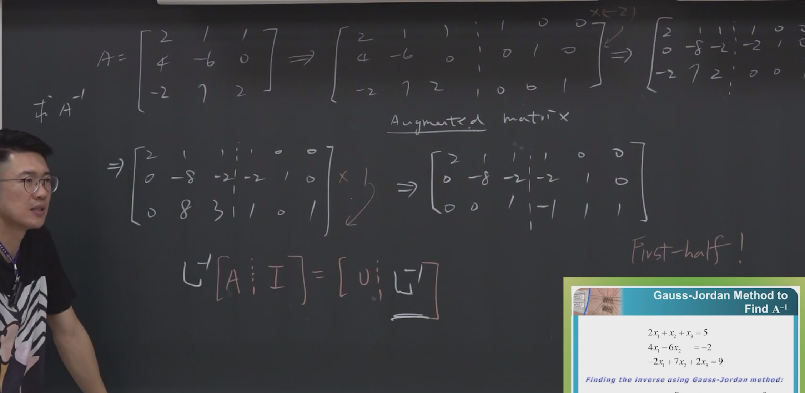
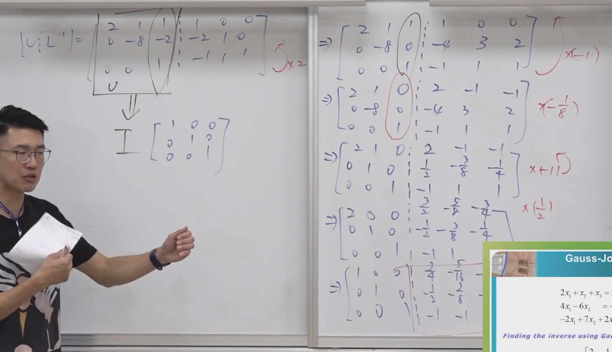
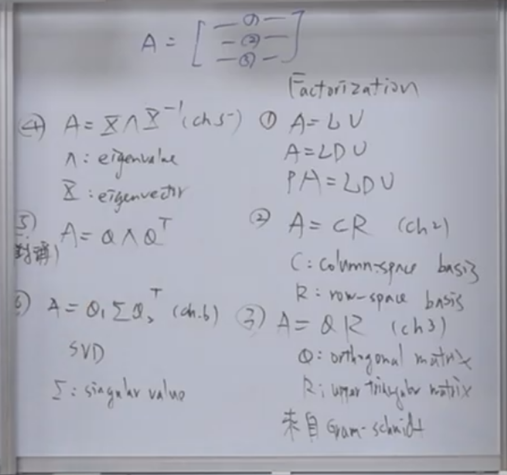
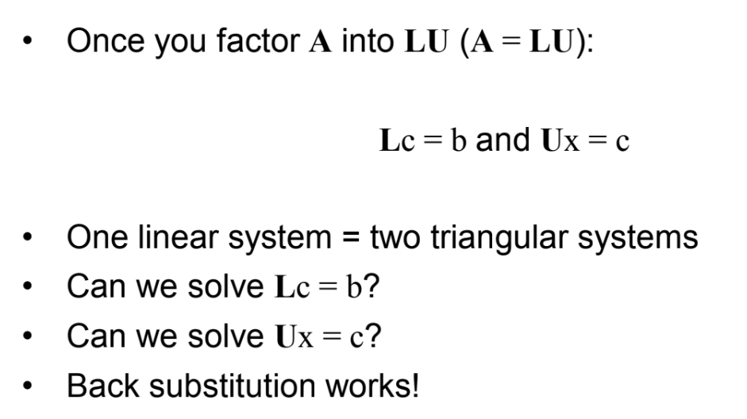

 # 线性代数：矩阵乘法观点、逆矩阵与LU分解

## **元数据：**

*   **标题：** 线性代数 (Linear Algebra) - 第2周课程
*   **作者：** 陈吴 教授 (国立台北科技大学 电子工程系)
*   **URL：** [單元 3．矩陣的基礎操作–LU分解、反矩陣 - YouTube](https://www.youtube.com/watch?v=fWd5FHR7j8k&t=1s)
[Title Unavailable \| Site Unreachable](https://drive.google.com/file/d/1RbVzdeO4x9oEX8JaC_JvxWuQ-aHpbiAe/view)
## 概述

本课程作为线性代数的第二周内容，深入探讨了处理矩阵的核心工具和思维方式。陈教授首先复习并强化了矩阵乘法的“行/列线性组合”观点，以此为基础引出了单位矩阵（Identity Matrix）和置换矩阵（Permutation Matrix）的概念。课程的核心重点在于讲解逆矩阵（Inverse Matrix）的物理意义及其计算方法（高斯-若尔当消去法），并详细推导了LU分解（$A=LU$）的原理，即如何通过高斯消去法将矩阵分解为下三角矩阵和上三角矩阵。最后，课程介绍了转置矩阵（Transpose）及其与逆矩阵的交换律性质，并引出了对称矩阵的概念。

---

## 主题详解

### 一、 矩阵乘法的核心观点：线性组合

在处理矩阵时，不应仅仅关注其尺寸（如 $5 \times 4$ 等于20个数字的集合），而应建立几何空间的视角。
> [!note]
> 在[[台北科技大学 单元2 矩阵与高斯消去法]]中我们提到，需要判断一个**矩阵**好不好
> 主要是判断是否是一个Singular矩阵
> 如果不是，那么必然有解，万事大吉
> 如果是，那么就需要详细讨论

1.  **列向量视角（Column View）：** 一个 $5 \times 4$ 的矩阵应被视为4个位于5维空间中的列向量的组合。
2.  **矩阵乘法的作用位置：**
    *   **左乘矩阵（Left Multiplication）：** 当一个矩阵乘在另一个矩阵的**左侧**时，它是在对右侧矩阵的**各行（Rows）**做线性组合。
    *   **右乘矩阵（Right Multiplication）：** 当一个矩阵乘在另一个矩阵的**右侧**时，它是在对左侧矩阵的**各列（Columns）**做线性组合。

**特殊矩阵示例：**
*   **单位矩阵（Identity Matrix, $I$）：** 这是一个特殊的对角矩阵，对角线元素为1，其余为0。无论它是左乘还是右乘，对原矩阵进行线性组合后的结果就是原矩阵本身，即“什么都不做”。
	* 
> [!note]
> 考虑这其中的意义
> 通过使用矩阵乘法，实现了**做了等于什么都没做的操作**

*   **置换矩阵（Permutation Matrix, $P$）：**
    *   通过交换单位矩阵的行或列得到。
    *   **作用：** 如果将$P$乘在左侧，它会交换目标矩阵的行（Row Exchange）；如果乘在右侧，则交换列。
    *   **性质：** 置换矩阵的逆矩阵等于其转置矩阵（$P^{-1} = P^T$）。

> [!note]
> 置换矩阵的逆矩阵等于其转置矩阵（$P^{-1} = P^T$）。
> 这句话不尽然对，比如看如下的$P_{2}$ 
> 这个矩阵实现了将第一列到第二列，第三列到第一列，第二列到第3列
> 也就不能说逆矩阵就是其本身

### 二、 逆矩阵（Inverse Matrix）的概念与性质

**1. 逆矩阵的定义**
逆矩阵 $A^{-1}$ 的核心意义在于“逆转”或“抵消”矩阵 $A$ 的作用。
*   如果矩阵 $A$ 将输入 $x$ 映射为输出 $b$（即 $Ax=b$），那么 $A^{-1}$ 的作用就是将输出 $b$ 还原回输入 $x$。
*   数学定义：若存在矩阵 $B$ 使得 $AB=I$ 且 $BA=I$，则 $B$ 为 $A$ 的逆矩阵，记作 $A^{-1}$。

**2. 奇异性与可逆性**
*   **非奇异矩阵（Non-singular Matrix）：** 指矩阵的各列向量线性无关（Linearly Independent）。只有非奇异矩阵才是“好”矩阵。
*   **可逆矩阵（Invertible Matrix）：** 只有方阵（Square Matrix）且为非奇异矩阵时，才存在逆矩阵。
*   **重要概念：** “非奇异”和“可逆”是等价的（互为充要条件）。如果一个矩阵是奇异的（Singular），它就不可逆，意味着其变换丢失了信息，无法还原。
> [!note]
> 判断是否是奇异矩阵使用的是[[高斯消元法]]
> 判断逆矩阵使用的是[[高斯-若尔丹消元法]]
> 二者都需要尽力高斯消元法，并且需要full rank

> [!note]
> 第二种理解是
> $AX=b$ 必定有解
> $UX=c$
> $x=A^{-1}b$ 则知道 inverse of A 必然存在

**3. 左逆与右逆**
对于方阵而言，左逆矩阵（Left Inverse，使得 $A^{-1}A=I$）和右逆矩阵（Right Inverse，使得 $AA^{-1}=I$）是同一个矩阵。这意味着逆矩阵既能抵消行操作，也能抵消列操作。
> [!note]
> 如果B和C都是A的Inverse，只不过一个左逆，一个右逆
> 二者一个是行变换，一个是列变换，为什么结果都是Identity matrix 呢
> 

**4. 逆矩阵的公式（2x2 特例）**
对于 $2 \times 2$ 矩阵 $\begin{bmatrix} a & b \\ c & d \end{bmatrix}$，其逆矩阵公式为：
$$ \frac{1}{ad-bc} \begin{bmatrix} d & -b \\ -c & a \end{bmatrix} $$
口诀为：**主对角线换位置，次对角线变符号，除以行列式（$ad-bc$）。**

[[逆矩阵求解技巧]]
### 三、 高斯-若尔当消去法（Gauss-Jordan Method）求逆矩阵

计算 $n \times n$ 矩阵的逆矩阵，手动计算非常繁琐（复杂度约为 $n^3$），但通过“增广矩阵”的方法可以系统化求解。

**操作步骤：**
1.  **构造增广矩阵：** 将原矩阵 $A$ 与单位矩阵 $I$ 并排放在一起，形成 $[A | I]$。
2.  **执行消去法：**
    *   **前半段（Gauss Elimination）：** 对 $A$ 进行行运算（Row Operations），将其化简为上三角矩阵 $U$。此时增广矩阵变为 $[U | L^{-1}]$（这一步本质是在做 $A=LU$ 分解）。
	    * 
    *   **后半段（Jordan Step）：** 继续向上进行消去，将对角线上的元素化为1，并将对角线上方的元素化为0，最终将左侧变为单位矩阵 $I$。
	    * 
3.  **结果：** 当左侧变为 $I$ 时，右侧原本的 $I$ 就变成了 $A^{-1}$。即 $[A | I] \to [I | A^{-1}]$。

**背后的逻辑：**
这一系列行运算相当于左乘了一个矩阵（即 $A^{-1}$）。
*   对 $A$ 做这些运算得到了 $I$（即 $A^{-1}A = I$）。
*   对 $I$ 做同样的运算自然就得到了 $A^{-1}$（即 $A^{-1}I = A^{-1}$）。

### 四、 LU分解（Factorization $A=LU$）
> [!note]
> 本课程一共有六大分解
> 

这是本课程介绍的第一个重要的矩阵分解形式。

**1. 基本形式**
任何非奇异矩阵 $A$ 都可以分解为两个矩阵的乘积：
$$ A = LU $$
*   **L (Lower Triangular)：** 下三角矩阵，对角线通常为1。它记录了消去过程中使用的乘数（Multipliers），代表了“还原”的操作。
*   **U (Upper Triangular)：** 上三角矩阵。它是高斯消去法的前半段结果，即阶梯形矩阵。

**2. 考虑行交换（$PA=LU$）**
如果在高斯消去过程中遇到了主元（Pivot）为0的情况，需要进行行交换（Row Exchange）才能继续。此时，公式修正为：
$$ PA = LU $$
其中 $P$ 是置换矩阵，代表预先对 $A$ 的行进行了重新排列，以确保消去法能顺利进行。

**3. LDU 分解**
为了进一步对称或简化，可以将 $U$ 的主元（Pivots）提取出来形成一个对角矩阵 $D$。
$$ A = LDU $$
此时，新的 $L$ 和 $U$ 的对角线元素都为1，$D$ 包含了所有的主元信息。

**4. 为什么要分解？**
将 $A$ 分解为 $L$ 和 $U$ 后，解线性方程组 $Ax=b$ 变得非常容易，因为它可以拆解为两个三角方程组（$Lc=b$ 和 $Ux=c$），分别通过前向代入和后向代入即可求解，无需计算高昂的逆矩阵。
> [!note]
> **LU分解** 有两个作用
> 1. 更方便判断**Nonsingular**的情况：一目了然，通过rank能够快速判断
> 2. 通过将操作简化：原本有一公式$AX=B$ 如果我们已知 Output,已知系统A，那么原本求Input的方式是通过求 $A$ 的逆矩阵，然后左乘B，但是这样的工作量太大了。所以转化为$A=LU$ ，这两个都是三角矩阵，更加容易求解

### 五、 转置矩阵（Transpose）与对称矩阵

**1. 转置（Transpose, $A^T$）**
*   定义：将矩阵的行变为列，列变为行。$A_{ij}$ 变为 $A_{ji}$。
*   性质：$(AB)^T = B^T A^T$。注意顺序发生了反转，这与逆矩阵的性质 $(AB)^{-1} = B^{-1}A^{-1}$ 非常相似。

**2. 逆矩阵与转置的交换律**
这是一个非常重要的性质：**“先转置再求逆”等于“先求逆再转置”。**
$$ (A^{-1})^T = (A^T)^{-1} $$
这表明转置操作和求逆操作是可以交换顺序的。

**3. 对称矩阵（Symmetric Matrix）**
*   定义：如果一个矩阵转置后等于它自己（$A^T = A$），则称其为对称矩阵。
*   构造：对于任意实数矩阵 $R$，乘积 $R^T R$ 永远是对称矩阵。这是一个在统计学（如协方差矩阵）和工程学中极为常见的结构。
*   性质：对称矩阵的 $LDU$ 分解中，由于对称性，$U$ 将是 $L$ 的转置，即 $A = LDL^T$。

---

## 框架与思维模型

### 1. 矩阵作为“操作符” (Matrix as Operator)
*   **模型内容：** 不要把矩阵看作静态的数字表格，而要看作是一种“动作”或“函数”。
*   **应用：**
    *   矩阵 $A$ 是一个将向量 $x$ 变换为 $b$ 的操作。
    *   逆矩阵 $A^{-1}$ 是一个“撤销（Undo）”操作。
    *   单位矩阵 $I$ 是“空”操作。
    *   置换矩阵 $P$ 是“交换”操作。
    *   通过这种思维，复杂的矩阵运算（如 $A^{-1}A=I$）就变成了直观的物理动作（做某事，然后撤销它，等于没做）。

### 2. 增广矩阵思维 (Augmented Matrix Model)
*   **模型内容：** 当你需要对多个向量执行相同的线性变换时，不要分批做，而是将它们“粘”在一起同时处理。
*   **应用：** 在求逆矩阵时，我们在寻找一个矩阵 $X$ 使得 $AX=I$。因为 $I$ 是由多个列向量组成的（$e_1, e_2, \dots$），我们实际上是在同时解 $Ax_1=e_1, Ax_2=e_2, \dots$。通过构造 $[A|I]$ 并进行消元，我们利用矩阵运算的并行性，一次性解决了所有方程，得到了 $[I|A^{-1}]$。

### 3. 分解思维 (Decomposition/Factorization)
*   **模型内容：** 将一个复杂的对象拆解为几个具有特定良好性质的简单对象的乘积。
*   **应用：**
    *   **LU分解：** 将任意矩阵拆解为下三角（L）和上三角（U）。三角矩阵在求解方程时非常高效。
    *   **LDU分解：** 进一步分离出尺度信息（对角矩阵D）。
    *   这是线性代数的核心思想之一，后续课程还会介绍 QR分解（正交化）和 SVD（奇异值分解）。分解是为了揭示矩阵的内在结构并简化计算。
