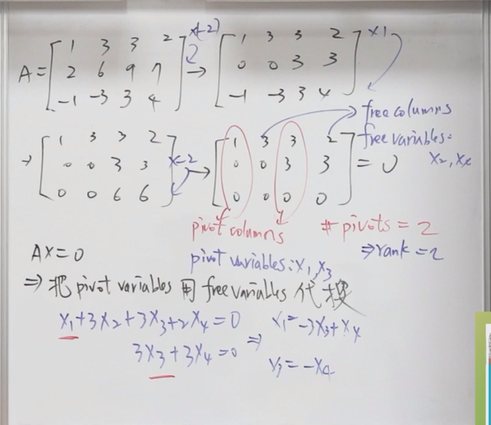
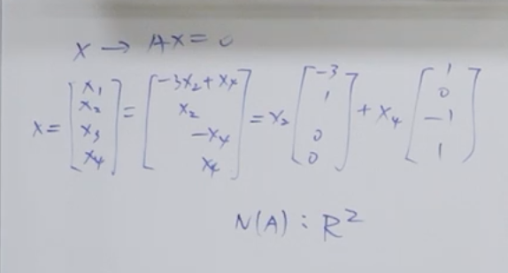
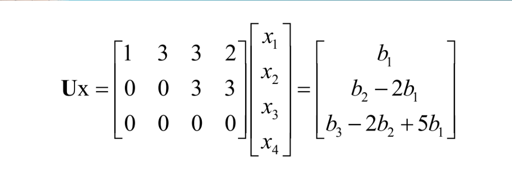
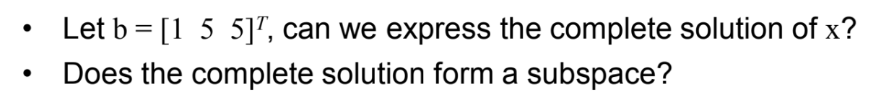
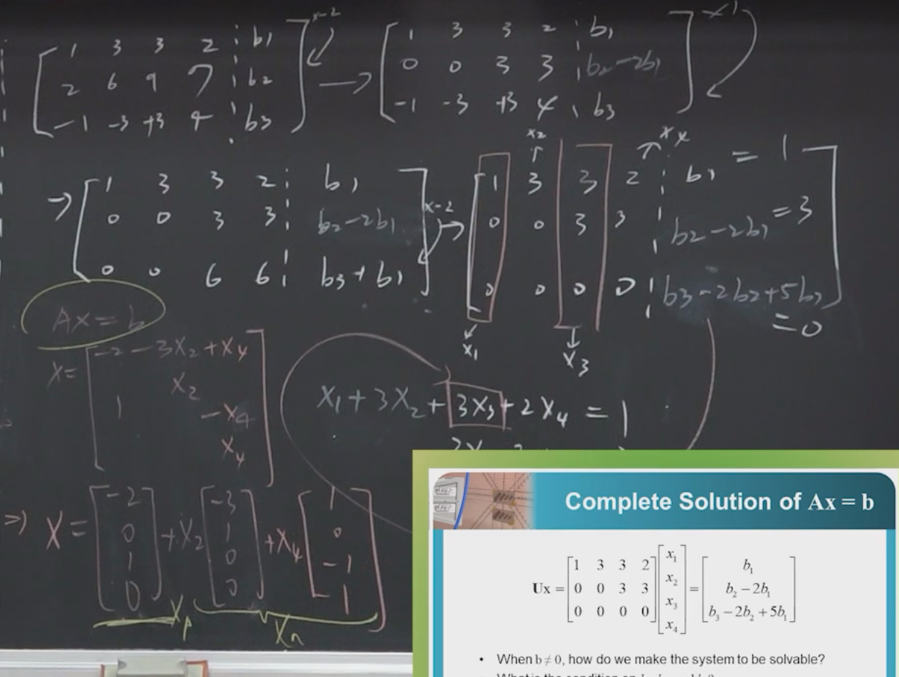
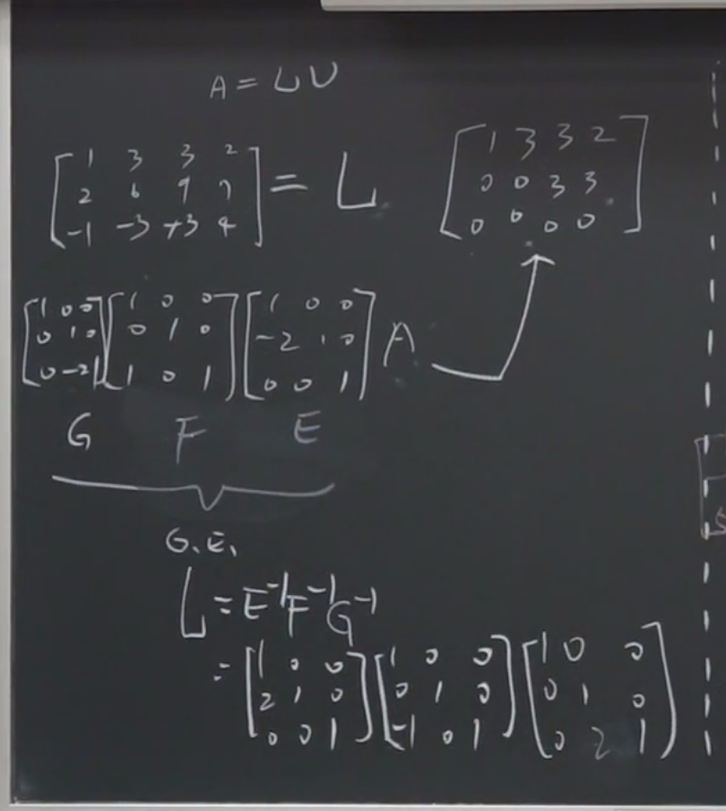
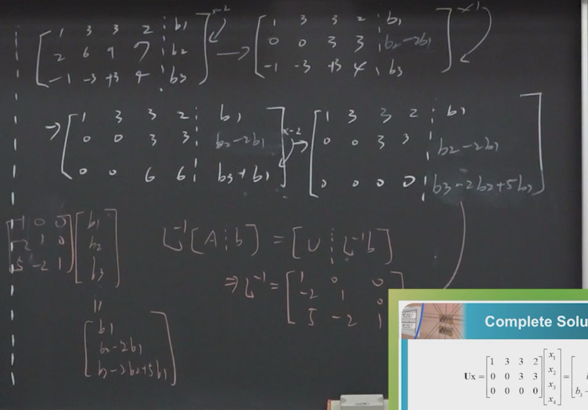
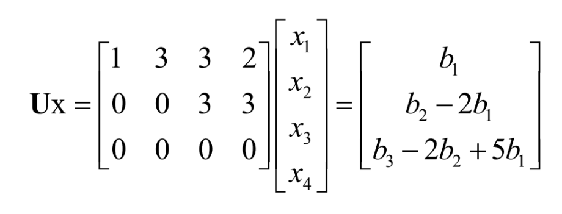
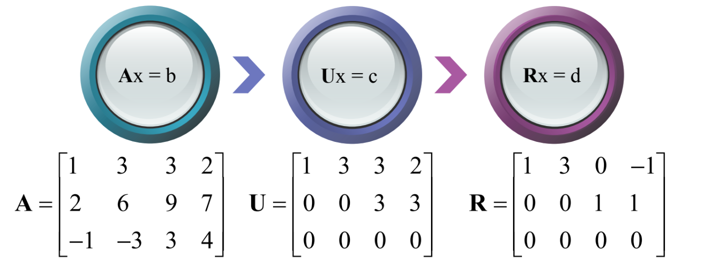
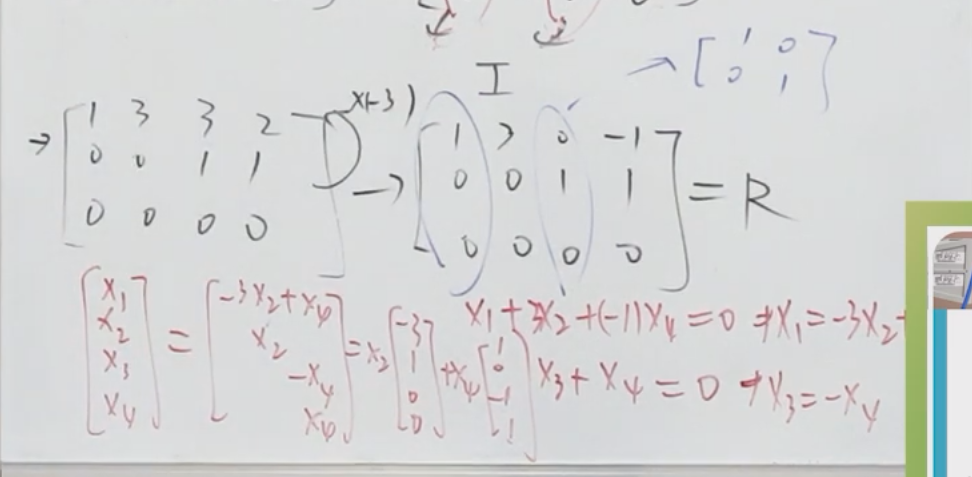

## **1. 元数据 (Metadata)**

*   **标题：** 線性代數 - 矩陣代數與應用 (Matrix Algebra and Its Applications) - 第2章：向量空間與子空間
*   **作者：** 國立臺北科技大學 電子工程系 陳旻笙 教授 (Taipei Tech)
*   **原始视频链接：** [單元 4．向量空間–初探「行空間」與「零空間」 - YouTube](https://www.youtube.com/watch?v=Z5uWHTAc6TY)
* [Vector space pdf](assets/台北科技大学%20单元5%20矩阵的四大空间/file-20260219085315907.pdf)

---

## **2. 概述 (Overview)**

本视频作为线性代数课程第二章的开篇，陈旻笙教授引导学生从第一章的“运算”视角转向第二章的“空间”视角。视频的核心论点在于：理解矩阵系统 $Ax=b$ 的解，不能仅停留在对单一向量或数值的计算上，而应透过现象看本质，去理解这些向量背后所构成的**空间 (Space)** 与**子空间 (Subspace)**。

主要结论包括：$Ax=b$ 是否**有解 (Existence)** 取决于向量 $b$ 是否落在矩阵 $A$ 的**行空间 (Column Space)** 内；而解是否**唯一 (Uniqueness)** 则取决于矩阵 $A$ 的**零空间 (Nullspace)**。视频详细演示了如何通过高斯消去法区分**主元变数 (Pivot variables)** 和**自由变数 (Free variables)**，进而求出零空间，并最终构建出线性方程组的通解结构：特解加齐次解。

---

## **3. 主题详解 (Thematic Breakdown)**

### 3.1 视角的转换：从运算到空间
课程首先回顾了第一章的内容。在第一章中，学生学习了矩阵的基本乘法、逆矩阵以及针对方阵（$m=n$）的高斯消去法。那时的重点在于判断矩阵是否可逆（非奇异）。

进入第二章，关注点发生了两个重大变化：
1.  **对象的一般化**：不再局限于方阵，而是讨论更一般的长方形矩阵（$m \times n$），即方程数与未知数不相等的情况。
2.  **视角的宏观化**：不再把矩阵看作数字的集合，甚至不再只看作孤立的行向量或列向量，而是要看这些向量集合背后所代表的更宏观的概念——**空间 (Space)**。

教授用电影《黑客帝国》(The Matrix) 做类比：第一部中主角对抗的是具体的特工 Smith（具体的向量），但后来发现对抗的其实是背后的母体系统（空间）。同理，在线性代数中，我们要研究的不再是单一向量，而是它们张成的空间。

### 3.2 空间与子空间的定义
在数学上，要形成一个“空间”或“子空间”，必须满足特定的严谨定义（八大规则），但在本节课中，教授强调了两个最核心的几何与代数直觉：
**子空间的两大要求**
1.  **封闭性**：
	1. 空间内的向量相加，结果仍在空间内；
	2. 空间内的向量乘以任意标量（缩放），结果仍在空间内。即**线性组合 (Linear Combination)** 后的结果跑不出这个空间。
2.  **包含零向量**：所有的子空间必须包含原点（零向量）。

**$\mathbb{R}^3$（三维空间）中的子空间示例：**
*   **零维**：仅包含原点 $(0,0,0)$。
*   **一维**：通过原点的直线。
*   **二维**：通过原点的平面。
*   **三维**：整个 $\mathbb{R}^3$ 空间本身。

*注意：任何不通过原点的直线或平面，都不是子空间。*

### 3.3 矩阵的四个基本子空间 (The Four Fundamental Subspaces)
要透彻理解矩阵 $A$，必须掌握其四个基本子空间。本节课重点介绍了前两个：

#### **A. 列空间 (Column Space, $C(A)$)**
*   **定义**：由矩阵 $A$ 的所有**列向量 (Column vectors)** 进行线性组合所生成（span）出来的空间。
*   **意义**：它回答了 $Ax=b$ **是否有解**的问题。
*   **判据**：对于方程 $Ax=b$，只有当向量 $b$ 落在矩阵 $A$ 的列空间内（即 $b$ 可以被 $A$ 的各列线性组合出来）时，方程才有解。
*   **符号**：通常记作 $C(A)$，有时也称为值域 (Range)，记作 $R(A)$。

#### **B. 零空间 (Nullspace, $N(A)$)**
*   **定义**：包含所有使得 $Ax=0$ 成立的向量 $x$ 的集合。换句话说，它是齐次方程组 $Ax=0$ 的所有解构成的空间。
*   **意义**：它回答了 $Ax=b$ 的解是否**唯一**的问题。
*   **结构**：零空间不仅仅包含零向量（平凡解），如果存在非零解，那么这些解的线性组合仍然是解，从而构成一个空间。
*   **符号**：记作 $N(A)$，也被称为核 (Kernel)。

### 3.4 寻找零空间的方法论
教授通过具体的计算示例，展示了如何系统性地找到零空间：

1.  **高斯消去法**：将矩阵 $A$ 转化为行阶梯形矩阵 ($U$)，甚至简化行阶梯形矩阵 ($R$ / RREF)。在这个过程中，方程组的解集是不变的（$Ax=0$ 与 $Ux=0$ 的解相同）。
2.  **区分变数**：
    *   **主元列 (Pivot Columns)**：包含主元 (Pivot) 的列。对应的变量称为**主元变数 (Pivot variables)**。
    *   **自由列 (Free Columns)**：不包含主元的列。对应的变量称为**自由变数 (Free variables)**。
3.  **代换求解**：
    *   自由变数拥有“自由度”，可以被任意指定数值。
    *   主元变数则完全由自由变数决定（被“锁死”）。
    *   **技巧**：通过交替将自由变数设为 1 和 0（例如：设 $x_2=1, x_4=0$ 求出一组解；再设 $x_2=0, x_4=1$ 求出另一组解），可以找到零空间的基底向量。
4.  **维度 (Dimension)**：零空间的维度等于**自由变数**的数量。

### 3.5 通解的结构 (Complete Solution)
对于一般的线性方程组 $Ax=b$，其**完全解 (Complete Solution)** 的结构由两部分组成：
$$x = x_p + x_n$$

*   **$x_p$ (特解, Particular Solution)**：满足 $Ax=b$ 的任意一个特定解。通常可以通过将所有自由变数设为 0 来求得。
*   **$x_n$ (齐次解/零空间解, Homogeneous Solution)**：来自零空间 $N(A)$ 的任意向量，满足 $Ax=0$。

**结论**：
无解：如果 $b$ 不在列空间 $C(A)$ 内。这意味着 $b$ 无法由 $A$ 的列线性组合得出。唯一解：如果 $b$ 在列空间 $C(A)$ 内，且零空间 $N(A)$ 只有零向量。这对应于列满秩（Full column rank），即所有的列都是线性无关的，没有自由变量。无穷多解：如果 $b$ 在列空间 $C(A)$ 内，且零空间 $N(A)$ 包含非零向量。这意味着矩阵存在自由变量（Free variables），你可以通过这些自由变量构造出无数个特解。

### 3.6 两种求 $L^{-1}$ 的方法（高斯消去法的数学操作表示的逆矩阵)
#### 方法1
也就是直接使用高斯消去法记录 $L$
然后取逆操作就是$L^{-1}$

#### 方法2
将$A,b$作为增广矩阵联立
然后发现$b$的系数其实记录了L的操作

### 3.7 行简化阶梯型

---

## **4. 框架与思维模型 (Frameworks & Mental Models)**

### 4.1 线性系统求解的“存在性与唯一性”模型
这是一个用于判断 $Ax=b$ 解的情况的心理模型：

*   **第一步：检查存在性 (Existence)**
    *   *问题*：$b$ 是否属于 $C(A)$？
    *   *方法*：看 $b$ 能否被 $A$ 的列向量线性组合出来。在高斯消去法的增广矩阵中，如果出现“左边全为0，右边不为0”的行（如 $0=3$），则无解。
    *   *直觉*：$b$ 必须落在 $A$ 的列张成的“网”里。

*   **第二步：检查唯一性 (Uniqueness)**
    *   *问题*：$N(A)$ 中是否只有零向量？
    *   *方法*：检查是否存在**自由变数 (Free variables)**。
    *   *直觉*：
        *   如果没有自由变数（满秩），零空间只是一个点（原点），解是唯一的。
        *   如果有自由变数，零空间是一条线、面或更高维空间，解有无穷多个。

### 4.2 变量分类法 (Pivot vs. Free Variables)
这是处理矩阵消去后的核心操作框架：

| 变量类型 | 主元变数 (Pivot Variables) | 自由变数 (Free Variables) |
| :--- | :--- | :--- |
| **定义** | 对应于行阶梯形矩阵中包含主元 (Pivot) 的列 | 对应于不包含主元的列 |
| **性质** | 它是“依赖者”，其值被方程约束 | 它是“自由者”，拥有自由度 (Degree of Freedom) |
| **操作** | 必须用自由变数来表示 | 可以任意赋值（通常设为1或0以求基底） |
| **对应空间** | 决定了矩阵的**秩 (Rank)** | 决定了**零空间 (Nullspace)** 的维度 |

这个框架解释了为什么有时候方程组会有无穷多解——因为自由变数的存在赋予了系统“滑动”的空间，而主元变数必须随之调整以维持方程平衡。
