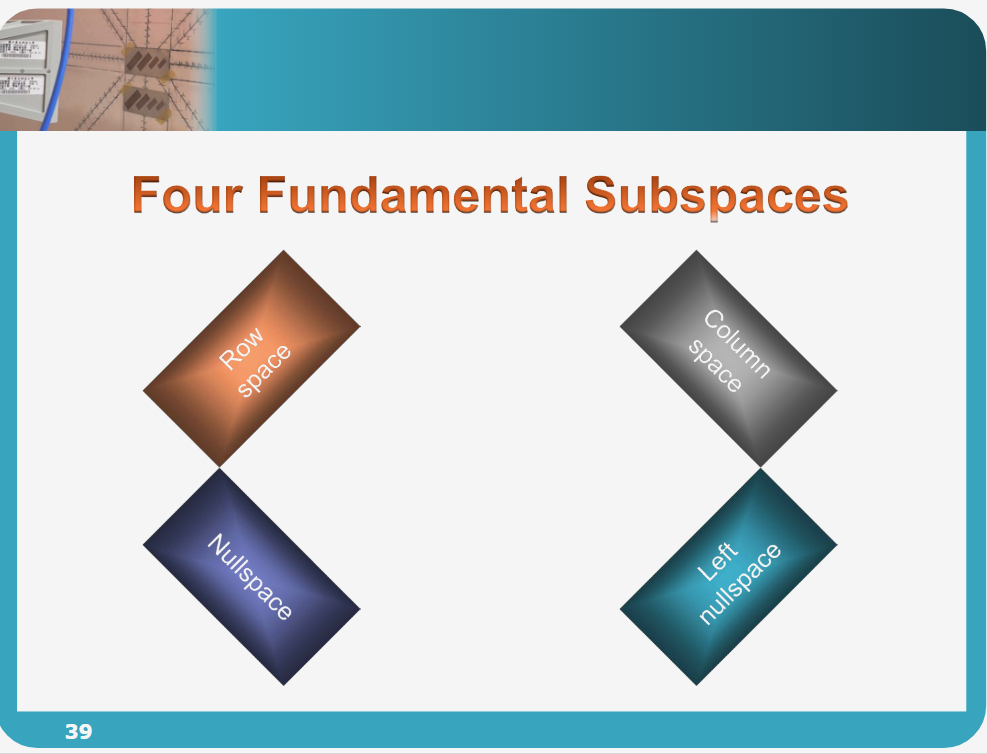

# 线性代数：基底 (Basis) 与四个基本子空间

*   **作者**：陈昊笙 教授（国立台北科技大学 电子工程系）
*   **原始视频标题**：线性代数
*   **URL**：[- YouTube](https://www.youtube.com/watch?v=qCclXBF3mr4)
- [Vector space pdf](assets/台北科技大学%20单元5%20矩阵的四大空间/file-20260219085315907.pdf)
## 概述

本讲座是线性代数课程中承前启后的关键环节，旨在从“矩阵的行与列”过渡到更抽象的“空间”概念。视频的核心在于引入**基底 (Basis)** 这一专业术语，将其定义为描述子空间最精简且完整的方式。陈教授详细回顾了如何通过高斯消去法 ($A \to U \to R$) 来分析 $Ax=b$ 的解，并以此为工具，深入剖析了矩阵的**四个基本子空间**：行空间 (Column Space)、列空间 (Row Space)、零空间 (Nullspace) 和左零空间 (Left Nullspace)。课程揭示了矩阵的秩 (Rank, $r$) 如何决定这些空间的维度，并强调了在工程数学视角下，理解这些空间对于分析线性系统的存在性与唯一性至关重要。

---

## 主题详解

### 1. 课程路线图：从向量到基底

课程将线性代数的学习进程划分为三个阶段：
1.  **个体向量到向量集合**：从单一向量的研究扩展到向量集合及空间。
2.  **子空间的特性**：通过 $Ax=b$ 探讨解的存在性（涉及 Column Space）和唯一性（涉及 Nullspace）。
3.  **精确描述空间**：引入 **基底 (Basis)** 和 **维度 (Dimension)**。

陈教授强调，拿到一个矩阵，不仅要看具体的数字，更要看其背后的空间特征。之前的课程虽然讨论了“解是否存在”和“解有多少”，但这只是开端；今天要用最精要的术语——**基底**——来对这些子空间进行专业描述。

### 2. 通过 $Ax=b$ 复习子空间概念

在深入四个子空间之前，通过一个 $3 \times 4$ 矩阵 $A$ 的例子回顾了之前的内容：

*   **解的存在性 (Existence)**：
    *   问题：什么样的 $b$ 会让 $Ax=b$ 有解？
    *   对应空间：**行空间 (Column Space, $C(A)$)**。
    *   $b$ 必须落在 $A$ 的各行向量所生成的空间内。
    *   **判断方法**：对增广矩阵 $[A|b]$ 进行高斯消去。如果 $A$ 的某几列线性组合会导致全零行，那么 $b$ 对应的线性组合也必须为 0，否则无解。
> [!note]
> 方法 ①：代数约束法（通过消元确保一致性）对增广矩阵 $[A | b]$ 进行行变换。当 $A$ 的某一行变为全 0 时，对应的 $b$ 部分也必须为 0。初始状态：$\begin{bmatrix} 0 & 1 & 2 & 2 & | & b_1 \\ 0 & 3 & 8 & 7 & | & b_2 \\ 0 & 0 & 4 & 2 & | & b_3 \end{bmatrix}$$R_2 - 3R_1$ 得到 $b_2 - 3b_1$。$R_3 - 2(R_2 - 3R_1)$ 得到最后一行全 0 行的等式：$$b_3 - 2b_2 + 6b_1 = 0$$这就是 $b$ 必须满足的平面方程。

> [!note]
> 方法 ②：向量线性组合法（利用主元列）列空间 $C(A)$ 是由 $A$ 的主元列张成的空间。由 RREF 可知，主元在第 2、3 列。回到原始矩阵 $A$，取出第 2 列和第 3 列。所有可能的 $b$ 都可以表示为这两列的线性组合：$$b = c_1 \begin{bmatrix} 1 \\ 3 \\ 0 \end{bmatrix} + c_2 \begin{bmatrix} 2 \\ 8 \\ 4 \end{bmatrix}$$此时 $rank(A) = 2$，因此列空间的维数 $dim(C(A)) = 2$。

*   **解的唯一性 (Uniqueness)**：
    *   问题：如果 $b=0$，所有的解 $x$ 是什么？
    *   对应空间：**零空间 (Nullspace, $N(A)$)**。
    *   如果 Nullspace 中除了零向量外还有其他非零向量，则解不唯一。
> [!note]
> 求解$AX = b$ 本质上是在找是否存在一组x，能够让A进行线性组合，得到b

### 3. 四个基本子空间 (Four Fundamental Subspaces)

矩阵 $A$ (大小为 $m \times n$) 拥有四个核心的关联子空间。理解它们如何通过高斯消去法被确定，是本节课的重点。

#### (1) 列空间 (Row Space, $C(A^T)$)
*   **定义**：由矩阵 $A$ 的所有**列向量 (Rows)** 线性组合而成的子空间。在台湾术语中为“列空间”，对应横向向量；在大陆术语中通常指“行空间”，但在本笔记中依据视频逻辑称为 Row Space。它是 $R^n$ 的子空间。
*   **性质**：
    *   **高斯消去法不改变 Row Space**。对矩阵进行列运算（Row operations），本质上是行的线性组合，产生的新行依然落在原本的 Row Space 中。因此，矩阵 $A$ 和消去后的阶梯形矩阵 $U$ (或简化阶梯形矩阵 $R$) 拥有相同的 Row Space。
*   **找基底 (Basis)**：
    *   直接取 $U$ (或 $R$) 中非零的行（即包含 Pivot 的行）。
    *   **注意**：不要取 $A$ 原本的行，取 $U$ 的非零行更简便且正交性更好（如果是正交基底的话）。
*   **维度 (Dimension)**：等于矩阵的秩 $r$。

#### (2) 行空间 (Column Space, $C(A)$)
*   **定义**：由矩阵 $A$ 的所有**行向量 (Columns)** 线性组合而成的子空间。它是 $R^m$ 的子空间。
*   **性质**：
    *   **高斯消去法会改变 Column Space**。$C(A) \neq C(U)$。
    *   但是，**行向量之间的线性独立关系保持不变**。如果在 $U$ 中第 1、3 行是主元行 (Pivot columns)，那么在 $A$ 中第 1、3 行也是线性独立的。
*   **找基底 (Basis)**：
    1.  对 $A$ 做消去得到 $U$。
    2.  找出 $U$ 中的主元行 (Pivot columns)。
    3.  **回溯**到矩阵 $A$，取对应的原始行向量。这些原始行向量即为 $C(A)$ 的基底。
*   **维度 (Dimension)**：等于矩阵的秩 $r$。
> [!note]
> Transpose 前后 Column space 的 rank 是一样的
> 所以说， $dim(C(A)) = dim(C(A^T))$
* 

#### (3) 零空间 (Nullspace, $N(A)$)
*   **定义**：所有满足 $Ax=0$ 的解 $x$ 组成的集合。它是 $R^n$ 的子空间。
*   **性质**：
    *   行运算不改变方程组的解，因此 $N(A) = N(U) = N(R)$。
*   **找基底 (Basis)**：
    1.  解 $Ax=0$（通过消去得到 $Ux=0$）。
    2.  找到自由变量 (Free variables)，即没有 Pivot 对应的列。
    3.  将自由变量分别设为 1（其他自由变量设为 0），反解出主元变量 (Pivot variables)。
    4.  得到的这些特解向量即为基底。
*   **维度 (Dimension)**：等于自由变量的个数，即 $n - r$。
> [!note]
> Nullspace本质上是告诉我们列向量之间的依赖性
> 如何能够线性组合为 0

> [!note]
> 求解零空间（Nullspace）的方法核心在于寻找方程 $Ax = 0$ 的所有解 。
> 这本质上是在询问：矩阵 $A$ 的各列进行怎样的线性组合，结果会恰好抵消为零向量？
> +1根据你提供的资料，这种求解方法的逻辑可以分为三个核心层面：1. 核心逻辑：保持解集不变的化简求解过程始于将矩阵 $A$ 转化为阶梯形矩阵 $U$ 或简化行阶梯形矩阵（RREF）$R$ 。+1为什么可以这样做？ 行变换（如消元）不会改变 $Ax = 0$ 的解集 。这意味着求解复杂的 $Ax = 0$ 等同于求解简单的 $Rx = 0$ 。+1RREF 的优势： 在 $R$ 矩阵中，主元列变成了单位向量，这让我们能直接看出变量之间的相互依赖关系 。+12. 变量的分工：主元变量 vs. 自由变量在消元过程中，列被分为两类 ：主元变量（Pivot variables）： 对应包含主元的列（如你例子中的 $x_2, x_3$）。它们是受控的，必须由其他变量来决定。自由变量（Free variables）： 对应不含主元的列（如 $x_1, x_4$） 。它们可以被赋予任意数值，代表了解的“自由度” 。+2求解公式的本质： 由于 $Rx = 0$，我们必须将每一个主元变量表达为自由变量的组合 。
> 例如在你的图片中：由 $x_2 + x_4 = 0$ 得出 $x_2 = -x_4$。由 $x_3 + \frac{1}{2}x_4 = 0$ 得出 $x_3 = -\frac{1}{2}x_4$。$x_1$ 所在的列是全零列，意味着它无论取什么值都不影响结果，因此它也是自由的。3. 构造基向量：基础解系的生成为了描述整个零空间（一个无限大的向量集合），我们只需要找到它的“基”（Basis） 。+1操作方法： 轮流令一个自由变量为 1，其余自由变量为 0 。物理意义： 这就像是在坐标系中分别确定每个独立方向上的分量。当 $x_1=1, x_4=0$ 时，得到向量 $[1, 0, 0, 0]^T$。当 $x_1=0, x_4=1$ 时，根据上述比例关系得到向量 $[0, -1, -1/2, 1]^T$。最终，零空间就是这些基础解系向量的所有线性组合 。+1总结：零空间的 SOP 性质维度（Nullity）： 零空间的维数等于自由变量的数量（即 $n - r$，$n$ 是列数，$r$ 是秩） 。+1几何意义： 零空间描述了矩阵变换过程中被“压缩”到原点的所有方向 。

#### (4) 左零空间 (Left Nullspace, $N(A^T)$)
*   **定义**：所有满足 $A^T y = 0$ (即 $y^T A = 0$) 的向量 $y$ 组成的集合。它是 $R^m$ 的子空间。
*   **物理意义**：它描述了对 $A$ 的列 (Rows) 进行怎样的线性组合会得到零向量。也就是寻找产生“全零行”的行运算组合。
*   **找基底 (Basis)**：
    *   方法一：将 $A$ 转置为 $A^T$，然后求 $A^T$ 的 Nullspace。
    *   方法二（更高级）：通过增广矩阵或记录高斯消去的过程。如果在消去过程中，使用了变换矩阵 $E$ (或 $L^{-1}$) 使得 $EA = U$，那么 $E$ 中对应于 $U$ 中全零行的那些列向量，就是 Left Nullspace 的基底。
    *   简单来说，如果在消去过程中发现“第1列 $\times c_1$ + 第2列 $\times c_2$ + ... = 0”，那么向量 $[c_1, c_2, ...]^T$ 就是基底之一。
*   **维度 (Dimension)**：等于 $U$ 中全零行的个数，即 $m - r$。

### 4. 核心术语辨析

为了精准定义 **基底 (Basis)**，必须先理解两个对立又互补的概念：

1.  **线性独立 (Linear Independence)**：
    *   **关注点**：资讯的“浓缩性”。
    *   定义：若一组向量 $v_1, ..., v_k$ 只有在系数全为 0 时线性组合才为 0 ($c_1v_1 + ... + c_kv_k = 0 \implies c_i=0$)，则它们是独立的。
    *   直观理解：没有多余的向量，没有任何一个向量可以被其他向量取代或组合出来。

2.  **生成 (Spanning)**：
    *   **关注点**：资讯的“扩充性”。
    *   定义：一组向量可以透过线性组合覆盖（张成）出的所有可能的向量集合。
    *   直观理解：这些向量不仅代表自己，还代表了它们能组合出的整个空间。

### 5. 基底 (Basis) 的定义与维度 (Dimension)

**基底 (Basis)** 是上述两个概念的完美结合：
> **Basis** 是一组向量，它们对于某个空间而言，既是**线性独立**的，又能**生成 (Span)** 整个空间。

*   **性质**：
    *   **最简 (Minimal)**：生成该空间所需的向量不能再少了。
    *   **最大 (Maximal)**：该空间内能保持独立的向量不能再多了。
    *   **唯一表示**：空间中的任何向量，都可以被基底唯一地线性组合表示出来。

**维度 (Dimension)**：
*   虽然一个空间的基底可以有无穷多种选择（例如三维空间可以选 $x,y,z$ 轴，也可以选旋转后的三个轴），但**所有基底包含的向量个数是相同的**。
*   这个固定的“个数”，就被定义为该空间的**维度**。

---

## 框架与心智模型

### 1. 矩阵秩 (Rank) 的统御模型
矩阵的秩 $r$ 是连接四个子空间的灵魂指标。对于一个 $m \times n$ 的矩阵：

| 子空间 | 符号 | 所在空间 | 维度 (Dimension) | 寻找基底的关键来源 |
| :--- | :--- | :--- | :--- | :--- |
| **行空间** | $C(A)$ | $R^m$ | $r$ | **$A$** 的主元行 (Pivot Columns) |
| **列空间** | $C(A^T)$ | $R^n$ | $r$ | **$U$** 的非零列 (Non-zero Rows) |
| **零空间** | $N(A)$ | $R^n$ | $n-r$ | $Ax=0$ 的特解 (自由变量) |
| **左零空间** | $N(A^T)$ | $R^m$ | $m-r$ | 使列组合为零的系数 (消去法记录) |

**心智模型**：
*   $r$ 代表了矩阵中“真正有用”的信息量。
*   $n$ 是输入的维度，$m$ 是输出的维度。
*   $n-r$ 代表了输入中有多少冗余（导致输出为0）。
*   $m-r$ 代表了输出空间中有多少是该系统无法触及的（或者说必须满足多少约束才能有解）。

### 2. 信息守恒与变换模型
*   **高斯消去法 ($A \to U$)**：
    *   **守恒**：Row Space 和 Nullspace 是守恒的（空间不变）。
    *   **映射**：Column Space 虽然改变了（空间变了），但列与列之间的“独立性关系”是守恒的。如果在 $U$ 中第1、2列独立，第3列依赖前两列，那么在 $A$ 中也是如此。这允许我们通过观察 $U$ 来“索引”回 $A$ 找基底。

### 3. 漫威英雄比喻 (Independence vs. Spanning)
为了解释线性独立和生成，陈教授使用了复仇者联盟的比喻：
*   **Spanning (生成)**：复仇者联盟作为一个整体（空间），是由各个英雄（向量）组成的。无论怎么组合出战，他们代表的都是这个联盟的战力范围。
*   **Independence (独立)**：如果“战争机器”的所有能力“钢铁侠”都有，且“鹰眼”的能力只是远程攻击，可能被其他人替代，那么他们就不是“独立”的。
*   **Basis (基底)**：要组建一个最高效的精简小队（基底），既要能覆盖所有必要的作战能力（Span），又不能有技能完全重复冗余的队员（Independent）。找出了这个小队，你就能通过他们的组合来描述整个联盟的能力边界。
