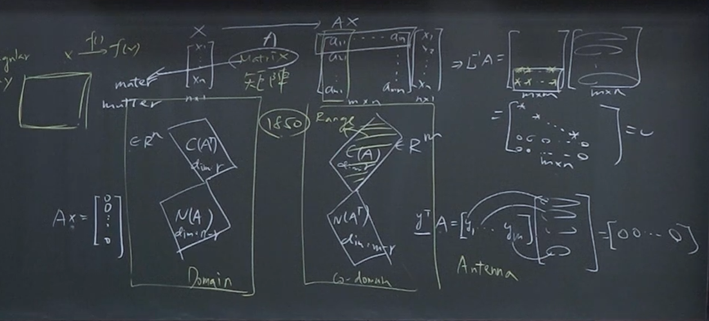
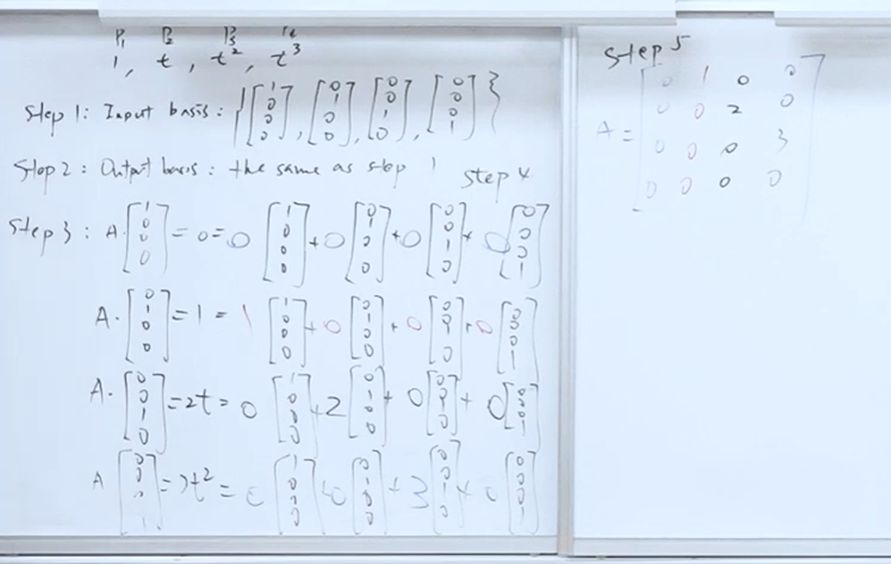

## **1. 元数据 (Metadata)**

* **标题：** 线性代数 - 05 矩阵代数与应用 (Matrix Algebra and Applications)
* **作者：** 国立台北科技大学 (陈昊笙 教授)
* **URL：** [單元 6．向量空間–兩種矩陣實例：線性轉換矩陣化、圖論 - YouTube](https://www.youtube.com/watch?v=rIUVEED3BTg&list=PL68D2uCy1WTNz4hadNnAXaFmb9_0fvDzg&index=6)
* [Vector space pdf](assets/台北科技大学%20单元5%20矩阵的四大空间/file-20260219085315907.pdf)

---

## **2. 概览 (Overview)**

本讲次是线性代数课程第二章的总结与应用延伸。陈昊笙教授首先回顾并深化了矩阵的“四个基本子空间”（Four Fundamental Subspaces）——即行空间 (Column Space)、零空间 (Null Space)、列空间 (Row Space) 与左零空间 (Left Null Space) 的几何意义与维度关系，并强调了“基底 (Basis)”作为连接这些抽象概念与具体运算的关键。接着，课程进入两个主要的应用分支：一是“矩阵化 (Matrix-lization)”，展示如何将微积分运算（如微分、积分）及几何操作（如旋转、投影、反射）转化为矩阵乘法；二是“图论 (Graph Theory)”，特别是通过关联矩阵 (Incidence Matrix) 来分析电路学中的克希荷夫定律 (KCL/KVL)，揭示了线性代数如何作为底层逻辑来解释物理世界的守恒与平衡。

---

**3. 主题拆解 (Thematic Breakdown)**

### 3.1 四个基本子空间的统整与物理意义

教授以系统观点（System view）重新诠释矩阵 $A$（大小为 $m \times n$）：它是一个将输入向量 $x$（来自 $\mathbb{R}^n$）映射到输出向量 $b$（位于 $\mathbb{R}^m$）的转换器。

* **定义域 (Domain) 的构成：**

  * **列空间 (Row Space, $C(A^T)$)：** 维度为 $r$ (秩, Rank)。它包含了所有有意义的输入成分。
  * **零空间 (Null Space, $N(A)$)：** 维度为 $n-r$。它是使得 $Ax=0$ 的所有 $x$ 的集合。物理上，这代表被系统“吃掉”或“无效化”的输入部分。
  * **关系：** 这两个空间互为正交补空间，共同构成了 $\mathbb{R}^n$。

* **对应域 (Codomain) 的构成：**

  * **行空间 (Column Space, $C(A)$)：** 维度为 $r$。也被称为值域 (Range)，代表系统能够产生的所有可能输出的集合。若目标向量 $b$ 落在行空间内，则方程式有解。
  * **左零空间 (Left Null Space, $N(A^T)$)：** 维度为 $m-r$。它限制了输出的可能性。
  * **关系：** 这两个空间互为正交补空间，共同构成了 $\mathbb{R}^m$。

### 3.2 应用一：线性转换的矩阵化 (Transformation Matrix)

教授提出一个核心概念：只要数学操作满足“线性转换 (Linear Transformation)”的三个条件（对零作用得零、加法性、纯量乘法性），该操作就可以被“编码”成一个矩阵。

**寻找转换矩阵的标准作业程序 (SOP)：**
这是一个将抽象操作（如多项式的微分）转化为具体矩阵 $A$ 的五步法：

1. **决定输入基底 (Input Basis)：** 选择一组能描述输入空间的基底向量（例如多项式的 $1, t, t^2, t^3$）。
2. **决定输出基底 (Output Basis)：** 选择一组能描述输出空间的基底向量（通常与输入基底相同，但视情况调整）。
3. **对输入基底进行操作：** 将数学运算（如微分 $\frac{d}{dt}$）实际作用在每一个输入基底向量上。
4. **线性组合表示：** 将步骤 3 得到的结果，用“输出基底”的线性组合来表示。
5. **构造矩阵：** 将步骤 4 中得到的系数，依序填入矩阵的“列 (Column)”中。

**实例演示：**

* **多项式微分：** 将多项式 $3+2t-t^2-4t^3$ 视为向量 $[3, 2, -1, -4]^T$。通过上述 SOP 建立微分矩阵，直接用矩阵乘法即可得到微分后的系数向量，无需重复进行微积分运算。
[單元 6．向量空間–兩種矩陣實例：線性轉換矩陣化、圖論 - YouTube](https://youtu.be/rIUVEED3BTg?t=3208)

* **几何操作：**
  * **旋转 (Rotation)：** 建立旋转矩阵。逆矩阵即为旋转角度取负号，或是矩阵的转置（正交矩阵特性）。
  * **投影 (Projection, $P$)：** 将向量投影到某条线上。特性为 $P^2 = P$（投影两次结果不变）。其零空间即为与投影线垂直的方向。
  * **反射 (Reflection, $H$)：** 将向量对某条线做镜射。特性为 $H^2 = I$（反射两次回到原点），且 $H = 2P - I$（反射可视为两倍投影减去原向量）。

### 3.3 应用二：图论与关联矩阵 (Graph Theory & Incidence Matrix)

图论是用来描述物件（节点 Node）之间关系（边 Edge）的学问。教授指出，电路学本质上就是图论的一种应用。

* **有向图 (Directed Graph)：** 包含节点、边以及方向（箭头）。
* **关联矩阵 (Incidence Matrix)：** 一个描述图形结构的矩阵。

  * **列 (Rows)：** 代表边 (Edges)，数量为 $m$。
  * **行 (Columns)：** 代表节点 (Nodes)，数量为 $n$。
  * **数值：** $-1$ 代表离开节点，$+1$ 代表进入节点，$0$ 代表无连接。

**四个子空间在图论（电路学）中的物理意义：**

1. **零空间 ($Ax=0$)：**

   * **意义：** 寻找一组节点电位 $x$，使得所有边上的电位差为 0。
   * **结论：** 若图是连通的，只有当所有节点电位都相等（常数向量 $c[1, 1, ..., 1]^T$）时才成立。
   * **维度：** 1。这解释了为什么电路分析中需要设一个接地点（Reference Node）来消除这个自由度。

2. **左零空间 ($A^T y = 0$)：**

   * **意义：** $A^T$ 的每一列代表一个节点，运算代表汇集到该节点的所有边（电流 $y$）之总和。$A^T y = 0$ 即表示流入等于流出。
   * **对应定律：** **克希荷夫电流定律 (KCL)**。
   * **维度：** $m - r = m - (n - 1)$。这对应到图形中独立网目（Loop）的数量。

3. **行空间 ($Ax=b$)：**

   * **意义：** $b$ 代表边上的电位差（电压降）。要让方程组有解，$b$ 必须满足特定条件。
   * **对应定律：** **克希荷夫电压定律 (KVL)**。即沿着任何回路（Loop）绕一圈，电压升降总和必须为 0。这构成了 $b$ 向量必须遵守的限制条件。

4. **欧拉公式 (Euler's Formula) 的线性代数推导：**

   * 通过维度分析：网目数 (Loops) = 边数 ($m$) - 秩 ($r$)。
   * 因为 $r = n-1$（节点数减 1），代入后得：**Loops = Edges - (Nodes - 1)**。
   * 移项整理即得欧拉公式：**Nodes - Edges + Loops = 1**。

### 3.4 词源学补充：Matrix 的由来

教授补充了 "Matrix" 一词的词源。1850年由 James Sylvester 提出，字根来自拉丁文的 "Mater"（母亲/子宫）。这暗示了矩阵不只是一堆数字的排列，而是一个“母体”，能够**孕育**出各种子空间、产生新的向量、并衍生出新的系统行为。这也呼应了电影《骇客任务》(The Matrix) 的命名，象征一个生成虚拟世界的母体系统。

---

**4. 框架与心智模型 (Frameworks & Mental Models)**

### 4.1 “编码与解码”心智模型 (Encoding/Decoding Model)

这是在处理线性转换时的核心思维。不要直接去想复杂的函数操作，而是将其视为坐标变换：

* **编码 (Encoding)：** 将输入函数（如 $3t^2$）根据选定的基底，转译成系数向量（如 $[0, 0, 3, 0]^T$）。
* **处理 (Processing)：** 使用转换矩阵 $A$ 与该向量相乘。这个矩阵 $A$ 是预先通过“SOP 五步法”计算好的“处理器”。
* **解码 (Decoding)：** 将得到的输出向量，根据输出基底还原回原本的数学形式（如多项式或几何图形）。
* **价值：** 这个模型将无限维度的函数空间操作，降维成有限维度的矩阵乘法，极大化了计算效率。

### 4.2 电路分析的子空间模型 (Subspace Model of Circuits)

将电路问题完全映射到线性代数的四个子空间中：

* **元件 (Components) $\leftrightarrow$ 边 (Edges) $\leftrightarrow$ 矩阵的列数 ($m$)**
* **节点 (Nodes) $\leftrightarrow$ 变量 (Columns) $\leftrightarrow$ 矩阵的行数 ($n$)**
* **电位 (Potentials) $\leftrightarrow$ 输入向量 $x$**
* **电压降 (Voltage Drops) $\leftrightarrow$ 输出向量 $b$**
* **电流 (Currents) $\leftrightarrow$ 对偶向量 $y$**

通过这个模型，物理定律不再是死记硬背的规则，而是矩阵结构（Row/Column space 的正交性与维度限制）所产生的必然数学结果。例如，KVL 是行空间的限制条件，KCL 是左零空间的定义。
