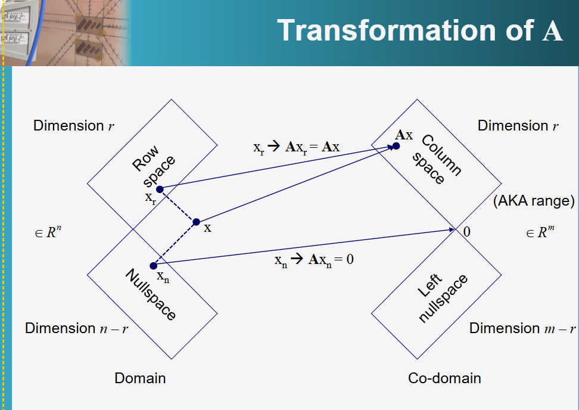
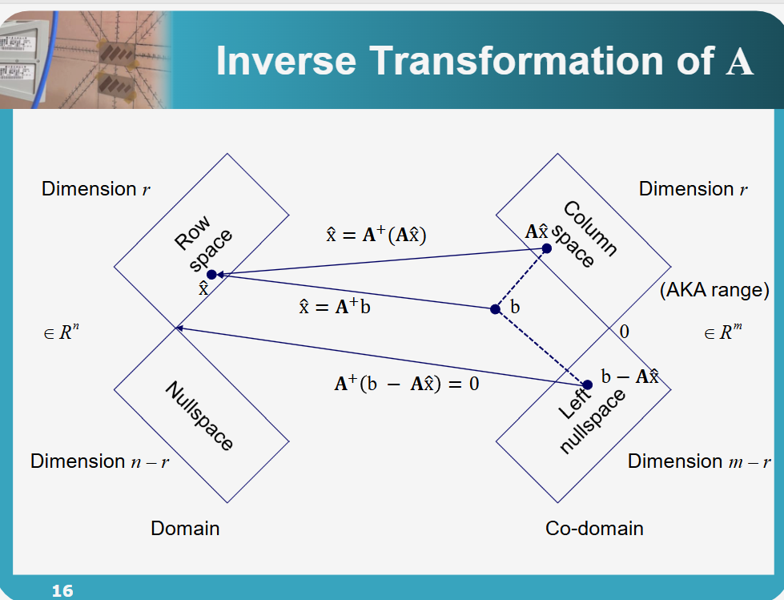
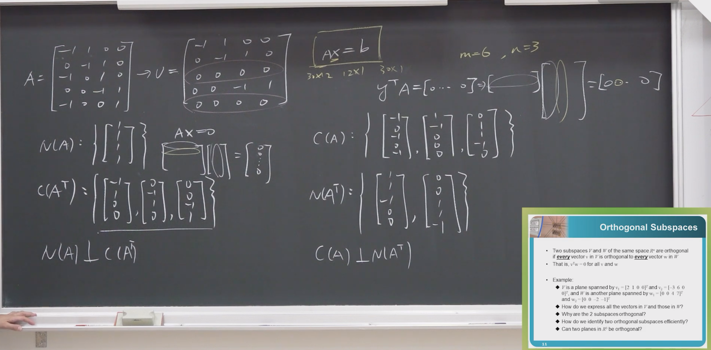

## **1. 元数据 (Metadata)**

*   **标题:** [线性代数] 05 - 四个子空间的正交性 (Orthogonality of the Four Subspaces)
*   **作者:** 陈昊笙 教授 / 国立台北科技大学 电子工程系
*   **URL:** [單元 7．正交性–四大子空間的正交性 - YouTube](https://www.youtube.com/watch?v=Dsq3fP2I_JI&t=2s)
* [正交性课件](assets/台北科技大学%20单元7%20四个子空间的正交性/file-20260303120156146.pdf)

> [!note]
> 
> ### **矩阵 $A$ 的线性变换特性整理**
> 
> #### **1. 输入向量的分解 (Domain Decomposition)**
> 
> 任意输入向量 $x \in \mathbb{R}^n$ 都可以唯一地分解为两个正交分量的和：
> 
> * **行空间分量 ($x_r$)**：属于 $C(A^T)$，即 Row space。
> * **零空间分量 ($x_n$)**：属于 $N(A)$，即 Null space。
> * **数学表达**：$x = x_r + x_n$，且 $x_r \perp x_n$。
> 
> #### **2. 映射过程与维数转换 (The Mapping)**
> 
> 矩阵 $A$ 作为一种线性变换（$Ax$），对这两个分量的处理方式截然不同：
> 
> * **行空间 $\to$ 列空间 (Row space $\to$ $C(A)$)**：
> * 行空间中维数为 **$r$** (秩) 的向量，通过矩阵 $A$ 变换后，会被映射到值域（列空间 $C(A)$）中。
> * 这是一个**一一对应**（逆矩阵在子空间内存在）的过程，即 $Ax_r$ 构成了列空间的所有向量。
> 
> 
> * **零空间 $\to$ 零点 (Null space $\to$ $0$)**：
> * 零空间中维数为 **$n-r$** 的向量，经过矩阵 $A$ 变换后，全部被“压缩”或映射为**零向量**。
> * **数学表达**：对于任意 $x_n \in N(A)$，恒有 $Ax_n = 0$。
> 
> 
> 
> #### **总结：变换的本质**
> 
> $$Ax = A(x_r + x_n) = Ax_r + Ax_n = Ax_r + 0 = Ax_r$$
> 
> 
> 这说明矩阵 $A$ 的作用本质上是**忽略输入中的零空间分量，仅将行空间分量转换至列空间**。

> [!note]
> ### **矩阵 $A$ 的逆变换特性整理 (Inverse Transformation)**
> 
> #### **1. 输出向量的分解 (Range Decomposition)**
> 
> 在输出空间 $\mathbb{R}^m$ 中，任何向量 $b$ 都可以唯一地分解为两个相互正交的分量的和：
> 
> * **列空间分量 ($b_c$)**：属于 $C(A)$，即 Column space。这是矩阵 $A$ 真正能“到达”的区域。
> * **左零空间分量 ($b_{ln}$)**：属于 $N(A^T)$，即 Left null space。
> * **数学表达**：$b = b_c + b_{ln}$，且 $b_c \perp b_{ln}$。
> 
> #### **2. 逆向映射的可能性 (The Inverse Mapping)**
> 
> 当我们试图从 $b$ 找回原始输入 $x$ 时，矩阵的作用表现如下：
> 
> * **列空间 $\to$ 行空间 (Column space $\to$ Row space)**：
> * **可逆性**：只有落在列空间中的分量 $b_c$ 才是“有效”的输出。
> * **转换逻辑**：每一个 $b_c$ 都能在行空间 $C(A^T)$ 中找到唯一对应的原像 $x_r$。在子空间限制下，这种映射是**一一对应**的（即存在伪逆 $A^+$ 或受限逆矩阵）。
> * **结论**：这部分信息是可以被完全逆转回原本输入的。
> 
> 
> * **左零空间 $\to$ 消失 (Left null space $\to$ 0 / Unreachable)**：
> * **不可逆性**：左零空间中的分量 $b_{ln}$ 与矩阵的输入没有任何因果关系（因为它与列空间正交）。
> * **转换逻辑**：从逆向视角看，这部分分量在 $A^T$ 的作用下会变为 $0$（因为 $A^T b_{ln} = 0$）。
> * **结论**：这部分属于“噪声”或“不可达区域”，无法逆转回任何有效的输入 $x$。
> 
> 
> 
> #### **总结：逆变换的本质**
> 
> 在处理现实中的无解方程 $Ax=b$ 时（即 $b$ 包含左零空间分量）：
> 
> 1. 我们通过**投影**丢弃掉无法逆转的 $b_{ln}$。
> 2. 仅保留 $b_c$（即投影 $p = Pb$）。
> 3. 利用 $A^T A \hat{x} = A^T b$ 寻找那个能完美逆转回行空间的唯一解 $\hat{x}$。
> 
> **核心结论：** 逆变换的本质就是**在列空间里找原像，在左零空间里清零**。

## **2. 概述 (Overview)**

本视频课程是线性代数课程中从第二章向第三章过渡的关键节点。陈教授首先通过“图论”中的**关联矩阵（Incidence Matrix）** 实例，回顾了矩阵的四个基本子空间（行空间、列空间、零空间、左零空间）的物理意义及其基底（Basis）的寻找方法。随后，课程引入了衡量向量与矩阵大小的**范数（Norm）** 概念，并结合Netflix推荐系统的**矩阵补全（Matrix Completion）** 问题，解释了低秩矩阵（Low-rank matrix）的实际应用。最后，课程的核心转向第三章的主题——**正交性（Orthogonality）**，深入探讨了向量正交、子空间正交以及**正交补空间（Orthogonal Complement）** 的定义，并最终引出了线性代数基本定理的第二部分：行空间与零空间互为正交补空间，列空间与左零空间互为正交补空间。

## **3. 主题详解 (Thematic Breakdown)**

### 3.1 关联矩阵与图论应用 (Incidence Matrix & Graph Theory)

课程首先通过一个具体的图论案例来复习第二章的核心内容。

*   **案例设定：** 一个包含4个节点（代表队伍）和5条边（代表比赛）的图。边的方向代表客队到主队。
*   **关联矩阵 A 的构建：**
    *   **行（Rows）：** 代表边（比赛）。如果有5场比赛，矩阵就有5行。
    *   **列（Columns）：** 代表节点（队伍）。如果有4支队伍，矩阵就有4列。
    *   **数值含义：**
        *   `-1`：代表出发点（客队）。
        *   `1`：代表终点（主队）。
        *   `0`：代表该队伍未参与该场比赛。
    *   此矩阵 $A$ 即为 **Incidence Matrix**。

*   **子空间的物理意义：**
    *   **零空间 (Nullspace, $N(A)$)：**
        *   解方程 $Ax=0$。这代表在图中寻找一个回路（Loop），使得回路上的电位差（或比分差）之和为零。
        *   在这个案例中，$N(A)$ 的基底是向量 $\begin{bmatrix} 1 \\ 1 \\ 1 \\ 1 \end{bmatrix}$。这意味着如果所有节点电位相同，则电位差为0。同时也隐含了图中的回路信息。
    *   **列空间 (Column Space, $C(A)$)：**
        *   探讨方程 $Ax=b$ 是否有解。$b$ 代表每场比赛的胜负分差。
        *   只有当 $b$ 落在 $C(A)$ 中时，方程才有解。这意味着分差数据必须符合“回路电压定律”（KVL），即绕行任何闭合回路，电位差之和必须为零。
        *   这引出了**生成树 (Spanning Tree)** 的概念：如果要避免无解（矛盾），比赛安排不应形成回路，或者必须满足回路上的分差和为零的约束。

### 3.2 范数：衡量向量与矩阵的大小 (Norms of Vectors and Matrices)

为了引入正交性，首先需要定义“长度”或“大小”。

*   **向量范数 (Vector Norms)：** 用双竖线 $\|v\|$ 表示。
    *   **$L_1$ 范数：** 所有元素绝对值之和 ($\sum |v_i|$)。
    *   **$L_2$ 范数 (欧几里得范数)：** 元素的平方和开根号 ($\sqrt{\sum v_i^2}$)。这是最常用、对应几何距离的范数。
    *   **$L_p$ 范数：** 元素绝对值的 $p$ 次方之和，再开 $p$ 次根号。
    *   **$L_\infty$ 范数：** 向量中绝对值最大的那个元素的值。
    *   **$L_0$ 范数：** 非零元素的个数。
> [!note]
> 在这里我们就能够知道，随着次方项数的增加，这表明你有多看重 Vector 中的某个 Vector
> 我们一般使用$L_{-2}$ norm 因为符合三次空间中的距离定理

[file-20260303120156146, p.5](./台北科技大学 单元7 四个子空间的正交性.assets/file-20260303120156146.pdf)
*   **矩阵范数 (Matrix Norms)：**
    *   **Frobenius Norm：** 矩阵中所有元素的平方和开根号（类似于将矩阵拉直成向量求 $L_2$ 范数）。
    *   **Spectral Norm (谱范数)：** 矩阵最大的奇异值（Singular Value，$\sigma_1$）。
    *   **Nuclear Norm (核范数/迹范数)：** 所有奇异值之和。

### 3.3 实际应用：Netflix 推荐系统与矩阵补全

教授通过Netflix竞赛的例子，解释了矩阵范数和低秩矩阵的应用。

*   **问题背景：** 用户对电影的评分构成了一个巨大的矩阵。行代表用户，列代表电影。
*   **稀疏性 (Sparsity)：** 用户只看过极少数电影，因此矩阵中绝大多数位置是空的（Missing Entries）。
*   **目标：** 预测（填补）这些空缺的评分，以此向用户推荐电影。
*   **核心假设 - 低秩 (Low Rank)：**
    *   虽然用户和电影很多，但用户的喜好模式（Pattern）是有限的（例如动作片爱好者、爱情片爱好者等）。
    *   因此，这个巨大的评分矩阵应当是一个**低秩矩阵 (Low-rank Matrix)**。
*   **解决方法：**
    *   寻找两个低秩矩阵 $U$ 和 $V$，使得 $UV^T$ 近似于已知的评分数据。
    *   **优化目标：** 最小化已知数据与 $UV^T$ 对应位置的差值的 **Frobenius Norm**。
    *   利用计算出的 $UV^T$ 来填补未知位置的评分，从而进行推荐。
> [!note]
> 其实我们构建的是一个最佳化模型
> 这个模型会将我们训练的 **矩阵** 与 实际矩阵进行比较
> 判断两个矩阵的相似性 --- 也就是我们推理判断的可行性

[file-20260303120156146, p.9](./台北科技大学 单元7 四个子空间的正交性.assets/file-20260303120156146.pdf)
### 3.4 正交性 (Orthogonality) 的定义与检测

进入第三章，核心在于“垂直”。

*   **向量正交：** 两个向量 $u$ 和 $v$ 正交，当且仅当它们的内积为零，即 $u^T v = 0$（或 $u \cdot v = 0$）。
    *   **重要性质：** 如果一组非零向量两两正交，那么它们必然是**线性独立**的。正交是“强化版”的线性独立。
*   **子空间正交：**
    *   两个子空间 $S$ 和 $T$ 正交，要求 $S$ 中的**每一个**向量都必须与 $T$ 中的**每一个**向量正交。
    *   **检测方法：** 不需要无穷尽地检测所有向量，只需检测两个子空间的**基底 (Basis)**。如果 $S$ 的所有基底向量都与 $T$ 的所有基底向量正交，则两个子空间正交。
> [!note]
> 其实 L2 norm 让我想到了 [[李琳山]] 提到的 内积
> 也就是两个 vector 之间的相似度
> 两个相同的vector的norm是大小（模长）
> 两个完全不同的 vector 的 norm 是 0

### 3.5 正交补空间 (Orthogonal Complement)

这是比单纯的“正交”更强的概念。
[file-20260303120156146, p.14](./台北科技大学 单元7 四个子空间的正交性.assets/file-20260303120156146.pdf)
*   **定义：** 在一个大空间（如 $R^n$）中，如果子空间 $V$ 的正交补空间 $V^\perp$ 包含了所有与 $V$ 正交的向量，则它们互为正交补空间。
*   **关键特征：**
    1.  **正交：** $V \perp V^\perp$。
    2.  **互补 (维度求和)：** $\text{dim}(V) + \text{dim}(V^\perp) = n$（整个空间的维度）。
    3.  它们可以“填满”整个空间，即任何 $R^n$ 中的向量都可以唯一分解为一个来自 $V$ 的分量和一个来自 $V^\perp$ 的分量。

### 3.6 线性代数基本定理 第二部分 (Fundamental Theorem of Linear Algebra, Part 2)

基于正交补空间的概念，教授总结了四个子空间之间的几何关系：

1.  **在 $R^n$ 空间中（针对 $Ax=0$）：**
    *   **行空间 (Row Space, $C(A^T)$) 与 零空间 (Nullspace, $N(A)$) 互为正交补空间。**
    *   关系式：$N(A) = C(A^T)^\perp$。
    *   维度关系：$r + (n - r) = n$。
    *   **物理意义：** $Ax=0$ 实际上是在做行向量与 $x$ 的内积。如果结果为0，说明 $x$ 与矩阵 $A$ 的每一行都正交，因此 $x$ 与行空间正交。

2.  **在 $R^m$ 空间中（针对 $Ax=b$）：**
    *   **列空间 (Column Space, $C(A)$) 与 左零空间 (Left Nullspace, $N(A^T)$) 互为正交补空间。**
    *   关系式：$C(A) = N(A^T)^\perp$。
    *   维度关系：$r + (m - r) = m$。
    *   **应用 - 可解性判据：**
        *   方程 $Ax=b$ 有解的条件通常表述为“$b$ 必须在列空间 $C(A)$ 中”。
        *   利用正交补空间的性质，这个条件等价于：“**$b$ 必须与左零空间 $N(A^T)$ 中的所有向量正交**”。
        *   这就是为什么我们要检查 $y^T b = 0$ （其中 $y$ 来自左零空间）来判断方程是否有解。
> [!note]
> 这里非常重要的一点是，因为正交互补
> 我们可以在已知其中一个子空间的情况下，求得另一个子空间

## **4. 框架与思维模型 (Frameworks & Mental Models)**

*   **“维度互补”模型 (Dimensional Complementarity Model)：**
    在理解子空间关系时，不要只看“垂直”（90度夹角），要看“填满”。就像三维空间中的地面（二维平面）和垂直于地面的柱子（一维直线），它们不仅互相垂直，而且 $2+1=3$，共同构成了整个三维空间。任何三维向量都可以拆解为“地面投影”和“垂直高度”。这就是行空间与零空间、列空间与左零空间的关系。

*   **$Ax=b$ 的“双重判据”模型：**
    判断线性方程组是否有解，就像是过安检，有两种检查方式但结果通过是一样的：
    1.  **正面清单（列空间视角）：** 检查 $b$ 是否在允许的列表（列空间的线性组合）中。即 $b \in C(A)$。
    2.  **负面清单（左零空间视角）：** 检查 $b$ 是否通过了所有“排斥测试”。即 $b$ 是否垂直于所有应该垂直的向量（左零空间）。即 $b \perp N(A^T)$。

*   **低秩近似模型 (Low-Rank Approximation)：**
    在处理大数据（如Netflix评分）时，虽然数据表面上是高维和稀疏的，但其内在逻辑通常由少数几个潜在因子（Latent Factors）控制。通过将高维稀疏矩阵分解为两个低维矩阵的乘积（$UV^T$），我们实际上是在用“最重要”的信息重构数据，这不仅能补全缺失值，还能去除噪声。这是现代推荐系统的基石。

---
