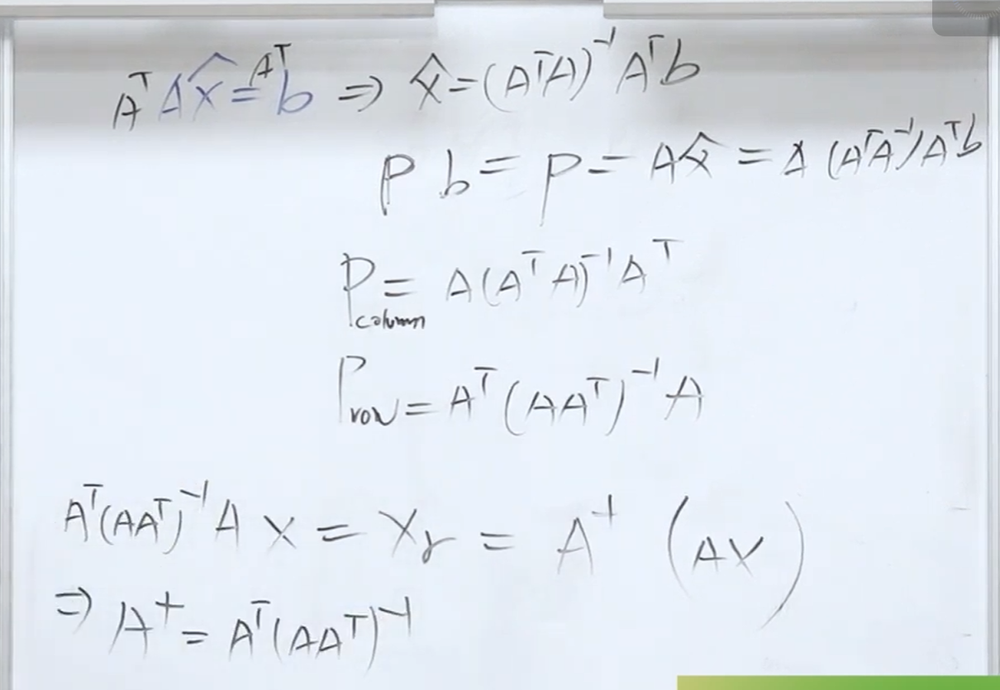
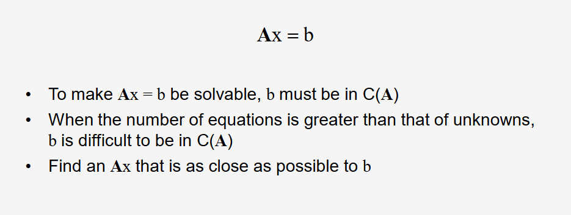
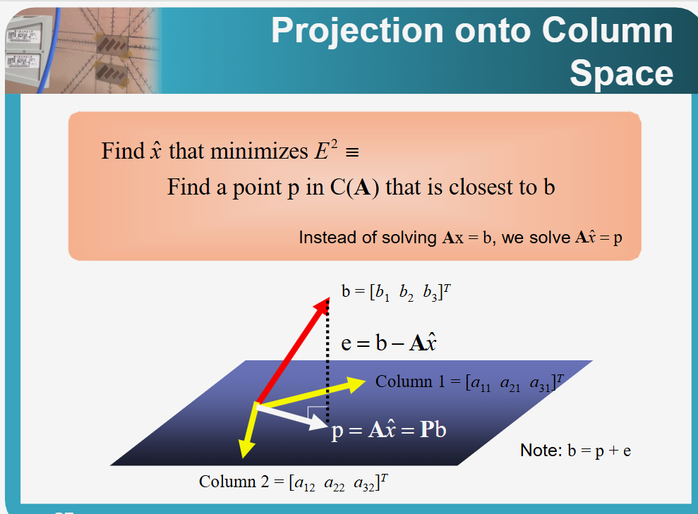
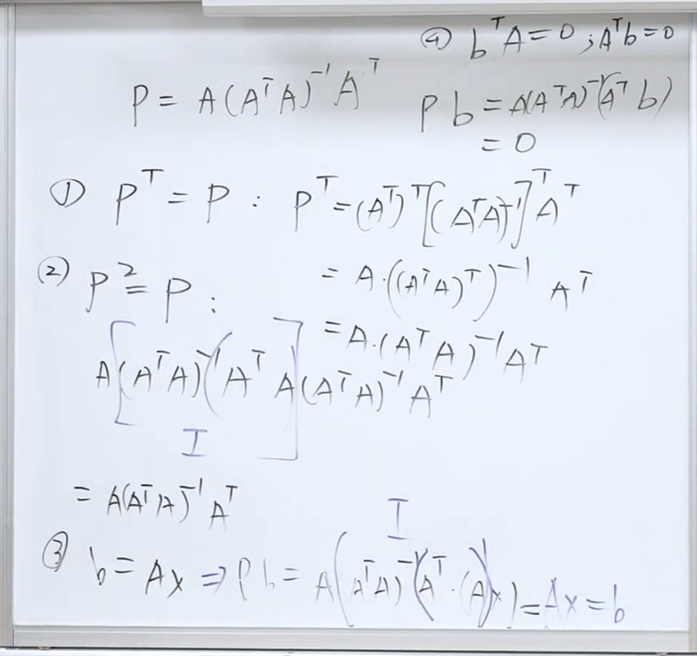
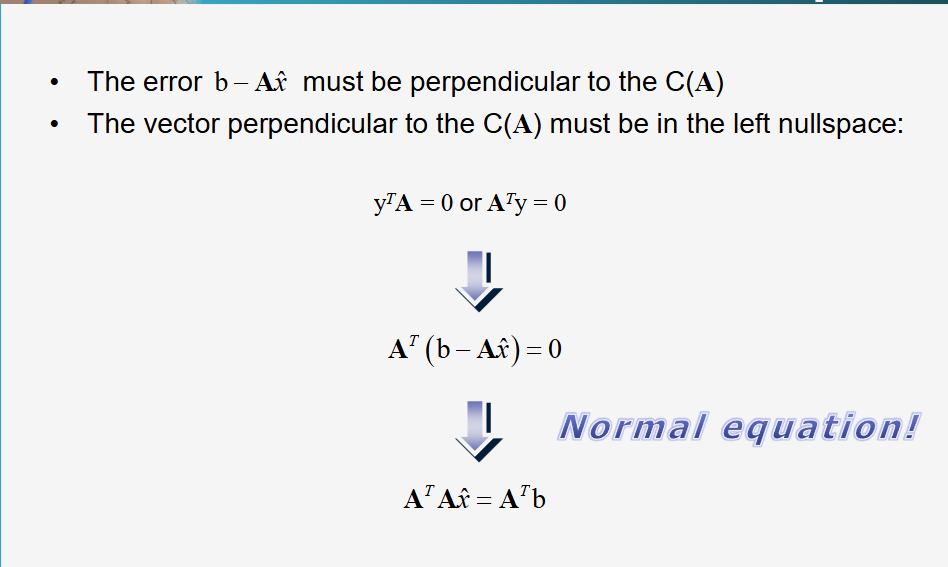
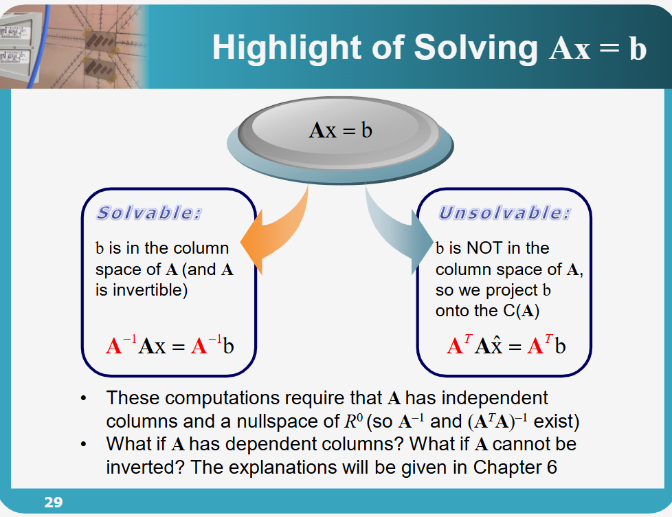
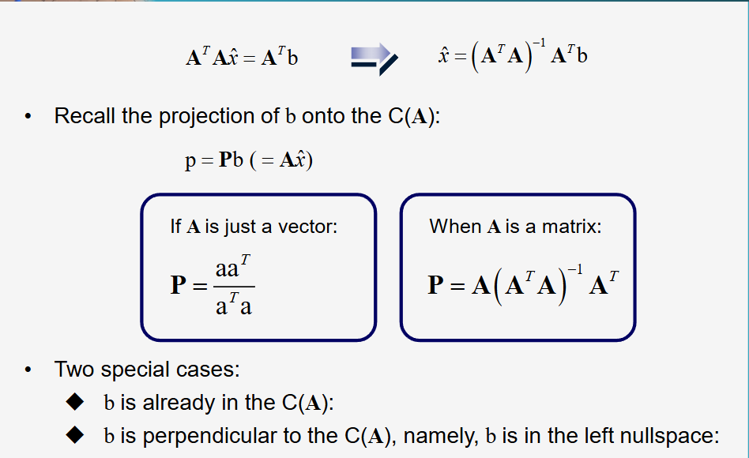
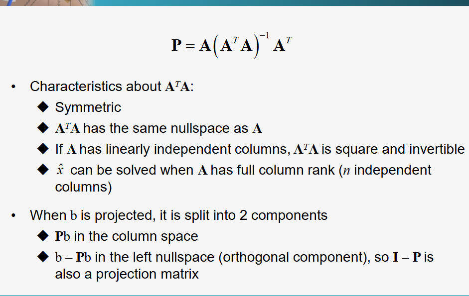
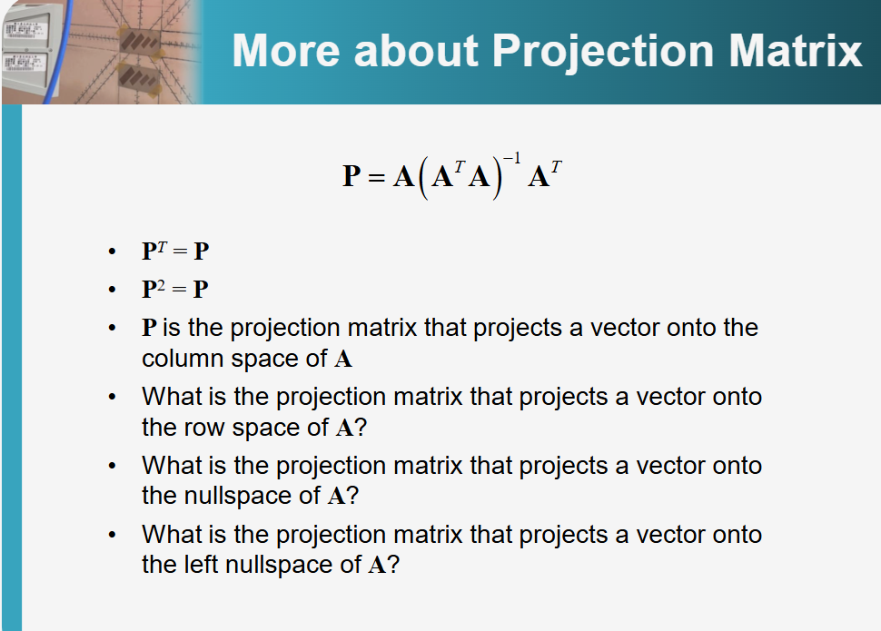
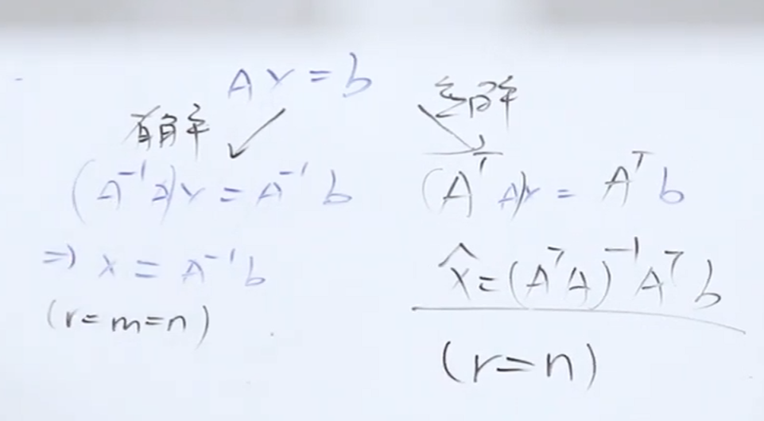

## **1. 元数据 (Metadata)**

*   **Title:** 线性代数 - 第三章：正交性、投影与最小二乘法 (Linear Algebra - Orthogonality, Projections, and Least Squares)
*   **Author:** 陳晏笙 教授 (国立台北科技大学 电子工程系)
- [[assets/台北科技大学 单元7 四个子空间的正交性/file-20260303120156146.pdf#page=18|Projection onto 1-D Subspaces]]
- [單元 8．正交性–最小平方法與投影矩陣 - YouTube](https://youtu.be/Unal60Qtpqs?si=ey0ZkvAua97A8oJL)

---

## **2. 核心概述 (Overview)**

本节课程是线性代数中从“精确求解”向“最优近似求解”过渡的核心转折点。陈晏笙教授首先回顾了矩阵的四个基本子空间及其正交互补关系。随后，课程直面工程与数据科学中极其常见的问题：当线性方程组 $A\mathbf{x} = \mathbf{b}$ 因为方程数量远大于未知数数量而面临“无解”时，该如何处理？为此，教授详细推导了**投影矩阵 (Projection Matrix)** 的概念与数学表达，并引出了**最小二乘法 (Least Squares Approximation)** 作为找寻最优近似解的数学工具。最终，课程通过“预测电影票房”的多元回归模型，生动展示了线性代数如何将现实世界的数据观测转化为可计算的数学矩阵。

**整节课浓缩版本**

---

## **3. 主题拆解 (Thematic Breakdown)**

### 3.1 从精确求解到近似求解：应对无解的 $A\mathbf{x} = \mathbf{b}$
在传统的工程和数学问题中，我们通常期望给定一个输入，系统能通过线性转换产生一个特定的输出，即求解 $A\mathbf{x} = \mathbf{b}$。
*   **有解的条件**：当且仅当目标向量 $\mathbf{b}$ 落在矩阵 $A$ 的**列空间 (Column Space, $C(A)$)** 内时，方程组才有精确解。
*   **无解的困境**：在现实采样的场景中（例如收集了大量包含噪声的数据点），系统的方程数量（观测次数 $m$）往往远大于未知数的数量（变量个数 $n$）。此时，矩阵 $A$ 是一个“瘦长型”矩阵，目标向量 $\mathbf{b}$ 极大概率不在 $A$ 的列空间内，导致方程组完全无解。
*   **解决思路**：既然无法在 $A$ 的列空间中找到一个精确等于 $\mathbf{b}$ 的向量，我们就退而求其次，在列空间中寻找一个**距离 $\mathbf{b}$ 最近**的向量 $\mathbf{p}$。我们将求解目标从 $A\mathbf{x} = \mathbf{b}$ 转化为求解 $A\mathbf{\hat{x}} = \mathbf{p}$。

### 3.2 投影矩阵 (Projection Matrix) 的数学推导
为了找到那个距离最近的向量 $\mathbf{p}$，我们需要将不在列空间内的 $\mathbf{b}$ **投影 (Project)** 到 $A$ 的列空间上。
[file-20260303120156146, p.19](./台北科技大学 单元8 正交性、投影与最小二乘法.assets/file-20260303120156146.pdf)

*   **误差向量 (Error Vector)**：我们将真实值 $\mathbf{b}$ 与投影值 $\mathbf{p}$ 之间的差定义为误差向量 $\mathbf{e} = \mathbf{b} - \mathbf{p}$。要使 $\mathbf{p}$ 是列空间中最接近 $\mathbf{b}$ 的点，误差向量 $\mathbf{e}$ 必须**垂直（正交）** 于 $A$ 的列空间。
*   **正规方程 (Normal Equation)**：由于 $\mathbf{e}$ 垂直于 $A$ 的列空间，根据线性代数基本定理，$\mathbf{e}$ 必然落在 $A$ 的**左零空间 (Left Nullspace, $N(A^T)$)** 内。因此：
    1.  $A^T \mathbf{e} = \mathbf{0}$
    2.  代入 $\mathbf{e} = \mathbf{b} - A\mathbf{\hat{x}}$，得到 $A^T(\mathbf{b} - A\mathbf{\hat{x}}) = \mathbf{0}$
    3.  展开并移项，得到核心公式：**$A^TA\mathbf{\hat{x}} = A^T\mathbf{b}$**。这就是著名的正规方程。
*   **最优近似解与投影矩阵**：
    *   通过正规方程解出最优近似解：$\mathbf{\hat{x}} = (A^TA)^{-1}A^T\mathbf{b}$
    *   将解代回求投影向量 $\mathbf{p}$：$\mathbf{p} = A\mathbf{\hat{x}} = A(A^TA)^{-1}A^T\mathbf{b}$
    *   由此，我们提取出了**投影矩阵 $P$** 的终极公式：**$P = A(A^TA)^{-1}A^T$**。只要将任何向量 $\mathbf{b}$ 乘上这个矩阵 $P$，就能将其投影到 $A$ 的列空间上。
> [!note]
> 注意，因为无解，所以两边都乘以 transpose $A^T$ 
> 得到 $A^TA\mathbf{\hat{x}} = A^T\mathbf{b}$ ，然后右边乘以逆矩阵，即可得到
> $\mathbf{\hat{x}} = (A^TA)^{-1}A^T\mathbf{b}$

### 3.3 投影矩阵的几何与代数特性
投影矩阵 $P$ 具有两个极度重要的数学特性，这也是检验一个矩阵是否为投影矩阵的试金石：
[file-20260303120156146, p.21](./台北科技大学 单元8 正交性、投影与最小二乘法.assets/file-20260303120156146.pdf)
1.  **对称性 (Symmetric)**：$P^T = P$。通过矩阵转置的运算法则展开 $(A(A^TA)^{-1}A^T)^T$，可以证明其转置等于其本身。
2.  **幂等性 (Idempotent)**：$P^2 = P$。物理意义非常直观：将一个向量投影到平面上后，它已经在这个平面上了。如果你对这个已经存在于平面上的点“再做一次投影”，它的位置不会发生任何改变。

### 3.4 最小二乘法 (Least Squares Approximation)
为什么上述的投影方法被称为“最小二乘法”？
*   在统计与微积分中，我们要寻找最佳拟合线，就是试图让所有观测点与拟合线之间的误差总和最小化。
*   为了避免正负误差互相抵消，我们计算误差的平方和 (Sum of Squared Errors)：$E^2 = \|\mathbf{e}\|^2 = \|\mathbf{b} - A\mathbf{\hat{x}}\|^2$。
*   对 $E^2$ 进行求导并令导数为 $0$ 以寻找极小值，得出的微积分结果与我们通过“空间正交投影”得出的线性代数结果（即正规方程 $A^TA\mathbf{\hat{x}} = A^T\mathbf{b}$）完全一致。这证明了**几何上的垂直投影，在代数上等价于误差平方和最小化**。
> [!note]
> - **误差向量 (Error Vector)**：定义为 $e = b - A\hat{x}$ 。
> - 正交条件**：误差向量 $e$ 必须与矩阵 $A$ 的列空间 $C(A)$ 正交。
> - **正规方程 (Normal Equation)**：基于上述正交性，$A^T(b - A\hat{x}) = 0$，展开得：
> - $$A^TA\hat{x} = A^Tb$$
>   

[file-20260303120156146, p.26](./台北科技大学 单元8 正交性、投影与最小二乘法.assets/file-20260303120156146.pdf)

#### 3.4.1 Transpose matrix
如何来记忆$\mathbf{x}$ 的公式
对于无解的方程 ，我们采用 transpose matrix 来替代 Inverse matrix
> [!note]
> 对于一个无解的方程$A\mathbf{\hat{x}} = \mathbf{b}$
> 注意，因为无解，所以两边都乘以 transpose $A^T$ 
> 得到 $A^TA\mathbf{\hat{x}} = A^T\mathbf{b}$ ，然后右边乘以逆矩阵，即可得到
> $\mathbf{\hat{x}} = (A^TA)^{-1}A^T\mathbf{b}$

#### 3.4.2More about Projection Matrix
[[pages/assets/台北科技大学 单元7 四个子空间的正交性/file-20260303120156146.pdf#page=30|file-20260303120156146, p.30]]

**互补投影:** 如果 $P$ 是投影到列空间的矩阵，那么 $I - P$ 就是投影到其正交补空间（即左零空间）的投影矩阵。

### 3.5 伪逆矩阵 (Pseudoinverse, $A^+$) 与秩的限制
在使用公式 $\mathbf{\hat{x}} = (A^TA)^{-1}A^T\mathbf{b}$ 时，有一个致命的隐含前提：**矩阵 $(A^TA)$ 必须是可逆的**。
*   **可逆的条件**：$(A^TA)$ 是一个 $n \times n$ 的方阵。它可逆的充要条件是其内部的秩 $r$ 等于变量的数量 $n$。换句话说，矩阵 $A$ 必须具有**线性独立的列 (Independent Columns)**，即它的零空间只有零向量（没有多余的、相互依赖的变量）。
*   **如果列不独立怎么办？**：如果 $A$ 的某些列是相关的（例如，特征之间存在多重共线性），则 $(A^TA)^{-1}$ 不存在。此时，最小二乘法公式失效。
*   **解决方案**：为了处理这种更加恶劣的情况，需要引入第六章的内容——利用**奇异值分解 (SVD)** 构建**伪逆矩阵 (Pseudoinverse, $A^+$)**。无论矩阵是否满秩，伪逆矩阵都能强行给出一个数学上最合理的近似解。

[file-20260303120156146, p.17](./台北科技大学 单元8 正交性、投影与最小二乘法.assets/file-20260303120156146.pdf)
[file-20260303120156146, p.34](./台北科技大学 单元8 正交性、投影与最小二乘法.assets/file-20260303120156146.pdf)
- **输入向量的分解**：任何输入向量 $x$ 都可以拆分为行空间分量 $x_r$ 和零空间分量 $x_n$ 。
  
- **伪逆 ($A^+$) 的功能**：由于零空间分量 $x_n$ 会被矩阵 $A$ 永久抹除（变为 $0$），我们无法找回完整的 $x$ 。
    - **伪逆的作用**是仅恢复那个落在**行空间**的分量 $x_r$ 。
    - 即 $A^+(Ax) = x_r$ 。
- **行空间投影**：这也意味着 $A^+A$ 本质上是一个将向量投影到**行空间**的投影矩阵 。
- **计算公式**：
    - 伪逆公式：$A^+ = A^T(AA^T)^{-1}$ 。
    - 满足性质：$AA^+ = I$ 。
#### 3.6.1 正规矩阵
[file-20260303120156146, p.31](./台北科技大学 单元8 正交性、投影与最小二乘法.assets/file-20260303120156146.pdf)
##### **1. 对称性 (Symmetric)**
$A^T A$ 永远是一个对称矩阵，无论原始矩阵 $A$ 是什么样的形状。
- **证明**：取其转置 $(A^T A)^T = A^T (A^T)^T = A^T A$。
- **意义**：对称矩阵具有非常优良的数学性质，例如它的特征值永远是实数，且可以被正交对角化。
##### **2. 相同的零空间 (Same nullspace as $A$)**
这是一个非常重要的性质：**$A^T A x = 0$ 当且仅当 $Ax = 0$**。
- **直观理解**：
    - 如果 $Ax = 0$，那么显然 $A^T(Ax) = A^T(0) = 0$。
    - 反之，如果 $A^T A x = 0$，我们可以两边左乘 $x^T$，得到 $x^T A^T A x = 0$，即 $(Ax)^T (Ax) = 0$。根据向量内积的性质，这意味着向量 $Ax$ 的长度为 0，因此 $Ax = 0$。
- **结论**：$A^T A$ 和 $A$ 的零空间完全一致，$N(A^T A) = N(A)$。
##### **3. 列线性无关时，其为方阵且可逆**
如果 $A$ 的列是线性无关的（即 $A$ 是列满秩的，rank = $n$）：
- **方阵性**：如果 $A$ 是 $m \times n$，则 $A^T A$ 是 $n \times n$ 的方阵。
- **可逆性**：由于 $N(A^T A) = N(A)$，且 $A$ 的列线性无关意味着 $N(A)$ 只有零向量，所以 $N(A^T A)$ 也只有零向量。一个零空间只有零向量的方阵必然是**可逆（Invertible）** 的。
- 这是最小二乘法能够计算出唯一解 $\hat{x} = (A^T A)^{-1} A^T b$ 的前提条件。
##### **4. 全列秩 (Full column rank) 时方程可解**
当 $A$ 拥有 $n$ 个独立列时，这意味着矩阵 $A$ 的秩 $r = n$。
- 在这种情况下，正如前一点所述，$A^T A$ 是非奇异的（可逆的）。
- 此时正规方程 $A^T A \hat{x} = A^T b$ 具有**唯一解**。
- **几何意义**：这意味着 $b$ 在 $A$ 列空间上的投影 $p$ 对应着唯一的系数向量 $\hat{x}$。
##### **总结：为什么 $A^T A$ 如此重要？**
在现实中，$Ax=b$ 往往因为方程个数 $m$ 多于未知数 $n$ 而无解（$b$ 不在列空间中）。$A^T A$ 的作用是将这个“不可解”的问题转化成一个“对称、方阵、且通常可逆”的方程组，从而找到使误差平方和最小的最优近似解。

### 3.6 实际应用：多元回归模型 (Multiple Regression)
课程最后展示了如何将最小二乘法应用于现实世界的数据建模，例如预测电影的上映首周票房。
*   **提取特征 (Features / Inputs)**：将电影的制作预算 (Production Budget)、预告片观看次数 (Trailer Views)、IMDb评分 (IMDb Score) 以及主演的Instagram粉丝数 (IG Followers) 作为输入变量 $x_1, x_2, x_3, x_4$。
*   **建立观察矩阵 (Observation Matrix)**：每一部历史电影的数据构成矩阵 $A$ 的一行，形成一个 $m \times 4$ 的矩阵（$m$ 是历史电影的数量）。
*   **加入截距项 (Intercept/Constant)**：在多项式回归中，通常会有一个常数项 $\beta_0$。在矩阵中，体现为给矩阵 $A$ 强行加入一整列的“1”。
*   **求解最优权重**：将真实票房作为目标向量 $\mathbf{b}$，利用 $(A^TA)^{-1}A^T\mathbf{b}$ 求解出最优的权重系数 $\boldsymbol{\beta}$。最终得到一个回归模型，输入新电影的特征即可预测其票房。

---

## **4. 思维模型与分析框架 (Frameworks & Mental Models)**

### 4.1 投影转换框架 (Projection Transformation Framework)
这是一个处理“理想目标无法达成时，如何寻找最优妥协解”的通用数学模型。
*   **要素定义**：
    *   **现实约束空间 ($C(A)$)**：你当前拥有的资源或能力所能组合出的所有可能性边界（列空间）。
    *   **理想目标 ($\mathbf{b}$)**：由于外界噪音或要求过高，处于约束空间之外。
    *   **最优妥协解 ($\mathbf{p}$)**：约束空间内距离理想目标最近的点。
    *   **舍弃的噪音 ($\mathbf{e}$)**：无法被模型解释的部分，必须与约束空间正交（保证完全无关）。
*   **应用方法**：当面对过约束系统（Overdetermined system，条件多于变量）时，不要试图精确满足每一个条件。将目标投影到你的能力空间内，利用 $A^TA\mathbf{\hat{x}} = A^T\mathbf{b}$ 寻找全局误差最小的最优解。

### 4.2 数据视角的回归矩阵化建模 (Matrixization of Regression)
一种将现实世界杂乱的统计数据转化为可计算的线性代数格式的标准流程。
1.  **定义目标 ($\mathbf{b}$ 向量)**：明确你要预测的唯一结果（如票房），将历史真实数据排成一列。
2.  **提取特征并补全常数 ($A$ 矩阵)**：将影响结果的因素排成列。至关重要的一步是：必须在第一列填充全为 `1` 的常数列，这在几何上代表基准平移（截距），确保模型能处理基础非零的情况。
3.  **计算映射关系 ($\mathbf{\hat{x}}$ 向量)**：通过最小二乘法求出的解，代表着每一个特征（列）在最终结果中的“权重”或“话语权”。在这个过程中，如果发现无法计算倒数 $(A^TA)^{-1}$，说明你提取的特征存在冗余（相关性），需要进行特征筛选降维。

---
