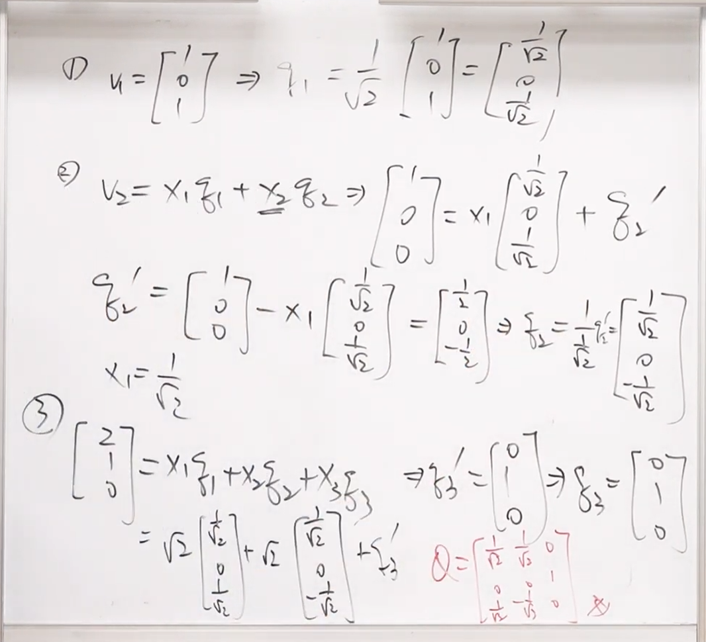
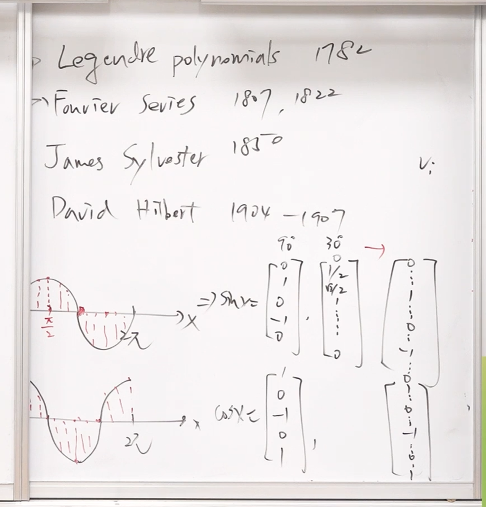
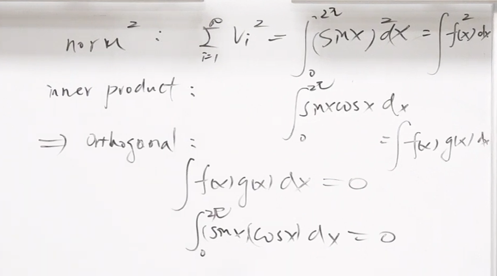
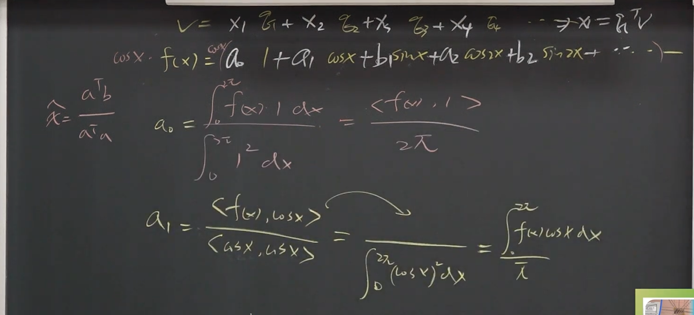
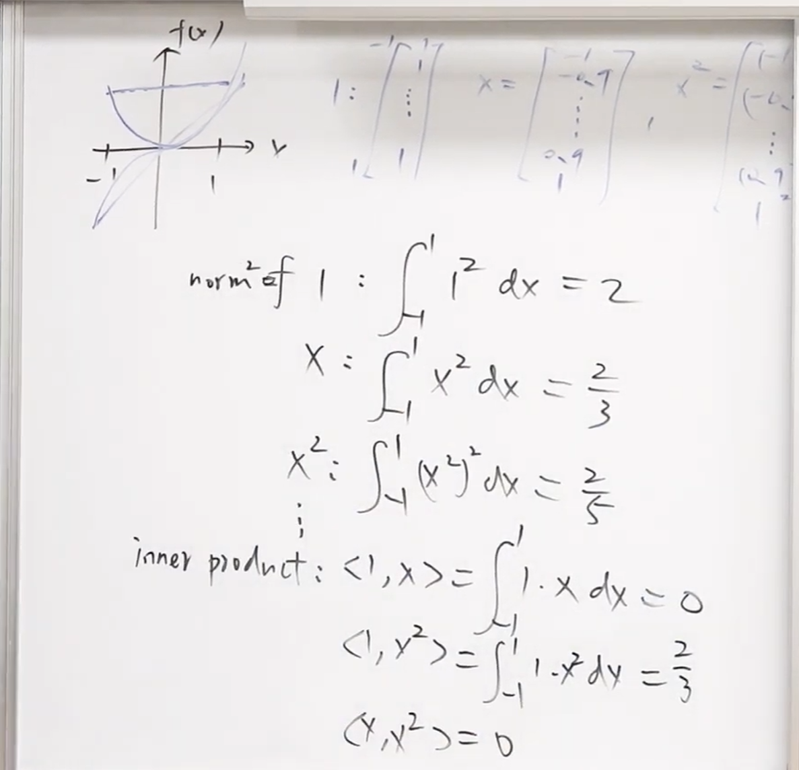

**标题：** 线性代数 - 第3章：正交性 (Orthogonality) 与 正交基底 (Orthonormal Bases)
**作者：** 陈晏笙 教授 (国立台北科技大学 电子工程系)
**URL：** [- YouTube](https://www.youtube.com/watch?v=mO6v6S9wRRM)
[[pages/assets/台北科技大学 单元7 四个子空间的正交性/file-20260303120156146.pdf#page=40|Orthonormal Bases]]

---

### 课程概述 (Overview)

本堂课为线性代数第三章的总结，核心探讨一个关键问题：「在无穷多种基底中，为何正交且正规化（长度为1）的基底是最好的？」。课程深入解析了由这些最佳基底所组成的矩阵 $Q$（正交矩阵，Orthogonal Matrix），探讨其几何意义（旋转与反射）、常见的生成方式（如 Hadamard 矩阵与小波矩阵），以及它如何将复杂的最小平方法（Least Squares）与投影矩阵计算大幅简化。最后，课程带来一次精彩的认知升维，将向量空间的概念延伸至无穷维度的「希尔伯特空间（Hilbert Space）」，揭示了傅立叶级数（Fourier Series）与多项式函数背后的正交性本质，完美桥接了线性代数与微积分。

这节课讨论了三个问题
1. 为什么垂直basis最好
2. 既然垂直basis最好，那么如何将不垂直的basis修正为垂直的呢
3. 希尔伯特空间

---

### 主题拆解与详细内容 (Thematic Breakdown)

#### 1. 寻找最佳基底：正规直交基底 (Orthonormal Bases)
在一个 $R^n$ 空间中，存在著无穷多种基底（Bases）的选择，每种基底都包含 $n$ 个线性独立的向量。然而，在所有的选择中，有一种基底被认为是「最好的」，那就是 **正规直交基底 (Orthonormal Bases)**。

要成为正规直交基底，必须满足两个条件：
1.  **正交性 (Orthogonality)：** 基底中的任何两个不同向量互相垂直。在代数上的意义是，任两个不同向量的内积为零（$q_i^T q_j = 0$, 当 $i \neq j$）。
2.  **正规化 (Normalization)：** 每个向量的长度（Norm）都必须为 1（$q_i^T q_i = 1$）。

为什么光是「垂直」还不够，非得加上「长度为1」的限制？这与后续构造矩阵及简化运算有极大的关系。

#### 2. 矩阵 $Q$ 与正交矩阵 (Orthogonal Matrix)
当我们把这些「垂直且长度为1」的基底向量 $q_1, q_2, \dots, q_n$ 排列成一个矩阵的行（Columns）时，这个矩阵我们习惯称之为 **$Q$ 矩阵**。

**$Q$ 矩阵的形状与严格定义：**
*   **长型矩阵 (Tall Matrix)：** 如果你在一个较高维度的空间（例如 $R^5$）中只挑出 3 个互相垂直的向量组成矩阵，这是一个 $5 \times 3$ 的长型矩阵。此时它只能被称为 $Q$，**不能**被称为正交矩阵。
*   **方阵 (Square Matrix)：** 当挑出的向量个数刚好等于空间的维度（例如在 $R^3$ 中挑出 3 个向量），这会形成一个方阵。**只有当 $Q$ 是方阵时，它才拥有专属名称：「正交矩阵 (Orthogonal Matrix)」。**

**$Q$ 矩阵的最重要性质：**
这是一种直觉反射——只要看到 $Q$ 矩阵（各行正交且长度为1），就必须立刻想到以下性质：
*   **$Q^T Q = I$**（转置矩阵乘以原矩阵等于单位矩阵）。这是因为 $Q^T$ 的列与 $Q$ 的行做内积时，只有自己对上自己会得到 1（长度为1），对上别人都是 0（互相垂直）。
*   **如果 $Q$ 是方阵（正交矩阵）：** 则其反矩阵就等于它的转置矩阵，即 **$Q^{-1} = Q^T$**。这意味著不仅 $Q^T Q = I$，同时 **$Q Q^T = I$** 也成立。这点极度重要，因为求反矩阵通常很困难，但对于正交矩阵，你只需要做简单的「转置」即可得到反矩阵。
[file-20260303120156146, p.42](./台北科技大学 单元9 正交性–正交矩阵与Gram-Schmidt 正交化.assets/file-20260303120156146.pdf)
#### 3. 矩阵 $Q$ 的几何意义与物理特性
除了代数上的美好，矩阵 $Q$ 在几何与物理上具有保值特性：
*   **保留长度 (Preserves Length)：** 一个向量 $x$ 被 $Q$ 作用（即 $Qx$）后，其长度不变（$||Qx|| = ||x||$）。
*   **保留角度/内积 (Preserves Angle)：** 两个向量 $x, y$ 被 $Q$ 作用后，它们的内积不变（$(Qx)^T(Qy) = x^T y$）。

**在空间操作上的意义：**
既然长度与角度都不变，代表用 $Q$ 矩阵去乘上一个空间中的物件，该物件只会经历两种操作：
1.  **旋转 (Rotation)：** 例如将物件转动 $\theta$ 角度。
2.  **反射 / 对称 (Reflection)：** 例如沿著某条轴进行镜射。置换矩阵（Permutation Matrix，交换列或行的矩阵）本质上就是一种反射操作。
矩阵 $Q$ 的操作，绝对跳脱不出这两种几何变换的范畴。

#### 4. 常见的的正交矩阵生成方式
实务上有几种著名的方式可以构造出正交矩阵 $Q$：
*   **Householder Reflection:** 从一个单位向量出发，透过公式 $H = I - 2uu^T$ 构造出的矩阵，必然是对称且正交的。
*   **Hadamard Matrix (哈达玛矩阵):** 一种仅由 $1$ 和 $-1$ 组成的矩阵（需再除以长度做正规化）。由于不需要进行复杂的乘法（只需处理正负号），它在通讯工程（如 CDMA、OFDM）、错误更正码以及统计学的「实验设计 (Design of Experiments)」中被广泛应用，极大地降低了硬体运算的成本。
	* [[pages/assets/台北科技大学 单元7 四个子空间的正交性/file-20260303120156146.pdf#page=44|file-20260303120156146, p.44]]
*   **Wavelet Matrix (小波矩阵):** 包含大量的 $0$，是一种稀疏矩阵（Sparse Matrix）。广泛应用于讯号处理与资料压缩（如 JPEG 图像压缩）。
	* [[pages/assets/台北科技大学 单元7 四个子空间的正交性/file-20260303120156146.pdf#page=45|file-20260303120156146, p.45]]

#### 5. 为何正交基底如此强大？(应用层面)
正交基底之所以被称为「最好」，是因为它能把所有复杂的线性代数问题「解耦（Decouple）」，让难题变简单：

*   **极简化的座标求解：** 如果你要找一个向量 $b$ 在基底 $q_1, q_2 \dots$ 上的座标（系数 $x_i$），如果是普通基底，你需要解联立方程式。但对于正交基底，你只需要将 $b$ 直接「投影」到该基底上即可：**$x_i = q_i^T b$**（直接做内积）。
	* <mark style="background:#b1ffff">也就是系数非常容易求</mark>
*   **拯救最小平方法 (Least Squares)：** 在解无解的方程式 $Ax = b$ 时，正规方程式为 $A^T A \hat{x} = A^T b$。如果你的 $A$ 刚好是长型正交矩阵 $Q$，因为 $Q^T Q = I$，方程式瞬间简化为 **$\hat{x} = Q^T b$**。完全不需要求反矩阵！
	* <mark style="background:#b1ffff">求输入很容易</mark>，因为原本需要求逆矩阵，但是因为正交矩阵的 Inverse = transpose 的原因，会让这个步骤变得非常简单。
*   **极简化的投影矩阵 (Projection Matrix)：** 原本投影到行空间（Column Space）的矩阵公式是 $P = A(A^T A)^{-1}A^T$。若 $A = Q$，中间的项变成 $I$，投影矩阵直接退化为 **$P = Q Q^T$**。
	* 对于无解的情况，<mark style="background:#b1ffff">求近似解也非常简单</mark>
[file-20260303120156146, p.47](./台北科技大学 单元9 正交性–正交矩阵与Gram-Schmidt 正交化.assets/file-20260303120156146.pdf)
#### 6.施密特正交化
• To have orthogonal columns is important and powerful 
• Make columns perpendicular to one another, and further generate an orthonormal basis  Gram-Schmidt process
[file-20260303120156146, p.52](./台北科技大学 单元9 正交性–正交矩阵与Gram-Schmidt 正交化.assets/file-20260303120156146.pdf)
[file-20260303120156146, p.53](./台北科技大学 单元9 正交性–正交矩阵与Gram-Schmidt 正交化.assets/file-20260303120156146.pdf)
1. 选一条边不动，将其正规化,得到$q_1$
2. 另一条想象用 $q_1,q_2$ 来线性组合表示 $v_2 = x_1 * q_1 + x_2 * q_2$
	1. 先求 $x_1$ ,使用我们之前求系数的方式，将其与 $q_1$,求内积，就可以得到
	2. 再求$q_2$ , $v_2-x_1 * q_1$ 就可以得到。
[[pages/assets/台北科技大学 单元7 四个子空间的正交性/file-20260303120156146.pdf#page=54|file-20260303120156146, p.54]]
$$\mathbf{A} = \begin{bmatrix} 1 & 1 & 2 \\ 0 & 0 & 1 \\ 1 & 0 & 0 \end{bmatrix}$$
Construct a $\mathbf{Q}$ that has the same column space as $\mathbf{A}$
计算内容太多，可以适当简化求解要求 
[[pages/assets/台北科技大学 单元7 四个子空间的正交性/file-20260303120156146.pdf#page=54|Example]]

### A=QR 分解
主要是转化为一个
正交矩阵乘以一个上三角矩阵
[file-20260303120156146, p.57](./台北科技大学 单元9 正交性–正交矩阵与Gram-Schmidt 正交化.assets/file-20260303120156146.pdf)
#### 8. 认知升维：希尔伯特空间 (Hilbert Space) 与函数正交性

课程最后将有限维度的向量空间 $R^n$，扩展到了无限维度 $R^\infty$ —— 也就是 **[[希尔伯特空间]] (Hilbert Space)**，在这里，**「向量」变成了「连续函数」**。

*   **向量到函数的转换：** 一个向量可以看作是在离散点上的取值（如 $v_1, v_2, v_3$）。当这些点变得无限密集时，向量就变成了一条连续的曲线，也就是函数 $f(x)$。
*   **内积的转换 (从连加到积分)：** 在离散向量中，内积是元素相乘后相加（$\sum v_i w_i$）。在函数空间中，内积变成了**相乘后的积分（$\int f(x)g(x)dx$）**。
*   **函数的正交：** 如果两个函数相乘后的积分等于 0，我们就说这两个函数是「垂直（正交）」的。例如 $\int_0^{2\pi} \sin(x)\cos(x)dx = 0$，这意味著 $\sin(x)$ 与 $\cos(x)$ 在该区间内是互相垂直的向量。

**经典应用：**
*   **[[傅里叶级数]](Fourier Series)：** 傅立叶的伟大之处在于，他发现 $\{1, \cos x, \sin x, \cos 2x, \sin 2x \dots\}$ 这一系列函数彼此之间**全部互相垂直**。因此，当我们要把一个复杂函数 $f(x)$ 展开成傅立叶级数时，求系数的过程，就如同我们在第 5 点所说的——**「只是单纯地把 $f(x)$ 投影到这些垂直的基底上」**（做内积/积分）。完全不需要解无限多维的联立方程式。
我们将sin,cos在 $0-2\pi$ 的区间内无限缩小之后，我们会发现
norm square = 在区间内的积分
inner product = 两个部分的积分 = 0
因为**傅立叶变换**是垂直bases，所以如果求系数就会变得非常简单。

*   **勒让大多项式 (Legendre Polynomials)：** 传统的多项式基底 $\{1, x, x^2, x^3 \dots\}$ 彼此之间并不垂直。为了让它们在微积分计算上享有正交基底的优势，数学家使用了 **格拉姆-施密特正交化过程 (Gram-Schmidt Process)**，将这些多项式逐一修正，剔除掉彼此重叠（投影）的部分，最终产生了互相垂直的勒让大多项式。

---

### 框架与心智模型 (Frameworks & Mental Models)

#### 1. 正交解耦模型 (The Orthogonal Decoupling Framework)
这个模型揭示了在面对多变数、互相干扰的复杂系统时，如何透过「寻找正交性」来简化问题。
*   **问题状态 (Coupled State)：** 一般系统中，变数彼此纠缠（如普通的基底向量彼此不垂直）。改变一个变数（例如解联立方程式中的一个系数），会牵动到其他的变数，导致计算量庞大（需要计算反矩阵）。
*   **转换机制 (Orthogonalization)：** 引入或转换到正交基底（Matrix $Q$）。这就像是找到了系统中互不干涉的「独立维度」。
*   **解决状态 (Decoupled State)：** 在正交状态下，所有的全域计算（求反矩阵、解联立）都会退化为局部的独立计算（转置、一维投影/内积）。
*   **应用场景：** 讯号处理（排除杂讯干扰）、资料压缩（独立储存重要特征）、机器学习（特征解耦如 PCA 主成分分析）。

#### 2. 连续-离散同构认知模型 (Discrete-to-Continuous Isomorphism)
这是一种强大的数学直觉，将代数与微积分统一起来。
*   **核心概念：** 不论是离散的数字集合（向量），还是连续的变化曲线（函数），其背后的几何结构本质上是相同的。
*   **对应关系：**
    *   离散点数 $n$ 空间 $\leftrightarrow$ 连续区间的无穷维空间 (Hilbert Space)。
    *   向量座标 $v_i$ $\leftrightarrow$ 函数在某点的值 $f(x)$。
    *   向量内积 (相乘后连加 $\Sigma$) $\leftrightarrow$ 函数内积 (相乘后积分 $\int$)。
    *   向量长度 (Norm, $\sqrt{\Sigma v_i^2}$) $\leftrightarrow$ 函数的能量/长度 ($\sqrt{\int f(x)^2 dx}$)。
*   **应用场景：** 当你在处理函数或波形的问题（如声波、电磁波）遇到瓶颈时，可以将其降维想像成简单的 2D 或 3D 箭头（向量）来思考；同理，线性代数中的定理（如投影、正交、毕氏定理）可以无缝套用在连续讯号的微积分计算上。

---
